# Forensic Investigation on Windows Systems

### Project Overview

This project involves conducting a comprehensive forensic investigation on **Windows Server 2019** using a variety of tools and techniques. The importance of Windows in the field of digital forensics cannot be overstated, given its dominance in both personal and enterprise environments. With over **75% of the desktop and laptop market share**, Windows-based systems are frequent targets in digital investigations, making it critical to develop expertise in analyzing them.

In this project, I performed live system analysis and extracted forensic artifacts, focusing particularly on the **Windows Registry**, a key repository of system and user data. Additionally, I extended the investigation to a **Windows drive image** using the forensic software **Paraben’s E3**, exploring multiple methods to gather and analyze evidence.

The project was divided into distinct phases:

1. **Phase 1**: Utilizing native Windows utilities to perform live system analysis, collecting real-time data from the system.
2. **Phase 2**: An in-depth exploration of the Windows Registry, using it to uncover important forensic evidence.
3. **Phase 3**: Conducting forensic analysis on a Windows drive image using Paraben’s E3, applying the concepts and skills developed throughout the earlier phases to extract key insights.

By systematically applying forensic techniques across these phases, I gained a deeper understanding of the evidence Windows systems generate and how to extract and analyze this data in real-world scenarios.

## Tools and Software

The following tools were central to my investigation, each providing critical functionality for collecting and analyzing forensic data from the Windows environment:

- **Task Manager**: Used to monitor system performance and identify active processes, which can be potential points of interest in an investigation.
- **Resource Monitor**: Allowed me to track the system’s resource usage in real-time, including CPU, memory, disk, and network activity, crucial for identifying unusual behavior.
- **Fsutil**: A command-line utility used to extract detailed information about the file system and volumes on the system.
- **Registry Editor (regedit)**: Key to exploring the Windows Registry, which contains a wealth of system configuration and user activity data.
- **Paraben's E3**: A forensic software platform used to analyze the Windows drive image, providing the ability to extract and examine file systems, artifacts, and logs.

## Objectives

The primary objectives of this forensic investigation were:

- To explore **Windows-specific artifacts** and understand their significance in digital forensics.
- To practice the application of **live system analysis** tools for collecting volatile data.
- To conduct a detailed examination of the **Windows Registry**, identifying key evidence.
- To extend the investigation to include analysis of a **Windows drive image**, using forensic software to uncover deeper insights.

Here's how I'd integrate this set of instructions into your ongoing forensic investigation project, making the necessary adjustments for tone, terminology, and personalizing it to reflect your workflow.

---

### Phase 1: Gathering Basic System Information

As part of my forensic investigation, I started by gathering critical system information from a **Windows Server 2019** machine. This phase involves using native Windows utilities to collect forensic data that can aid in analyzing the state of the system and identifying any potential anomalies.

One of the key tools I used was **Task Manager**, a utility that allows for real-time monitoring of active processes, services, and system performance. Below is a detailed breakdown of the steps I followed, along with observations and insights gathered during this phase.

#### Step 1: Accessing Task Manager

I began by opening **Task Manager**. From the desktop, I right-clicked anywhere on the taskbar and selected **Task Manager** from the context menu. This provided an overview of all active applications, processes, and services on the system.

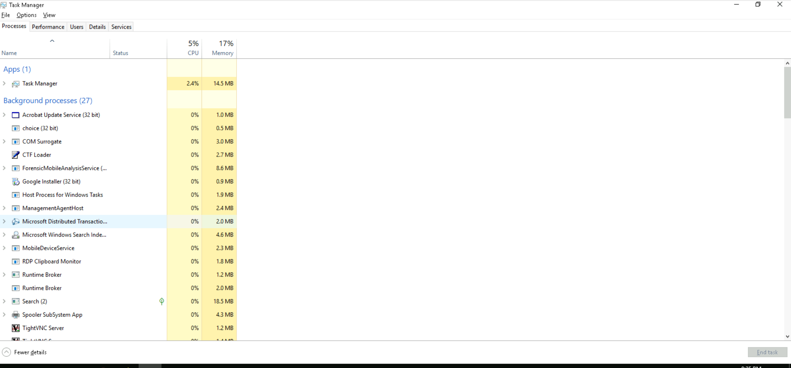

Task Manager offers a comprehensive view of running processes, which is essential for identifying both legitimate and suspicious activity. Among the processes displayed, I identified several core **Windows processes**, which are crucial for the functioning of the operating system:

- **System (ntoskrnl.exe)**: The kernel responsible for managing system operations.
- **Windows Session Manager (smss.exe)**: Manages session and user environment services.
- **Windows Logon Application (winlogon.exe)**: Handles user logon.
- **Local Security Authority Process (lsass.exe)**: Manages security and logon policies.
- **Windows Explorer (explorer.exe)**: The user interface for navigating files and folders.
- **Client Server Runtime Process (csrss.exe)**: Responsible for creating threads and console windows.

Each of these processes plays a vital role in the system’s overall functionality, and understanding their behavior is key to identifying anomalies during a forensic investigation.

#### Step 2: Adding the Command Line Column

To gather more detailed forensic data about the running processes, I added the **Command Line** column to the Task Manager view. This allowed me to observe the file paths for each executable process, along with any command-line arguments used to launch them.


To do this, I right-clicked the **Name** column header in Task Manager and selected **Command line** from the context menu. This provides additional forensic insight, as the full path and command arguments can help identify suspicious processes or unusual behavior. This is particularly useful when analyzing malware, as attackers often run malicious executables from hidden directories or use obscure command-line switches.

#### Step 3: Viewing Process Properties

For further analysis, I examined the properties of one of the core processes—**winlogon** (windows Logon Application). I right-clicked the process in Task Manager and selected **Properties** from the context menu. The **Properties window** provides additional information such as the file's location, size, and creation/modification dates, which can be critical for forensic investigators when trying to determine if the process has been tampered with or if the executable is being used maliciously.

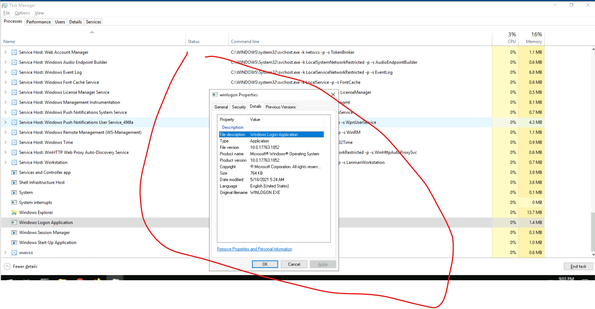

---

### Analyzing System Resource Usage and Network Activity

After gathering basic system information, I proceeded to examine the system’s resource usage and network activity. Monitoring these aspects of a Windows system provides further insight into its current state, especially in scenarios where performance degradation, unauthorized network activity, or potential malware threats are suspected. 

#### Step 4: Monitoring System Performance

To begin, I clicked on the **Performance** tab in Task Manager. This tab offers a high-level overview of resource utilization, including CPU, memory, disk, and network usage. This overview helps establish a baseline for how the system’s resources are being consumed, which is crucial in identifying any abnormal spikes or irregularities that could be caused by malicious software or misconfigurations.


#### Step 5: Launching Resource Monitor

To dive deeper into system resource usage, I clicked the **Open Resource Monitor** link at the bottom of the Task Manager. **Resource Monitor** is an invaluable tool for forensic analysis, as it provides detailed, real-time information about CPU, memory, disk, and network activity on the system. While similar information is available in the Performance tab, Resource Monitor allows for more granular analysis.
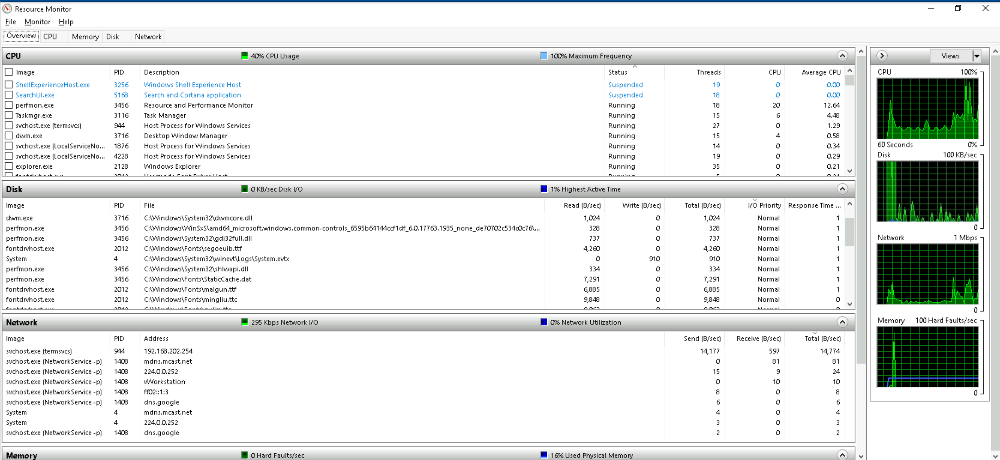

#### Step 6: Analyzing Network Activity

Once inside Resource Monitor, I switched to the **Network** tab to analyze processes generating network activity. This tab reveals which processes are actively sending or receiving data, helping to pinpoint any applications or services that are communicating over the network, which could be indicative of malicious behavior.

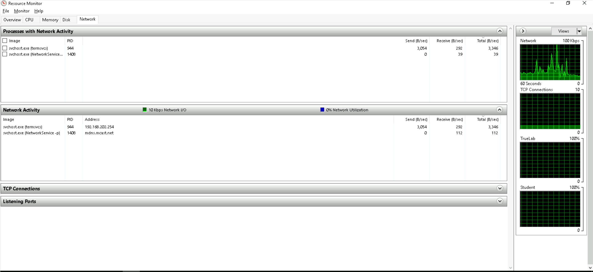

Forensic investigators often rely on this data to identify and track malware, such as spyware or botnets, which need network connectivity to function. By reviewing this tab, I was able to observe the following:

- **Processes with network activity:** This section lists processes currently communicating over the network, along with the corresponding bandwidth usage.
- **TCP Connections:** Displays all active TCP connections, showing which ports are being used to communicate externally.
- **Listening Ports:** This section is particularly important in identifying open ports that may be used for unauthorized connections.

#### Step 7: Expanding the Listening Ports List

To get a clearer view of potential vulnerabilities, I expanded the **Listening Ports** section. This revealed a list of ports that were actively listening for incoming connections, alongside the processes utilizing them. This is essential in forensic investigations, as open or unusual listening ports could indicate backdoors or other security vulnerabilities that are being exploited by attackers.

Here’s a screenshot illustrating the **Listening Ports** view:

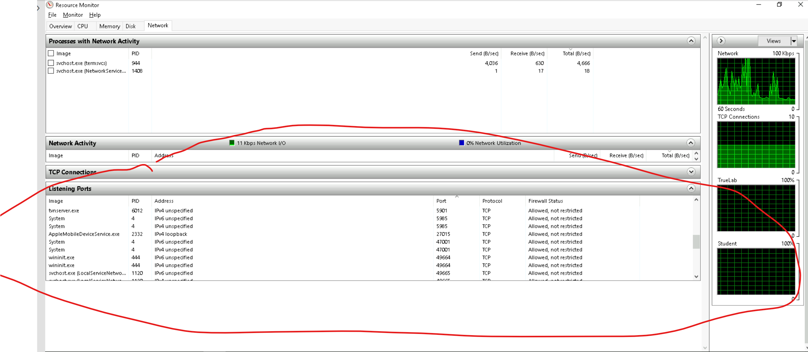

#### Step 8: Concluding Network and Resource Monitoring

After gathering the necessary data, I closed both the **Resource Monitor** and **Task Manager** windows. This concludes the detailed examination of the system’s performance and network activity, offering key forensic insights into the system’s current behavior.


### Phase 2: Gathering and Analyzing File System Information Using `fsutil`

After gathering resource and network activity information, I moved on to analyzing the file system of the vWorkstation. By using the **fsutil** command, I can extract detailed information about the file system's structure and historical changes. This is particularly useful in forensic investigations for detecting hidden data or understanding historical file system activity.

#### Step 1: Gathering NTFS Information for the C: Drive

To begin, I launched the **Command Prompt** by clicking on the Command Prompt icon in the taskbar. From there, I executed the following command:

```bash
fsutil fsinfo ntfsinfo C:
```


This command retrieves detailed information about the NTFS file system on the **C:** drive. The output provided key details such as:

- **NTFS Volume Serial Number**
- **NTFS Version**
- **Total and Free Clusters**
- **Bytes Per Sector**
- **Bytes Per Cluster**
- **Total Reserved Clusters**

This data is important in identifying if there are any irregularities in the file system, such as hidden data within bad clusters or altered boot records. By analyzing this information, we can also determine the volume’s overall health and identify any areas of the drive that are being misused to hide malicious activity.

#### Step 2: Querying the Update Sequence Number (USN) Journal

Next, I retrieved information from the **Update Sequence Number (USN) Change Journal** using the following command:

```bash
fsutil usn queryjournal C:
```


The USN journal is crucial for forensic investigations as it logs all changes to files, directories, and NTFS objects, providing a historical record of modifications. This output includes:

- **Journal ID**
- **First and Next USN**
- **Lowest and Highest Valid USN**
- **Maximum Size**
- **Allocation Delta**

This information helps us understand the volume of changes that have occurred on the system and provides a baseline for investigating file creation, modification, and deletion activities.

#### Step 3: Reading the Contents of the USN Journal

To inspect the actual changes logged in the USN journal, I ran the following command:

```bash
fsutil usn readjournal C:
```

This command allows us to read through all records logged by the USN journal. As files are created, deleted, or modified, records are added to the journal. These records are invaluable for tracing back the timeline of significant file activities.

<video controls src="Files/videos/Reading Journal.mp4" title="Title"></video>

I allowed the command to run for approximately 10 seconds before stopping it using `Ctrl + C`. During this time, the journal displayed a list of recent file activities, including:

- **File Modifications**
- **File Deletions**
- **Executable file creations**
- **Prefetch file modifications**

This type of data is particularly useful for identifying the execution of potentially malicious programs, file deletions in an attempt to cover tracks, or even unauthorized system changes. Additionally, it can help in understanding the timeline of an initial system compromise, which is critical in forensic investigations.


### Phase 3: Creating and Analyzing USN Journal Records

In this phase, I generated a new record in the USN journal by creating a file and exporting the journal to a CSV file. I then identified the **File ID** of the newly created file and used this information to trace the file location.

#### Step 1: Creating a New Text File

1. On the **vWorkstation desktop**, I right-clicked an empty space and selected **New > Text Document** to create a new text file.
2. I named the file **NobleAntwi.txt** by typing my name and pressing **Enter**.

#### Step 2: Exporting the USN Journal to a Log File

To extract the contents of the USN journal, I used the **Command Prompt**:

 I changed the directory to the desktop by running the following command:

   ```bash
   cd Desktop
   ```

I then saved the contents of the USN journal to a file named **usn.log** with this command:

   ```bash
   fsutil usn readjournal C: csv > usn.log
   ```


   This created a **usn.log** file on the desktop containing the journal data in CSV format.

#### Step 3: Identifying the File ID of the New File

5. I opened **usn.log** by double-clicking it on the desktop, which opened the file in **Notepad**.
6. Scrolling to the bottom of the log, I located the entry for the newly created file, **NobleAntwi.txt**.
7. The **File ID** for **NobleAntwi.txt** was identified as:

   **0000000000000000000c00000000178d**

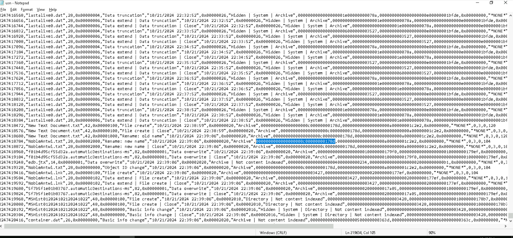

### Phase 4: Querying the File Path Using File ID

In this phase, I utilized the **File ID** obtained from the **usn.log** file to trace the corresponding file's location within the NTFS file system.

#### Step 1: Querying the File Path

1. At the **Command Prompt**, I entered the following command to retrieve the file path associated with the **File ID**:

   ```bash
   fsutil file queryFileNameById C:\ 0x0000000000000000000c00000000178d
   ```

2. Upon executing the command, the output returned the following file path:

   **\\?\C:\Users\Administrator\Desktop\NobleAntwi.txt**

Certainly! Here’s the revised write-up, incorporating the specific installation date and timestamp information:

---

## Part 2: Exploring the Registry

In this segment of my forensic investigation, I focused on the Windows Registry, a pivotal part of the operating system that contains crucial settings and configuration data. Analyzing the Registry is vital in forensic work, as it can provide insights into system activity and user interactions.

I began by accessing the Registry Editor to explore its hierarchical structure, which comprises Keys and Values. Key Hives of interest included:


- **HKEY_CLASSES_ROOT (HKCR)**: Responsible for file associations and programmatic identifiers.
- **HKEY_CURRENT_USER (HKCU)**: Holds settings relevant to the logged-in user.
- **HKEY_LOCAL_MACHINE (HKLM)**: Contains extensive information about installed software and the operating system.
- **HKEY_USERS (HKU)**: Stores user-specific settings for all active accounts.

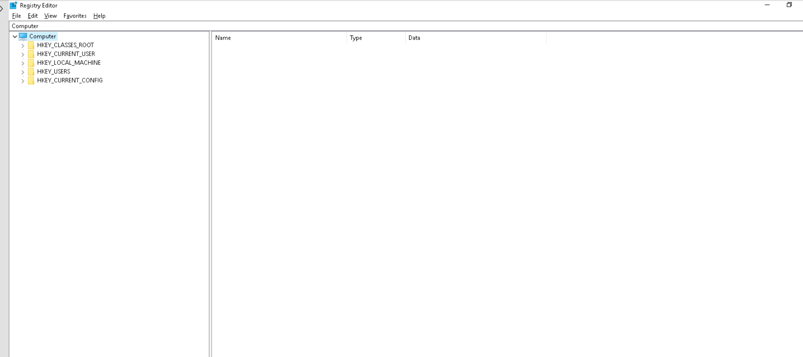

Navigating to the `HKEY_LOCAL_MACHINE\SOFTWARE\Microsoft\Windows NT\CurrentVersion` key, I uncovered essential data regarding the Windows installation, including its version and build. I specifically examined the **InstallDate** value, which was recorded in hexadecimal format as **5d2e2486**. 
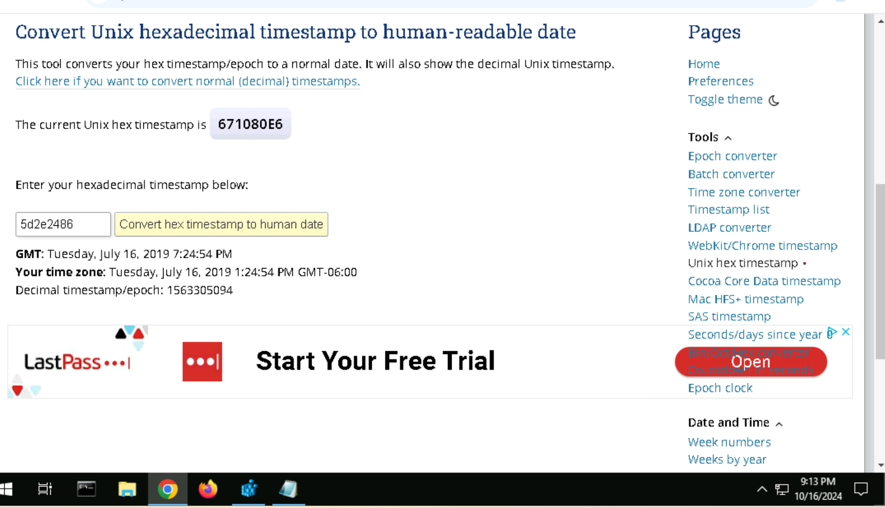

Using an online hexadecimal converter, I translated this value to a more comprehensible format. The installation date was revealed as **Tuesday, July 16, 2019, at 7:24:54 PM GMT**, or **2:24:54 PM** in my local time zone (GMT-05:00). The corresponding decimal timestamp was **1563305094**. 

This information is particularly significant; the installation date not only indicates when the operating system was set up but also allows me to establish a timeline in relation to potential vulnerabilities associated with that specific version of Windows. 

Certainly! Here’s a personalized and concise write-up summarizing your exploration of the Registry in the context of your project, incorporating the required details:


## Registry Exploration Continued

Continuing my investigation into the Windows Registry, I navigated to the following key: 

**HKEY_LOCAL_MACHINE\SYSTEM\CurrentControlSet\Services\Tcpip\Parameters\Interfaces\{39007c8a-d2a1-4c34-bb9d-e9c1bce829b3}**. 

This key holds crucial details about the default network interface for the vWorkstation, including its IP address and default gateway. Upon examining the other sub-keys within the **Interfaces** key, I found that two of them contained minimal information, indicating disconnected network interfaces. The fourth interface key, like the first, was richly populated, revealing that it served as the second active network interface. This setup is essential, as the first interface connects within the lab environment, while the second facilitates my remote connection from my local machine.

**HKEY_LOCAL_MACHINE\SOFTWARE\Microsoft\Windows NT\CurrentVersion\Winlogon**. 

This component is integral to the Windows operating system, responsible for handling the secure attention sequence and user profile loading upon login. Notably, Winlogon is often targeted by various threats, and any signs of increased memory usage could indicate a compromise. 

**HKEY_CURRENT_USER\Software\Microsoft\Windows\Shell\Bags**. 

The ShellBags key maintains records of folders accessed by the current user. Although interpreting the specific folder names and paths typically requires a ShellBags parser, the data here is invaluable for establishing non-repudiation claims. I

**HKEY_CURRENT_USER\Software\Microsoft\Windows\CurrentVersion\Explorer\RecentDocs**. 

This key logs the last 10 files accessed by the current user in File Explorer, presented in hexadecimal format. I captured the RecentDocs key values, which will aid in understanding user activity on the system.

Certainly! Here’s a personalized write-up summarizing **Section 2: Applied Learning**, detailing the process you undertook to create and sort a new case file using Paraben’s E3 for the investigation into Beverly Gates.

---

## Section 2: Applied Learning

### Part 1: Create and Sort a New Case File

In this segment of the lab, I utilized Paraben’s E3 to conduct a forensic investigation into the activities of Beverly Gates, the HR Manager at Intricate Solutions, Inc. Tasked with reviewing a drive image from Beverly's work laptop, I aimed to uncover potential evidence of her involvement in a drug trafficking operation connected to the Russian mafia.

#### Steps Undertaken:

1. **Launching the Application:**
   I started by launching the Electronic Evidence Examiner (E3) application from the vWorkstation desktop. After a brief wait for the program to load, I was greeted by the welcome screen, which offered shortcuts for common forensic activities.

2. **Creating a New Case File:**
   On the welcome screen, I clicked the **Add Evidence** button, which opened the New Case dialog box. I entered the case name **Noble Windows Case File** to uniquely identify my investigation. After clicking **Continue**, the Add New Evidence dialog box appeared.

3. **Importing the Drive Image:**
   In the Add New Evidence dialog, I selected the **Image File** category and chose the **Auto-detect image Source** type. I clicked **OK** to proceed. 

   I navigated through the file system in the Open dialog box, selecting **This PC > Local Disk (C:) > Beverly Gates Evidence** and double-clicked on **BG_evidence.001** to select the first chunk of the digital drive image. Upon being prompted, I accepted the default name for the drive image, adding it to my case file.

4. **Closing the NTFS Settings:**
   I was prompted to review the NTFS Settings dialog box. I clicked **OK** to close it without making any changes.

   At this point, my case file **Noble Windows Case File** was now visible in the Case Content pane. This pane serves as the primary interface for navigating and managing all evidence linked to the case. It allows for easy access to various nodes, including case nodes, evidence nodes, and folder nodes.
   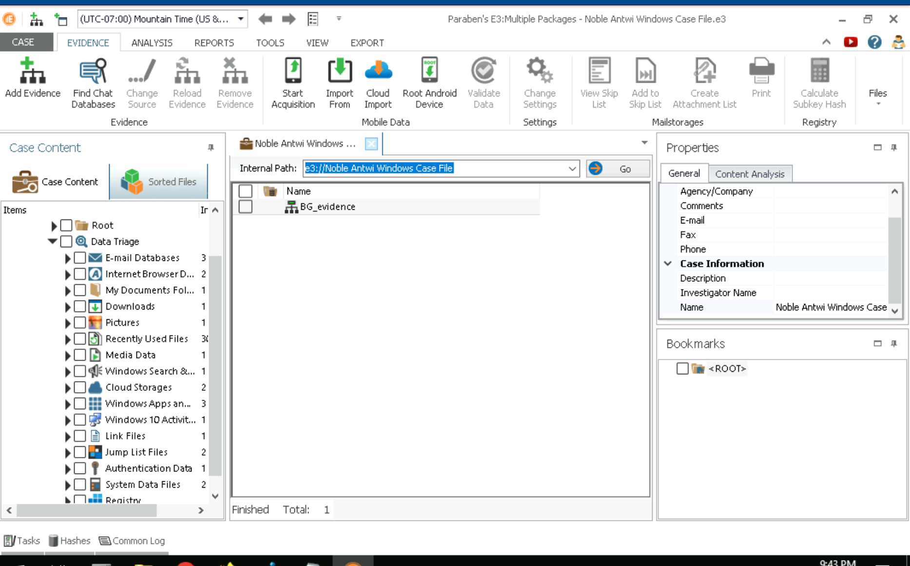

5. **Navigating the Case Content:**
   I navigated to **Noble Windows Case File > BG_evidence > NTFS > Root > Users > Beverly Gates > AppData**. Here, I right-clicked on the **Local** folder and selected **Content Analysis > Sort Data** from the context menu, which initiated the Content Analysis Wizard.
   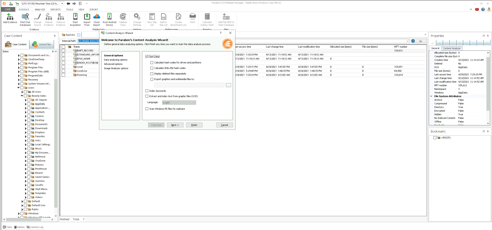

Here's a continuation of your detailed write-up summarizing **Section 2: Applied Learning**, focusing on Part 2, where you perform forensic analysis on the Windows drive image of Beverly Gates.

---

### Part 2: Perform Forensic Analysis on a Windows Drive Image

Following the successful sorting of files within the **Local** folder, I proceeded to conduct a forensic analysis on the Windows drive image to uncover potentially incriminating evidence against Beverly Gates. 

#### Steps Undertaken:

1. **Analyzing the Sorted Files:**
   In the **Sorted Files** pane, I selected the **Compressed** category. This allowed me to view a list of archive files on the suspect’s drive in the Data Viewer, streamlining my focus for this initial investigation phase.

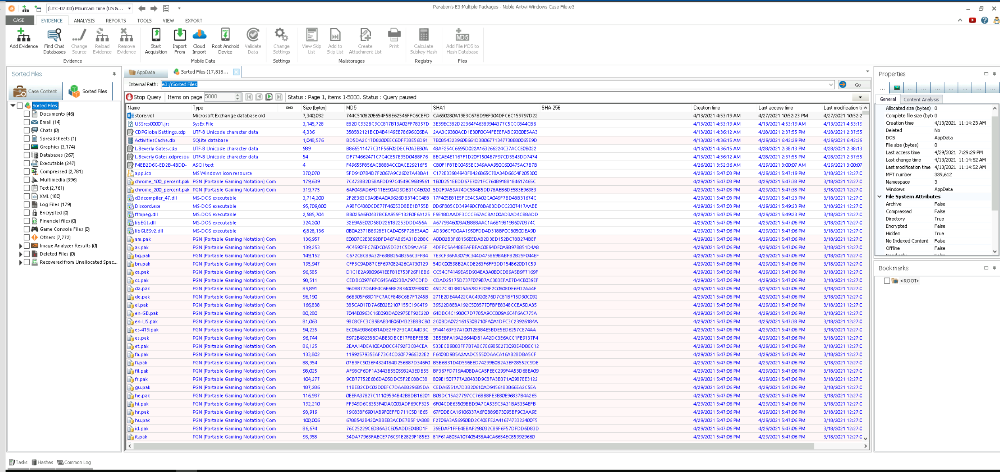
2. **Executing a Sorted File Search:**
   I navigated to the **Analysis** tab on the E3 toolbar and clicked the **Sorted Files Search** button, which opened the Sorted Files Search tab in the center console. Here, I typed **.jpg** in the **Filename** field and checked the **Only files with extension mismatch** checkbox. After clicking **Run Query**, E3 executed a search on the sorted evidence for files incorrectly identified as .jpg files.

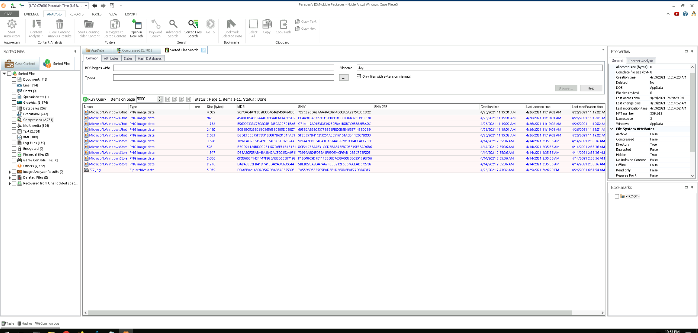

The search yielded **11 results**. Most of the returned files were PNG files mislabelled as .jpg, a common oversight. However, one file stood out: a **.zip** archive improperly labelled as a **.jpg** file, raising suspicion about the intention behind its misclassification, potentially indicating an attempt to conceal its true nature.
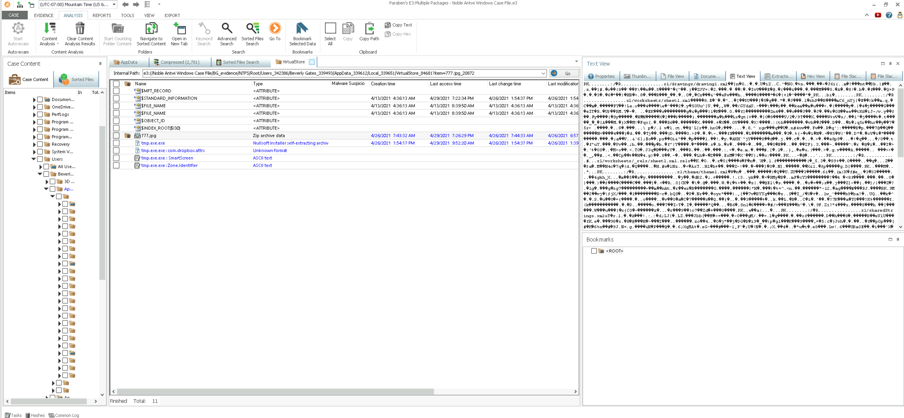

1. **Investigating the Anomalous File:**
   I then selected the **777.jpg** file from the search results. Double-clicking this file displayed its location in the Case Content pane and opened a new tab showing the contents of the enclosing folder.

   - The file was located in the **VirtualStore** folder (Path: **Root\Users\Beverly Gates\AppData\Local\VirtualStore**). This hidden folder is designed for internal application data and often serves as a compatibility feature for older programs. However, its hidden nature can also be exploited to obscure files.


2. **Gathering File Information:**
   In the right pane of the E3 interface, I clicked through various tabs to collect detailed information about the **777.jpg** file. The available viewers included:
   - **Properties**: Displaying metadata such as file size, creation date, and last modified date.
   - **Thumbnails View**: Providing a visual representation of the file.
   - **File View**: Showing the raw content of the file.
   - **Document View**: Displaying any document-related data if applicable.
   - **Text View**: For text-based files, revealing the text content.
   - **Extracted Text View**: Extracting any recognizable text from the file.
   - **Hex View**: Presenting the file data in hexadecimal format.
   - **File Slack: Text View**: Examining any unused space in the file that may contain hidden data.
   - **File Slack: Hex View**: Showing the hex representation of the slack space.

Here’s a detailed continuation of your write-up summarizing **Section 2: Applied Learning**, specifically focusing on steps taken to analyze potential incriminating evidence related to Beverly Gates, particularly through the **777.jpg** file and associated link files.


3. **Screen Capture of the 777.jpg File:**
   I made a screen capture showing the contents of the **777.jpg** file in the **Document View**. Despite E3 identifying it as a mislabeled **.zip** file, the Document View revealed that the file appeared to be a spreadsheet. This finding is significant as Excel files (.xls and .xlsx) are indeed compressed packages of XML files. Changing the defined file format of an Excel file would allow for unzipping and inspection of its internal structure. The contents of this spreadsheet appeared to be a list of customers, amounts owed, and drugs, suggesting potential illicit activities.
   

4. **Expanding the Data Triage Header:**
   In the **Case Content** pane, I scrolled down to the bottom and expanded the **Data Triage** header. Under this category, I then expanded the **Link Files** category to display its contents in a new tab in the Data Viewer.

  The **Link Files** category contained one folder—**Recent**—which holds several links to files located throughout the filesystem. This functionality within E3 is crucial for tracking user activity and serves as irrefutable proof that files have been recently accessed.
   - 

5. **Accessing the Recent Folder:**
   I double-clicked the **Recent** folder in the Data Viewer to open it.

7. **Locating and Selecting the 777.lnk File:**
   Within the **Recent** folder, I located and selected the **777.lnk** file, then clicked the **Text View** tab on the right pane to view its contents.

   - The **777.lnk** file contained the file path to **777.jpg** in the system, which matched the previously observed file path, reinforcing the link between the mislabelled file and the suspect’s activity.
  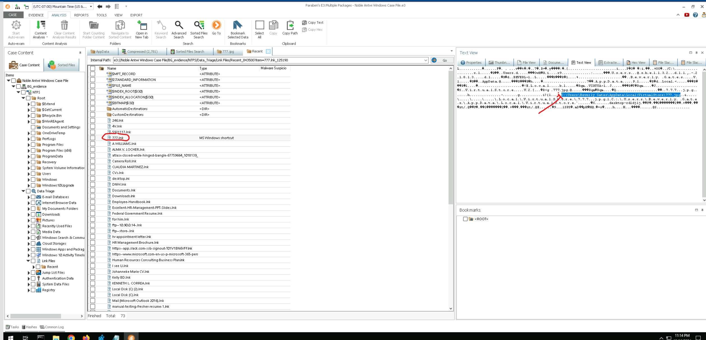

8. **Exploring the Downloads Category:**
    Next, I selected the **Data Triage / Downloads** category in the **Case Content** pane to display its contents in the Data Viewer.

9. **Opening the Downloads Folder:**
    I double-clicked the **Downloads** folder to review its contents.

11. **Identifying Suspicious Activity:**
    In the **Downloads** folder, I scrutinized the files for traces of suspicious activity. I discovered installation files for **Speedify VPN** and **Tor browser**, both of which are often associated with covert online communications.
    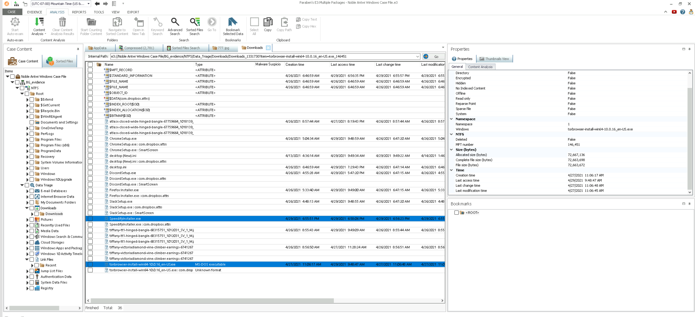

    - The **Tor network** encrypts user traffic and routes it through various relays to disguise identity, making it a popular choice for anonymous communication on the Internet. The use of such software, particularly in a corporate environment, is typically prohibited due to security risks, further raising suspicions about Beverly Gates' activities.

13. **Expanding the Registry Category:**
    In the **Case Content** pane, I then expanded the **Data Triage / Registry** category, followed by expanding the **Windows 10 Enterprise / Full Registry** sub-categories.

    - The **Registry** category in E3 mirrors the structure of the Windows Registry as seen in a live system. The disk image contained three primary registry hives:
      - **HKEY_CLASSES_ROOT (HKCR)**
      - **HKEY_LOCAL_MACHINE (HKLM)**
      - **HKEY_USERS (HKU)**

    - Notably, two hives previously investigated in Section 1 were absent due to the lack of a current user or configuration in the disk image. The **HKEY_CURRENT_USER** hive is part of the **HKEY_USERS** hive, while the **HKEY_CURRENT_CONFIGURATION** hive is included in the **HKEY_LOCAL_MACHINE** hive.

    - The **Parsed Registry Data** category is likely to contain registry values significant to the investigation, warranting further examination.
Here's the next set of steps and a summary to complete the remaining tasks for Section 2:

   I expanded the **Parsed Registry Data** category, navigated to **Programs**, and selected the **Uninstall** folder. This folder contains registry keys related to the deinstallation of programs on the system.

   - I paid special attention to any suspicious applications and identified additional evidence of the **Speedify VPN** application, confirming that it was not only downloaded but installed on the suspect’s machine.
  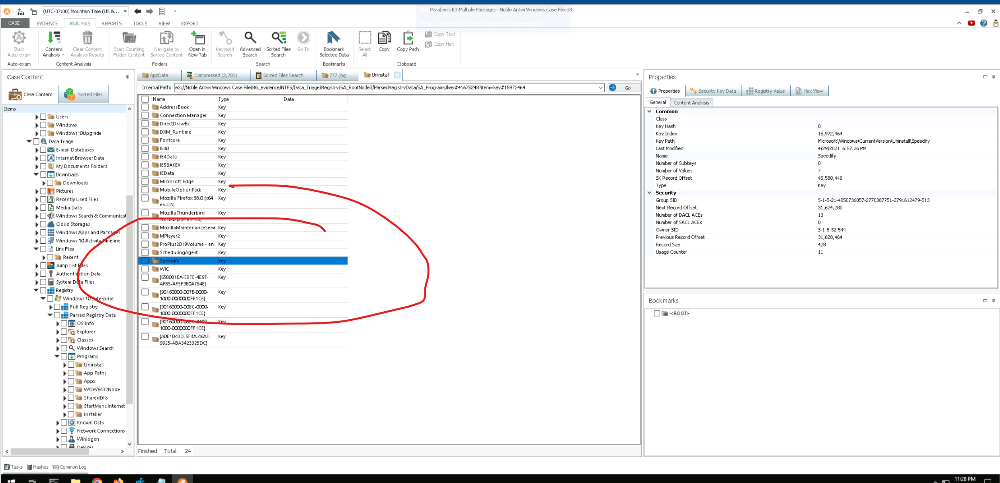

   I then selected the **Users Info** sub-category in the **Case Content** pane to view the list of users on the suspect’s machine.
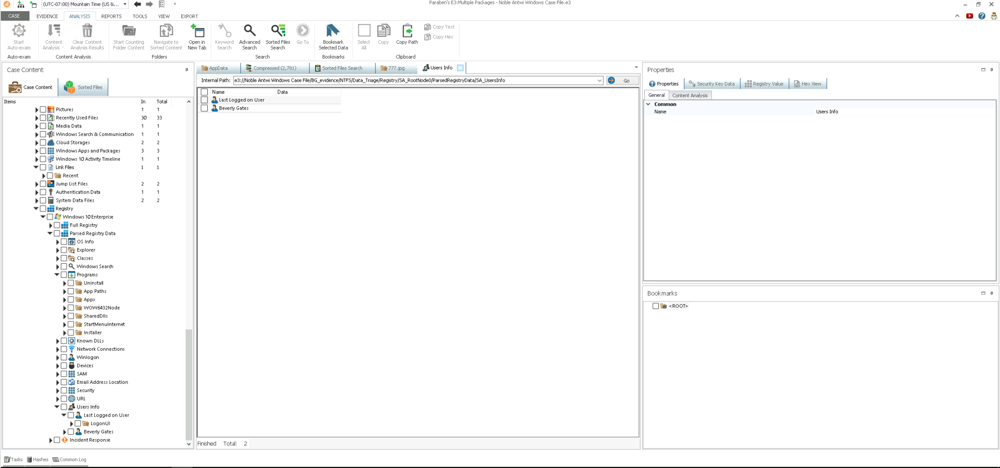

In the **Data Viewer**, I opened the **Beverly Gates** user record, followed by opening the **Run** folder. This folder contains applications set to run automatically upon system start-up.
After clicking **OK** to close the notification, I reviewed the contents to identify suspicious or unauthorized applications.


I selected the **Data Triage / Internet Browser Data** category in the **Case Content** pane and navigated to the **Default / History** folder in the **Data Viewer** to analyze browsing history.
   

I carefully reviewed the **History** sub-node for any suspicious browsing activity. This could include access to illegal websites, darknet markets, or any other suspicious online behavior. These contnet continaes hsotry of how to browse webstie unonymouslyy which also goes to guve credence to the fact that, Beverly was indeed tryung to stay hidden in order to carry out herdrug activities.

A screen capture was taken showing at least one suspicious browsing record found in the **History** sub-node, further implicating Beverly Gates in potentially illegal online activity.
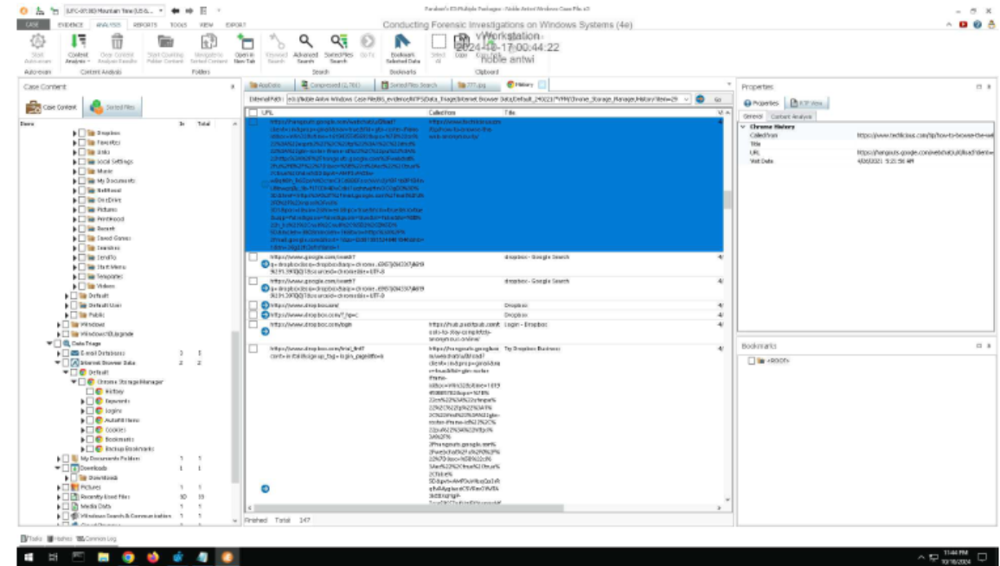

   I then reviewed the **Keywords** sub-node, which stores keywords used in web searches. I looked for any suspicious search terms related to illicit activities.

#### 26. **Screen Capture of Suspicious Search:**
   A screen capture was made showing at least one suspicious search found in the **Keywords** sub-node, revealing Beverly Gates' intent to hide her online activities or search for questionable content.


---
### Conclusion on Beverly Gates' Involvement in the Drug Case:

Based on the findings, Beverly Gates' involvement in the drug-related activities appears highly likely. The key pieces of evidence point to deliberate attempts to engage in covert and potentially illegal operations. 

1. **Incriminating Spreadsheet**: The **777.jpg** file, which contains customer data, amounts owed, and drug information, directly ties Beverly to drug-related operations. The manipulation of the file format suggests an intentional effort to conceal its contents, further implicating her in hiding illicit information.

2. **Anonymizing Software Usage**: The installation and use of **Speedify VPN** and **Tor Browser** indicate Beverly was actively attempting to anonymize her online activities. These tools are commonly used to bypass monitoring systems and access hidden parts of the internet, such as darknet markets, where illegal drugs are often bought and sold. The presence of these applications suggests that Beverly was likely involved in, or at least facilitating, covert communications and transactions related to the drug trade.

3. **Suspicious Online Activity**: The **browsing history** and **search keywords** point to an effort to seek out or engage in clandestine operations, further reinforcing the theory that Beverly was involved in illegal activities. Her online behavior aligns with someone attempting to cover their tracks while interacting with illicit content or services.

4. **Registry and Auto-Start Programs**: The presence of VPN and anonymizing software in the **registry records** and **auto-start programs** confirms that these tools were regularly used on Beverly's system, reinforcing her involvement in using these tools to obscure her activities.

### Overall Assessment:
The combination of incriminating documents, the use of anonymizing software, and the pattern of suspicious online behavior strongly indicates that Beverly Gates was involved in, or facilitating, drug-related activities. The evidence points to a conscious and coordinated effort to conceal these actions, suggesting an active role in the illicit operations. Further investigation may be necessary to uncover the full extent of her involvement, but the current evidence strongly implicates her in the drug case.
