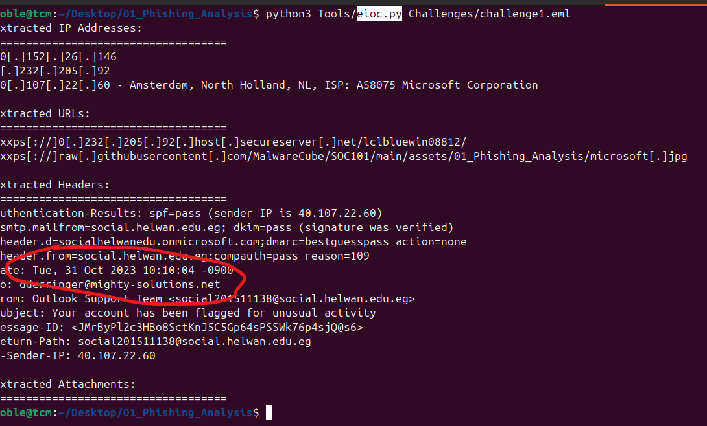
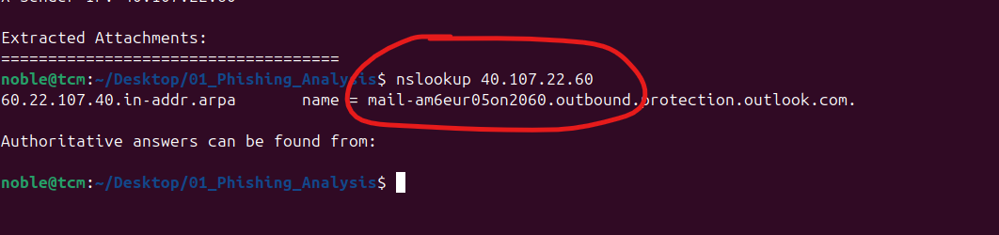
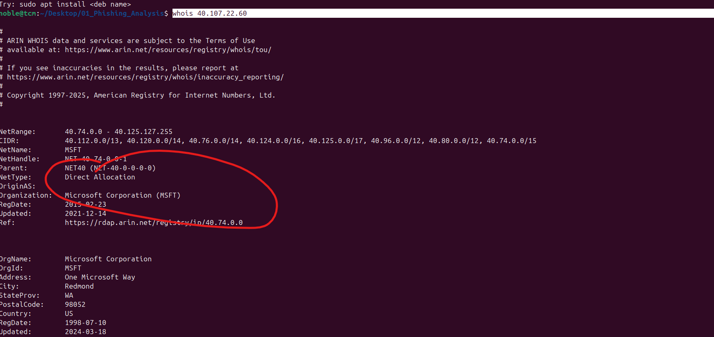
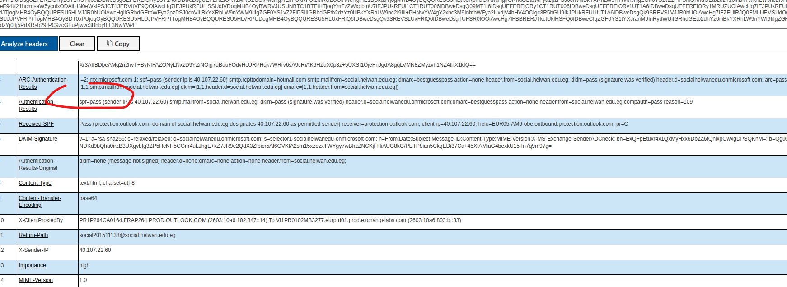
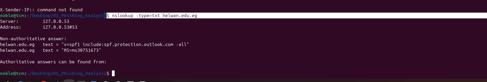
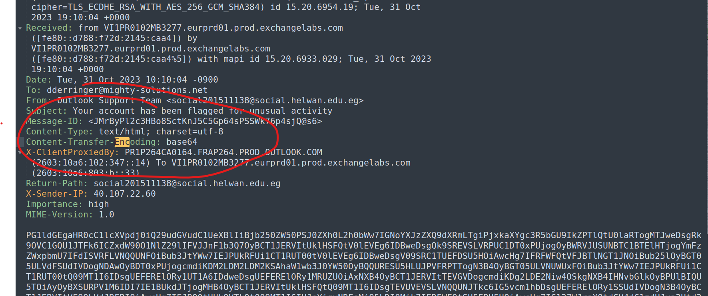
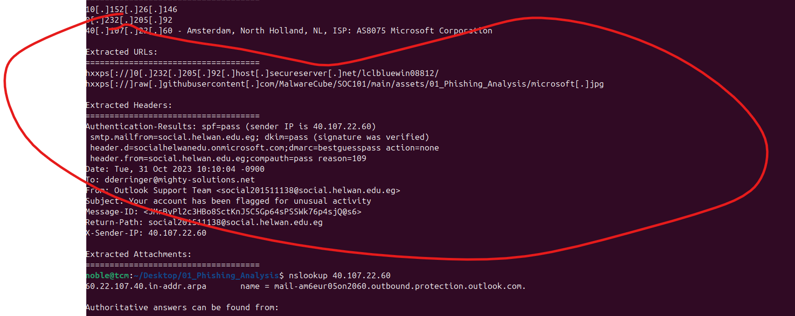
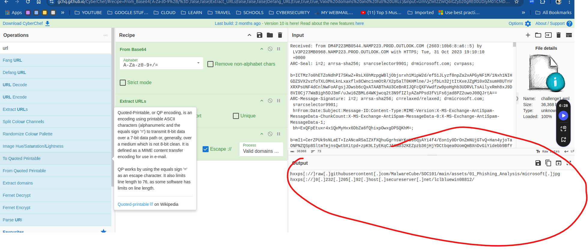
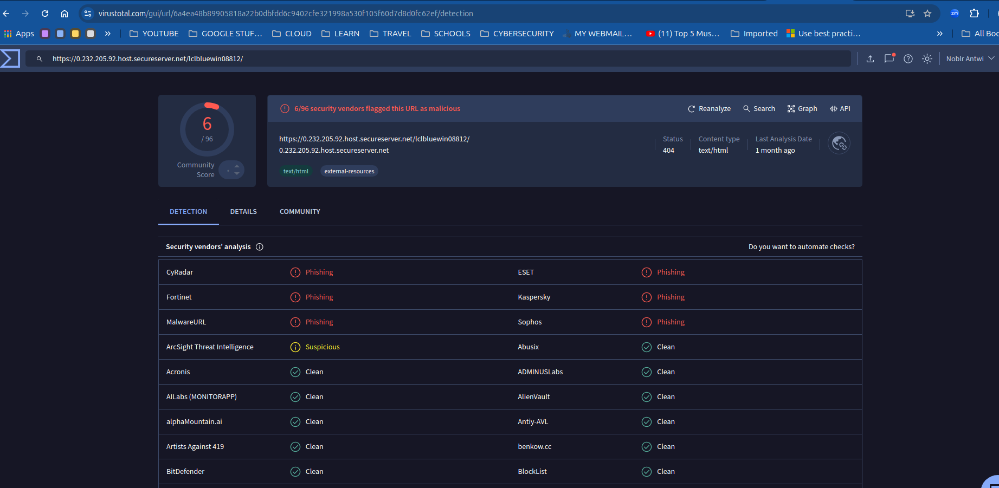

# Comprehensive Incident Report

## Introduction

On October 31, 2023, the Security Operations Center (SOC) at Mighty Solutions, Inc. received an email forwarded by Dana Derringer, an account executive. The email warned that her online access had been disabled. Dana noted that this was suspicious as her access to her online business platforms and inbox was unaffected. She forwarded the email to the security team's phishing mailbox for review.

Upon detailed investigation, it was determined that the email was a phishing attempt, attempting to deceive Dana into taking potentially harmful actions. This report provides a step-by-step analysis of the investigation process, including tools used, evidence gathered, and final recommendations.

---

## Incident Overview

**Organization**: Mighty Solutions, Inc.\
**Alert Triggered**: Suspicious email forwarded to phishing mailbox\
**Recipient**: Dana Derringer\
**Suspected Sender**: "Outlook Support Team"

---

## Step 1: Email Header Analysis

### **1.1 Delivery Date and Time**

The email header was analyzed using Didier Stevens' `eioc.py` script to extract key metadata. The following command was executed:

```bash
python3 Tools/eioc.py Challenges/challenge1.eml
```

- **Result**: The email delivery date and time were identified as:
  ```plaintext
  Tue, 31 Oct 2023 10:10:04 -0900
  ```



### **1.2 Subject of the Email**

From the script output, the subject line was extracted as:
```plaintext
Your account has been flagged for unusual activity
```


### **1.3 Recipient Details**

The email was addressed to:
```plaintext
dderringer@mighty-solutions.net
```

### **1.4 Sender Details**

- **Display Name**: Outlook Support Team\
- **Actual Sender Email**: `social201511138@social.helwan.edu.eg`

### **1.5 Return Path (Bounce Address)**

The email header revealed the return path, used for receiving bounced emails, as:
```plaintext
social201511138@social.helwan.edu.eg
```


### **1.6 Sender's IP Address**

The sender's IP address was identified as:
```plaintext
40.107.22.60
```


### **1.7 Resolved Hostname of the Sender’s IP Address**

Using the following command, the sender’s IP address was resolved to its hostname:

```bash
nslookup 40.107.22.60
```

- **Result**: The resolved hostname was:
  ```plaintext
  mail-am6eur05on2060.outbound.protection.outlook.com
  ```
  
  

### **1.8 Corporation Owning the Sender's IP Address**

A `whois` query was performed to identify the owner of the sender's IP address:

```bash
whois 40.107.22.60
```

- **Result**: The IP address is owned by **Microsoft Corporation**.


### **1.9 SPF Check**

Using the email header parser platform at [mha.azurewebsites.net](https://mha.azurewebsites.net), the SPF check result was:
```plaintext
Pass
```


### **1.10 Sender's Full SPF Record**

The sender’s SPF record was extracted using the following command:

```bash
nslookup -type=txt helwan.edu.eg
```

- **Result**:
  ```plaintext
  v=spf1 include:spf.protection.outlook.com -all
  ```


### **1.11 Message ID**

The email's unique Message ID was identified as:
```plaintext
<JMrByPl2c3HBo8SctKnJ5C5Gp64sPSSWk76p4sjQ@s6>
```

### **1.12 Content Transfer Encoding**

The email body content encoding was extracted using a text editor. It was determined to be:
```plaintext
Base64
```


---

## Step 2: URL Analysis

### **2.1 Extracted URL in Defanged Format**

The second URL from the email body was extracted and defanged for security purposes:
```plaintext
hxxps[://]0[.]232[.]205[.]92[.]host[.]secureserver[.]net/lclbluewin08812/
```


- **Additional Verification**: CyberChef was used to decode the Base64 content, extract URLs, and defang them.



### **2.2 VirusTotal Scan**

The defanged URL was scanned using VirusTotal. The verdict assigned by **Fortinet** was:
```plaintext
Phishing URL
```


---

## Conclusion

As the SOC Analyst, I have thoroughly reviewed the email and confirmed that it is not genuine. The following evidence supports this conclusion:

1. **Sender Spoofing**: The email claimed to be from "Outlook Support Team," but the sender’s actual domain was `helwan.edu.eg`, a non-affiliated domain.
2. **Phishing URL**: The email contained a malicious URL identified as phishing by VirusTotal.
3. **Base64 Encoding**: The email body was encoded in Base64, a common technique used by attackers to obfuscate malicious content.
4. **Mismatch in SPF Records**: Although the SPF check passed, the sender's domain does not align with the claimed sender organization.

### Recommendations

1. **Block Sender**: Add `social.helwan.edu.eg` and the associated IP address to the organization’s blocklist.
2. **Alert the User**: Inform Dana Derringer about the phishing attempt and advise her to remain vigilant.
3. **Strengthen Email Security**: Implement stricter DMARC policies and anomaly detection for incoming emails.
4. **Threat Intelligence Sharing**: Share the malicious URL and other indicators with threat intelligence platforms.
5. **Phishing Awareness Training**: Conduct company-wide training to educate employees about identifying phishing attempts.

This investigation highlights the importance of continuous monitoring and proactive measures to mitigate phishing threats.

