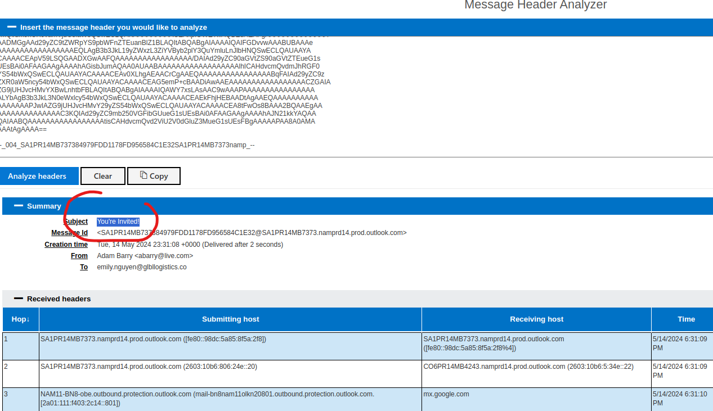

# Comprehensive Incident Report

## Introduction

On May 14, 2024, the Security Operations Center (SOC) at Global Logistics identified a potentially malicious email flagged by the company’s email gateway solution. The email, addressed to Emily Nguyen from the marketing team, claimed to be sent by Alexia Barry. Upon investigation, it was discovered that the email contained a phishing attempt, complete with a malicious attachment designed to compromise the recipient’s system.

This report provides a thorough step-by-step analysis of the incident, detailing the tools, processes, and findings that led to the identification of the email as a phishing attack. Supporting evidence, including screenshots and output logs, are included throughout the document.

---

## Incident Overview

**Organization**: Global Logistics\
**Alert Triggered**: Email quarantined by email gateway\
**Recipient**: Emily Nguyen, Marketing Team Member\
**Suspected Sender**: Alexia Barry

---

## Step 1: Email Header Analysis

### **1.1 Extraction of Email Header Details**

To identify critical email header information (e.g., delivery date, subject, recipient), the following tools were used:

- **Didier Stevens' ********`eioc.py`******** Script**:

  ```bash
  python3 Tools/eioc.py Challenges/challenge3.eml
  ```

  - **Output**: The email’s full delivery date and time were revealed as:

    ``` bash
    Tue, 14 May 2024 23:31:08 +0000
    ```

    

- **Email Header Parsers**: Additional validation was performed using [mha.azurewebsites.net](https://mha.azurewebsites.net) and [MXToolbox](https://mxtoolbox.com), both confirming the same date and time.


### **1.2 Subject of the Email**

- The identified subject line was:
  
  ``` bash
  You’re Invited!
  ```




  
### **1.3 Recipient Details**

- The email was addressed to:
  
  ``` bash
  emily.nguyen@glbllogistics.co
  ```

  

  

### **1.4 Sender Details**

- **Display Name**: Adam Barry
- **Actual Sender Email**: [abarry@live.com](mailto\:abarry@live.com)\


### **1.5 Email Infrastructure**

To identify the sending infrastructure:

- Command Used:

  ```bash
  whois live.com
  ```

  - Output: The sender’s domain (`live.com`) is operated by **Microsoft Corporation**.

 

### **1.6 Message ID**

The unique email identifier was extracted as:

```plaintext
<SA1PR14MB737384979FDD1178FD956584C1E32@SA1PR14MB7373.namprd14.prod.outlook.com>
```


---

## Step 2: Attachment Analysis

### **2.1 Locating the Attachment**

Using `emldump.py` from Didier Stevens’ toolkit, the attachment’s index and details were extracted:

- **Command**:

  ```bash
  python3 Tools/emldump.py Challenges/challenge3.eml
  ```

  - **Output**: The attachment was located at **index 5**.
  - **Attachment Name**: AR\_Wedding\_RSVP.docm

    

### **2.2 Extracting the Attachment**

The attachment was extracted using the following command:

```bash
python3 Tools/emldump.py Challenges/challenge3.eml -s 5 -d > /home/noble/Desktop/AR_Wedding_RSVP.docm
```

- **Result**: The attachment was saved locally.
  


### **2.3 Hash Calculation**

To verify the integrity of the attachment, its SHA-256 hash was computed using both Didier Stevens’ script and the `sha256sum` command:

- **Hash Value**:

  ```plaintext
  41c3dd4e9f794d53c212398891931760de469321e4c5d04be719d5485ed8f53e
  ```

  

  

### **2.4 VirusTotal Submission**

The hash was submitted to **VirusTotal** for analysis:

- **Threat Label**: Downloader.autdwnlrner/W97M
- **Classification**: Trojan Downloader\


---

## Step 3: Static Analysis of the Malicious Document

### **3.1 VBA Macro Extraction**

The `.docm` file extension indicated the presence of embedded macros. Using `oledump.py`, the macro was identified in stream **A3**:

- **Command**:

  ```bash
  python3 Tools/oledump.py /home/noble/Desktop/AR_Wedding_RSVP.docm
  ```

  - Output: Stream A3 contained compressed VBA code.


- **Decompression Command**:

  ```bash
  python3 Tools/oledump.py /home/noble/Desktop/AR_Wedding_RSVP.docm -s 3 --vbadecompresscorrupt
  ```

  - **Result**: The VBA code was successfully extracted.
  


### **3.2 Macro Behavior Analysis**

The extracted VBA code was analyzed:

#### **Breakdown of the Macro**

1. **Document\_Open() Subroutine**:

   - This subroutine is automatically triggered when the document is opened. It initiates malicious activities using three key objects:
     - **http\_obj**: An instance of `Microsoft.XMLHTTP` used to send HTTP GET requests.
     - **stream\_obj**: An instance of `ADODB.Stream` to handle binary data for downloading files.
     - **shell\_obj**: An instance of `WScript.Shell` to execute system commands.

2. **Defining Variables**:

   - **URL**: Points to `https://github.com/TCWUS/Pastebin-Uploader.exe`, the malicious file to be downloaded.
   - **FileName**: The downloaded file is saved as `shost.exe`.
   - **RUNCMD**: The command to execute the downloaded file.

3. **Downloading and Saving the Malicious File**:

   - **http\_obj.open()** and **http\_obj.send()**: Fetches the executable from the remote URL.
   - **stream\_obj.write()**: Writes the binary content of the file.
   - **stream\_obj.savetofile(FileName, 2)**: Saves the file locally as `shost.exe`.

4. **Executing the Malicious File**:

   - **shell\_obj.Run**: Executes the `shost.exe` file, potentially installing malware or opening a backdoor on the victim’s system.

#### **Purpose and Impact**

The VBA macro effectively acts as a **malware downloader**. By automating the download and execution of the payload, it compromises the target system, allowing attackers to:

- Gain unauthorized access.
- Install additional malware.
- Exfiltrate sensitive data.

#### **Defanged URL**

To prevent accidental interaction, the malicious URL was converted to a defanged format:

```plaintext
hxxps[://]github[.]com/TCWUS/Pastebin-Uploader[.]exe
```


---
## Conclusion

As the analyst investigating this incident, I determined that the email posed a significant security risk. The attachment contained a malicious VBA macro designed to download and execute a Trojan Downloader from a remote server. This would have likely resulted in unauthorized access and further compromise of the recipient's system.

Given these findings, I recommend the following actions:

1. Do Not Release the Email: The email must remain quarantined to prevent accidental exposure.

2. Notify the Recipient: Emily Nguyen should be informed about this phishing attempt and advised on recognizing similar threats.

3. Block the Sender: Implement domain and IP blocks for the sender to prevent further phishing attempts.

4. Submit Threat Intelligence: Share the hash of the malicious file and the associated URL with relevant threat intelligence platforms to assist other organizations in mitigating similar risks.

5. Phishing Awareness Training: Conduct training sessions for all employees to enhance their ability to identify and report phishing attempts.