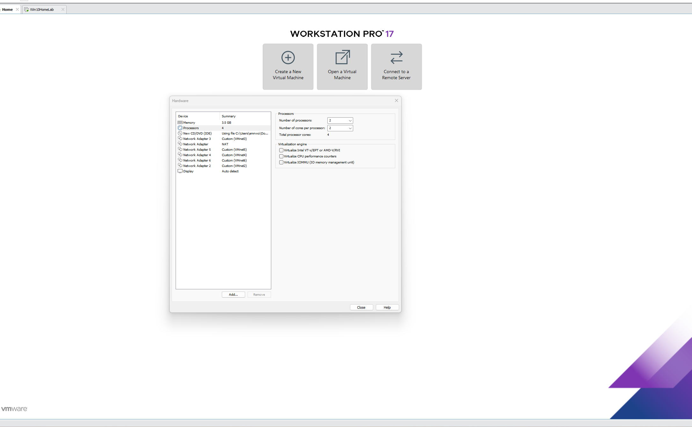
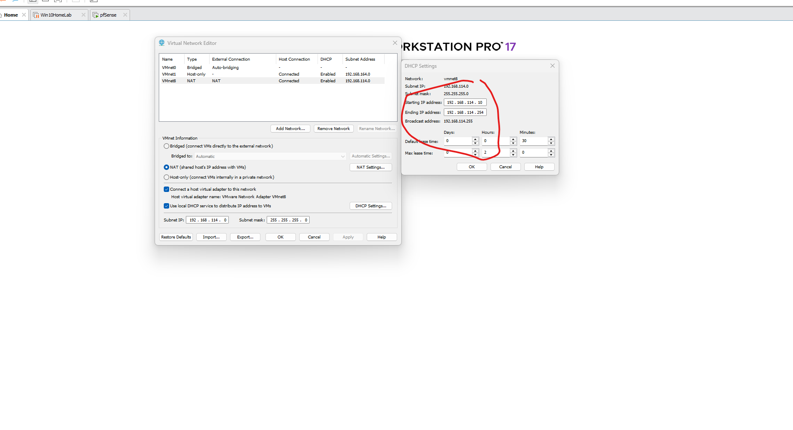
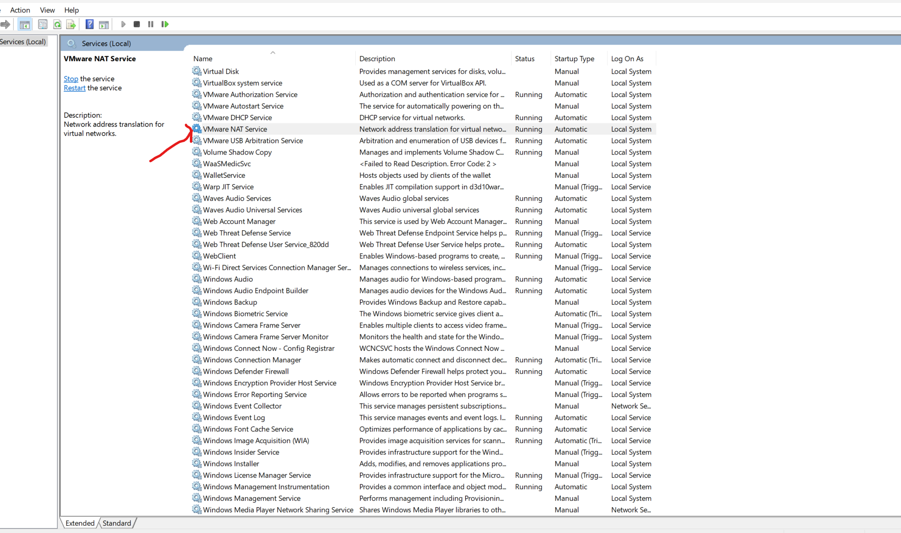
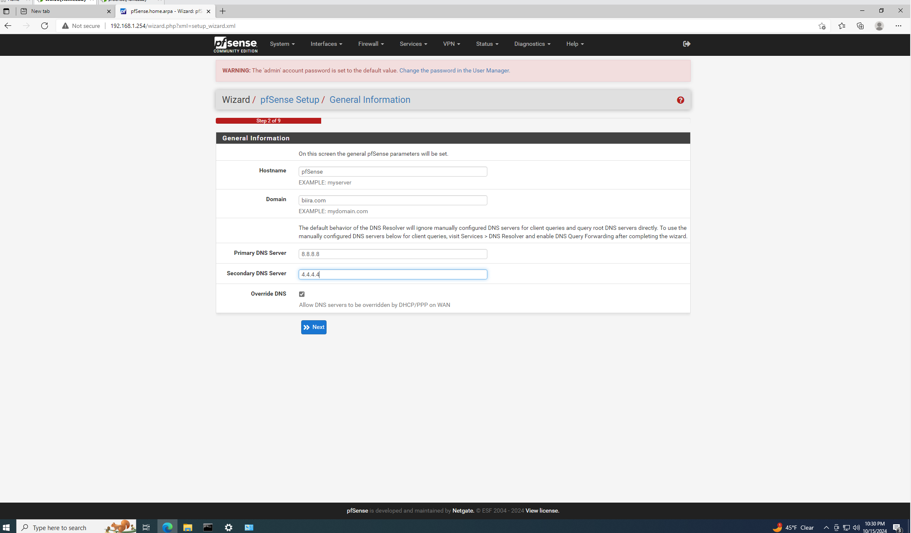
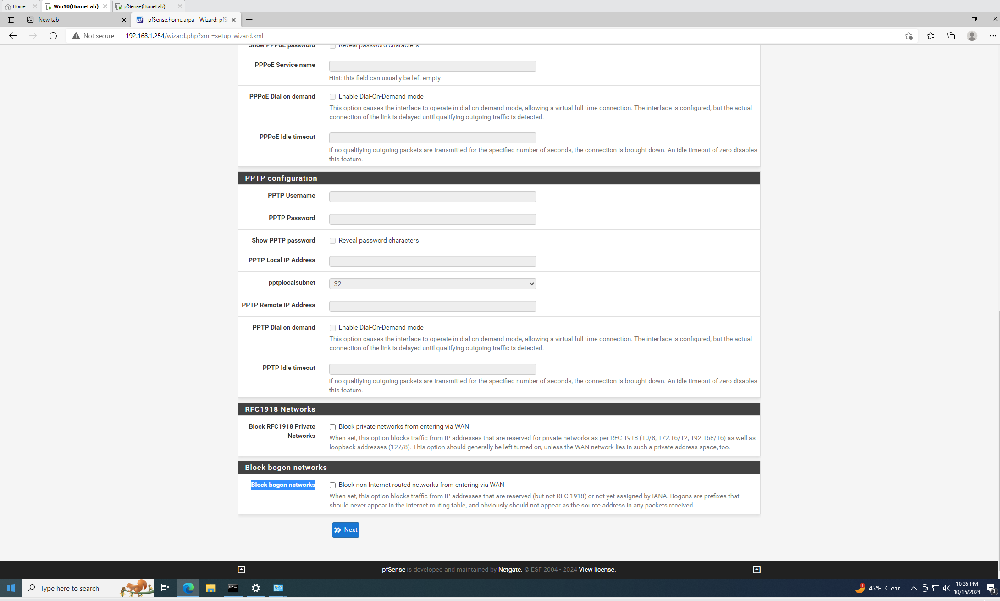
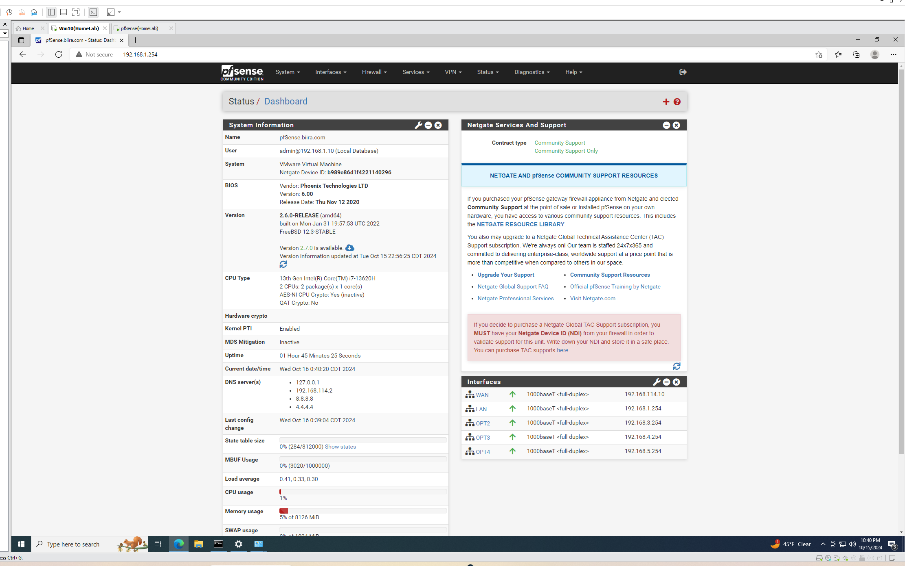
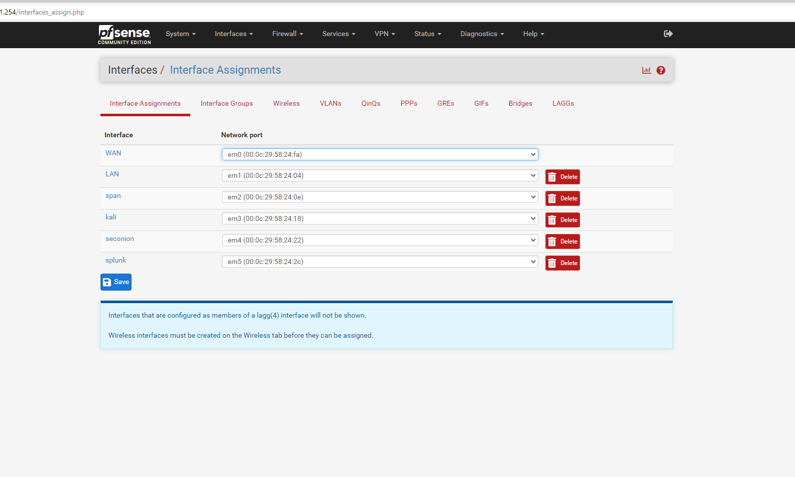
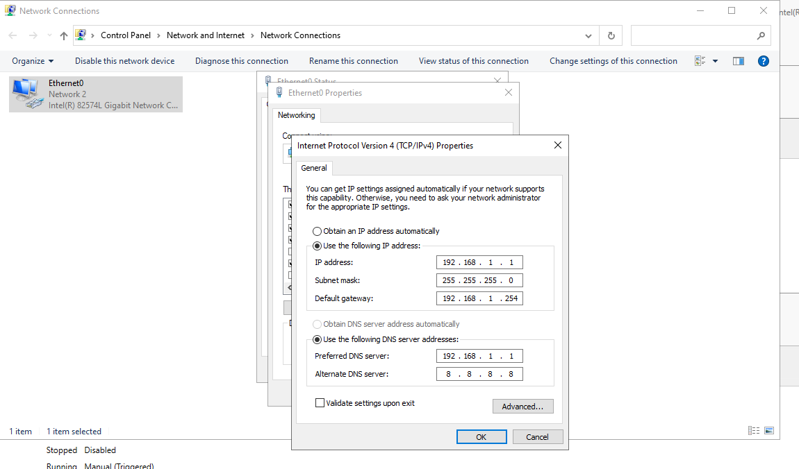

# CYBER THREAT DETECTION AND MONITORING LAB

## Introduction

In the ever-evolving landscape of cybersecurity, hands-on experience is invaluable. This project details the creation of a robust cybersecurity home lab designed to simulate real-world scenarios, from network segmentation to active threat detection and vulnerability exploitation. The lab environment provides a safe, isolated space to practice offensive and defensive security techniques, enhancing skills in network security, system hardening, and incident response.

This comprehensive setup includes:

- A segmented network architecture using pfSense for routing and firewall management
- Multiple virtual machines running various operating systems and security tools
- A vulnerable Active Directory environment for practicing attack and defense scenarios
- Security monitoring solutions like Security Onion and Splunk for log analysis and threat detection
- Kali Linux for penetration testing and security assessments

By walking through the step-by-step process of building this lab, from initial network design to the creation of a deliberately vulnerable Active Directory setup, this project offers insights into the complexities of modern cybersecurity infrastructures. It serves as both a learning tool for aspiring security professionals and a testbed for experienced practitioners to experiment with new tools and techniques in a controlled environment.

The following sections will detail each component of the lab, the rationale behind design choices, and the potential security scenarios that can be explored within this virtual ecosystem.

## Network Architecture


The cybersecurity home lab is designed with a segmented network architecture to simulate real-world scenarios and provide isolated environments for different purposes. This design allows for effective separation of attack simulations, monitoring, and defensive operations.

### Network Design and Segmentation

#### 1. **Security Operations Network** (**Monitoring/Defense Network**)

- **IP Range**: `192.168.3.0/24`
- **Description**: This network is designated for Security Onion and other related defense tools such as Intrusion Detection Systems (IDS), Intrusion Prevention Systems (IPS), and log aggregation services. It will act as the nerve center for monitoring traffic, analyzing logs, and correlating events across the labs networks.

#### 2. **Victim Network** (**Corporate Network/Target Network**)

- **IP Range**: `192.168.1.0/24`
- **Description**: This network represents the internal, corporate-like environment that is simulated for victim systems. It will be the target of attacks launched from the Attacker Network. The key focus here is creating a realistic corporate domain structure with systems such as Domain Controllers, workstations, and potentially other internal services (e.g., file servers, web servers).
- **Components**:
  - **Domain Controller**: (`192.168.1.1`) This acts as the Active Directory (AD) server, controlling user access, group policies, and authentication within the victim environment.
  - **Windows Workstation 1**: (`192.168.1.X`) A standard user machine that attackers might exploit using lateral movement, phishing campaigns, or malware.
    - **Potential Expansion**: Additional systems (Linux servers, database servers, etc.) can be added as needed to increase the scope of attack simulations.

#### 3. **Monitoring Network** (**Log Aggregation Network**)

- **IP Range**: `192.168.5.0/24`
- **Description**: This network contains the key log aggregation and monitoring systems, including Splunk. The purpose is to collect logs from all systems across the lab (Security Onion, victim systems, etc.) and provide a central point for analyzing logs, monitoring events, and correlating them to potential attacks.
- **Components**:
  - **Splunk**: (`192.168.5.1`) A powerful platform for searching, monitoring, and analyzing machine-generated data from across the network.
  - **Grafana** (future potential): A real-time analytics tool that provides visualizations of network performance, security events, and system health data, pulling from sources like Splunk or other log collectors.

#### 4. **Attacker Network** (**Penetration Testing/Threat Actor Network**)

- **IP Range**: `192.168.3.0/24`
- **Description**: This network is designed to simulate external attackers attempting to breach the victim environment. It is isolated from the other networks but connected via pfSense, which will handle routing and segmentation. The purpose here is to allow the launch of attacks from the attacker environment to the corporate network.
- **Components**:
  - **Kali Linux**: (`192.168.3.X`) The attacker machine used to perform penetration testing, exploit vulnerabilities, and simulate real-world attacks. This machine will utilize tools like Metasploit, Nmap, and others to compromise the victim systems.

#### 5. **pfSense Firewall and Routing**

- **IP Range**: `192.168.4.0/24`
- **Description**: Each network segment will be routed through **pfSense**, which serves as the core firewall and router, ensuring traffic flows securely between networks.

- **Traffic Segregation**: Ensure all networks (Attacker, Victim, Monitoring) are properly isolated using pfSense to avoid unauthorized access between segments.

The following table outlines the IP schema and subnet allocation for each network segment:

| Network Segment | Subnet | PfSense Interface | VMware Adapter | Purpose |
|-----------------|--------|-------------------|----------------|---------|
| External (WAN) | 192.168.114.0/24 | em0 | Network Adapter (NAT) | Internet simulation |
| Internal LAN | 192.168.1.0/24 | em1 | Network Adapter 2 (VMNet2) | Corporate network |
| SPAN Port | No IP Address | em2 | Network Adapter 3 (VMNet3) | Traffic mirroring |
| Attacker | 192.168.3.0/24 | em3 | Network Adapter 4 (VMNet4) | Offensive tools |
| Security Onion | 192.168.4.0/24 | em4 | Network Adapter 5 (VMNet5) | Log collection |
| Splunk | 192.168.5.0/24 | em5 | Network Adapter 6 (VMNet6) | Log analysis |

### PfSense Interface and DHCP Configuration

PfSense serves as the central router and firewall, managing traffic between network segments. The following table details the PfSense interface configurations and DHCP settings:

| PfSense Interface | IP Address | DHCP Enabled | DHCP Range |
|-------------------|------------|--------------|------------|
| WAN (em0) | 192.168.114.10 (auto) | No (Acquired from host) | N/A |
| LAN (em1) | 192.168.1.254 | Yes | 192.168.1.10 - 192.168.1.253 |
| SPAN (em2) | No IP Address | No | N/A |
| Attacker (em3) | 192.168.3.254 | Yes | 192.168.3.10 - 192.168.3.253 |
| Security Onion (em4) | 192.168.4.254 | Yes | 192.168.4.10 - 192.168.4.253 |
| Splunk (em5) | 192.168.5.254 | Yes | 192.168.5.10 - 192.168.5.253 |

## Infrastructure Setup

### VMware Installation

VMware Workstation was chosen as the virtualization platform for this lab due to its robust features and ability to create isolated networks. The installation process was straightforward, and the following virtual networks were created:

| Network Name | Purpose |
|--------------|---------|
| VMNet2 | Internal LAN |
| VMNet3 | SPAN Port |
| VMNet4 | Attacker Network |
| VMNet5 | Security Onion Network |
| VMNet6 | Splunk Network |

These virtual networks provide the necessary segmentation for different components of the lab, allowing for isolated testing and monitoring.

### pfSense Installation and  Configuration

pfSense is an open-source firewall and router platform that offers comprehensive network security and management features. Acting as the central component of the network infrastructure, pfSense plays a pivotal role in ensuring reliable connectivity, secure traffic management, and network segmentation.

#### Interface Assignment

In this setup, a pfSense virtual machine (VM) was deployed with six network adapters, each mapped to a specific VMware virtual network (VMNet). This configuration facilitates robust network segmentation and allows controlled communication between different virtual environments. Below is a detailed description of the setup:

| Network Adapter | VMNet |
|-----------------|-------|
| Network Adapter | NAT |
| Network Adapter 2 | VMNet2 |
| Network Adapter 3 | VMNet3 |
| Network Adapter 4 | VMNet4 |
| Network Adapter 5 | VMNet5 |
| Network Adapter 6 | VMNet6 |

**Network Adapter 1 (NAT):** Serves as the WAN interface for pfSense, connecting it to an external network via VMware’s NAT service, simulating internet access.
**Network Adapters 2-6:** Each is mapped to a different isolated VMNet, representing separate subnets used for various virtual lab components such as workstations, monitoring tools, and security appliances.

#### Initial WAN Interface Issue and Resolution

Upon initial configuration, the WAN interface (Network Adapter 1) did not acquire an IP address. This was traced to the VMware NAT service being stopped on the host machine. The issue was resolved by restarting the VMware NAT service, allowing the WAN interface to obtain an IP address of 192.168.114.10/24. This IP address was dynamically assigned by the host system, enabling the pfSense VM to connect to external networks.

#### IP Configuration

Each interface on pfSense was configured with distinct IP settings to manage the traffic flow and provide network services:

| pfSense Interface | IP Address | DHCP Enabled? | DHCP Range |
|-------------------|------------|---------------|------------|
| WAN (em0) | 192.168.114.10 (auto) | No (Acquired from host) | N/A |
| LAN (em1) | 192.168.1.254 | Yes | 192.168.1.10 - 192.168.1.253 |
| SPAN (em2) | No IP Address | No | N/A |
| Kali (em3) | 192.168.3.254 | Yes | 192.168.3.10 - 192.168.3.253 |
| SecOnion (em4) | 192.168.4.254 | Yes | 192.168.4.10 - 192.168.4.253 |
| Splunk (em5) | 192.168.5.254 | Yes | 192.168.5.10 - 192.168.5.253 |

**WAN (em0):** This is the external-facing interface, configured to receive its IP address from the host system via VMware’s NAT.
**LAN (em1):** Acts as the primary internal network interface, with DHCP enabled to allocate IP addresses between 192.168.1.10 and 192.168.1.253 for connected devices.
**SPAN (em2):** Configured without an IP address, this interface is used for traffic mirroring, allowing network monitoring tools to analyze and capture packets without being part of the routed network.
**Kali (em3):** Connected to a network segment for the Kali Linux VM, with DHCP providing IPs within the 192.168.3.x range.
**SecOnion (em4):** Used for the Security Onion environment, a network monitoring and intrusion detection system, with its own DHCP pool in the 192.168.4.x range.
**Splunk (em5):** Configured for a Splunk instance to analyze and visualize logs, with DHCP allocating IPs in the 192.168.5.x range.

**SPAN Interface Purpose**

The SPAN (Switched Port Analyzer) interface is configured without an IP address to function solely as a traffic mirror. This setup allows it to replicate network traffic to monitoring systems for inspection and analysis, enhancing the lab’s capability for security auditing and troubleshooting.

This configuration of pfSense with multiple network adapters mapped to VMware virtual networks creates a versatile and secure lab environment. The segmentation into dedicated subnets allows each connected virtual machine to interact as needed while maintaining strong security boundaries and enabling detailed traffic analysis through the SPAN interface.

#### Firewall Rules Configuration in pfSense

In a lab environment, it is often necessary to configure firewall rules that allow flexibility for testing and monitoring network interactions without restrictions. For this reason, permissive firewall rules were created on pfSense to ensure seamless communication across different network segments. Below is a detailed breakdown of the rules applied to the various interfaces.

#### 1. **WAN Interface Rules**

- **Configuration**: A rule was created to allow all inbound and outbound traffic on the WAN interface.
- **Purpose**: This setup facilitates unrestricted external connectivity for the lab, ensuring that test environments requiring internet access or communication with external services can do so without hindrance.
- **Security Note**: Allowing all traffic on the WAN interface is highly insecure for production environments. In real-world scenarios, WAN rules should be tightly controlled to permit only essential traffic to prevent unauthorized access and potential threats.

#### 2. **LAN Interface Rules**

- **Configuration**: Similar to the WAN interface, the LAN interface was configured with a rule allowing all traffic.
- **Purpose**: This approach simplifies communication between connected devices on the LAN network, making it easier to test services, applications, and network flows without facing connectivity issues.
- **Security Consideration**: For production networks, this rule should be modified to include only specific allowed traffic to protect sensitive data and systems. Best practices involve defining rules that limit access based on IP address, port, and protocol.

#### 3. **Rules for Other Interfaces (e.g., Kali, SecOnion, Splunk)**

- **Configuration**: Each of the other interfaces (em3, em4, em5) was set up with rules allowing all traffic.
- **Purpose**: These permissive rules ensure smooth traffic flow across the entire lab environment, which is vital when testing network monitoring, intrusion detection systems (e.g., Security Onion), or log analysis tools (e.g., Splunk). Full traffic access enables comprehensive testing of security configurations, network performance, and data flow analysis.
- **Security Consideration**: While such open rules are acceptable in isolated lab environments, they pose significant security risks if used in production. In practical applications, these rules should be restricted to allow only necessary traffic. For instance, limiting traffic to specific sources, destinations, or service ports can help minimize exposure to potential security threats.

### Best Practices for Production Use

- **Restrict Traffic**: Replace permissive "allow all" rules with rules that define specific sources, destinations, and allowed services.
- **Use Firewall Aliases**: To simplify rule management, use aliases to group IP addresses or networks and apply rules efficiently.
- **Enable Logging**: Activate logging for critical rules to monitor and analyze traffic patterns for potential issues or unauthorized access attempts.
- **Regular Review**: Periodically review and update rules to adapt to changing security requirements and network structures.

### Windows 10 Installation and Configuration

A Windows 10 virtual machine (VM) was installed and connected to VMNet2, which represents the internal LAN segment managed by the pfSense router. This setup serves to validate the network configuration and simulate a typical client environment within the lab.

#### Network Configuration and IP Assignment

- **DHCP Assignment:** The Windows 10 VM successfully received an IP address of 192.168.1.10 from the DHCP server configured on the pfSense LAN interface (em1). This automatic IP assignment confirms that the pfSense DHCP service is functioning as expected and properly managing the 192.168.1.x subnet.
- **Subnet Details:** The LAN interface, em1, is set up with an IP address of 192.168.1.254, acting as the default gateway for devices within this subnet.
  
**Client Machine Role and Connectivity**
**Purpose**: The Windows 10 VM acts as a client machine on the internal network, enabling various use cases such as:

- **Accessing Network Resources:** Testing connectivity to other devices and services in the lab.
- **Network Configuration Testing**: Verifying that the internal network is properly segmented and isolated from other network interfaces.
- **Application Testing:** Simulating user interaction with applications hosted within the lab.
  
**Web Configurator Access:** The Windows 10 VM can access the pfSense web configurator by navigating to *<http://192.168.1.254>.* This allows administrators to make real-time adjustments to the pfSense configuration from within the internal network.
Benefits of This Configuration
Network Validation: The successful DHCP assignment and connectivity confirm that pfSense is properly routing and managing traffic within the 192.168.1.x subnet.
Testing Environment: The Windows 10 client provides a platform for testing firewall rules, connectivity to security tools (such as Security Onion and Splunk), and the overall lab setup.
Based on the information provided in your README file, I'll provide a detailed and professional explanation of the security tools deployment for your cybersecurity home lab, focusing on Kali Linux, Metasploitable, Security Onion, and Splunk installation.

## Security Tools Deployment

### Kali Linux Installation and Configuration

Kali Linux, a popular open-source penetration testing and security assessment distribution, was successfully installed and configured as part of the lab environment. This instance was designed to represent an attacker’s position, allowing security assessments and testing of defensive measures.

#### **Network Configuration**

- **Assigned Interface**: The Kali Linux VM was connected to **VMNet4**, creating a dedicated network segment.
- **IP Address Range**: The `192.168.3.0/24` subnet was configured for this segment, managed by pfSense.
- **Kali Machine IP Address**: The VM was assigned a static IP of `192.168.3.10`, ensuring consistency for testing scenarios.

#### **Internet Connectivity**

The pfSense firewall was configured to allow the Kali Linux instance to access the internet. This connectivity is essential for:

- **System Updates**: Keeping the Kali Linux distribution and its tools up to date.
- **Tool Downloads**: Installing additional security tools required for penetration testing and advanced assessments.
- **External Resource Access**: Simulating real-world attacker behaviors that rely on external connectivity.

#### **Purpose and Use in the Lab Environment**

The inclusion of Kali Linux serves several important roles in the lab setup:

- **Attacker Simulation**: Placing Kali Linux in its own network segment (`VMNet4`) simulates an external or isolated attacker's position. This helps test how well the internal network and other systems respond to potential security threats.
- **Penetration Testing**: Kali Linux is equipped with numerous tools for vulnerability scanning, network discovery, password attacks, and exploitation. It can be used to evaluate the robustness of the security measures in place within the lab.
- **Security Assessments**: Administrators can use Kali to perform controlled tests on other network segments (such as those hosting Security Onion or Splunk) to verify their monitoring, detection, and response capabilities.

### Metasploitable 2 Setup and Configuration

**Metasploitable 2** is an intentionally vulnerable Linux distribution used for testing and learning about security vulnerabilities and exploitation techniques. Its inclusion in the lab provides a safe environment for practicing penetration testing and enhancing cybersecurity skills.

#### Network Configuration

- **Assigned Interface**: The Metasploitable 2 VM was connected to **VMNet2**, which represents the **Internal Network/LAN** segment.
- **IP Assignment**: The machine was automatically assigned an IP address of `192.168.1.11` by the pfSense DHCP server, confirming proper integration with the network and connectivity to other lab devices.
- **Default Login Credentials**:
  - **Username**: `msfadmin`
  - **Password**: `msfadmin`

#### **Accessing the Metasploitable 2 Interface**

The **Metasploitable 2 web interface** can be accessed through a web browser at `http://192.168.1.11`. This interface provides access to various vulnerable services and applications, including:

- **Damn Vulnerable Web App (DVWA)**: A PHP/MySQL web application designed to help security professionals and enthusiasts practice common web vulnerabilities, such as SQL injection, XSS (cross-site scripting), and command injection.

#### **Purpose and Use in the Lab**

The installation and configuration of Metasploitable 2 serve multiple purposes within the lab environment:

- **Realistic Exploitation Scenarios**: Provides a practical target for security testing, allowing the use of tools like **Kali Linux** for launching simulated attacks and evaluating potential vulnerabilities.
- **Vulnerability Assessments**: Users can perform in-depth scans and analysis using various security tools (e.g., **Nmap**, **Metasploit Framework**) to identify weaknesses and explore exploitation techniques.
- **Training and Learning**: Offers a controlled platform for practicing ethical hacking, developing custom scripts for testing, and understanding how different vulnerabilities can be exploited and remediated.

### Security Onion Installation and Configuration

**Security Onion** is a powerful, open-source Linux distribution optimized for network security monitoring, intrusion detection, and threat hunting. Tailored for cybersecurity professionals, it aggregates multiple advanced tools into a cohesive environment to aid in the proactive detection, monitoring, and response to cyber threats across both network and endpoint layers. Security Onion’s comprehensive suite of pre-configured security tools supports network traffic analysis, alerting, endpoint monitoring, and log management.

#### Key Components of Security Onion

1. **Intrusion Detection Systems (IDS)**:
   - **Snort** and **Suricata**: Security Onion includes both Snort and Suricata as IDS options, each capable of deep packet inspection to identify malicious behavior in network traffic. These tools use signature-based and anomaly-based detection methods, ensuring real-time alerts and detection for a range of attack types.
   - **Signature Management**: Automatically updates signatures from community and proprietary sources, improving detection accuracy and threat identification.

2. **Network Traffic Analysis (NTA)**:
   - **Zeek (formerly Bro)**: Zeek’s powerful NTA capabilities provide comprehensive network session analysis, logging metadata about every session on the network. It enables detection of unusual behaviors such as protocol misuse, unauthorized access attempts, and suspicious connections.
   - **Behavioral Analysis**: Through protocol analysis, Zeek creates a detailed record of network behaviors, which assists in identifying deviations from normal patterns, indicative of potential security incidents.

3. **Log Management and Analysis**:
   - **Elasticsearch, Logstash, and Kibana (ELK Stack)**: Security Onion integrates the ELK stack to facilitate the collection, parsing, and indexing of logs from multiple sources, including network traffic, firewall logs, and endpoint activity.
   - **Log Aggregation**: Logstash efficiently aggregates logs from diverse sources, creating a centralized data repository that aids in correlation, query execution, and log analysis.
   - **Data Visualization**: Kibana’s intuitive dashboard offers robust visualization capabilities, allowing security teams to filter, search, and explore the data for quick insights and incident investigation.

4. **Alert Management and Visualization**:
   - **Kibana Dashboards**: Pre-built Kibana dashboards allow for visualization and management of alerts generated by IDS, NTA, and endpoint monitoring tools. These customizable dashboards support filtering by IP, event type, and severity to help identify and investigate threats.
   - **The Hive Integration**: For advanced incident response, Security Onion can be integrated with The Hive, a powerful open-source incident response platform. The Hive enhances Security Onion’s capabilities by enabling case management, collaboration, and threat intelligence integration for effective incident handling.

5. **Endpoint Monitoring and Host-Based IDS (HIDS)**:
   - **OSSEC/Wazuh**: Security Onion incorporates either OSSEC or Wazuh, host-based intrusion detection systems that monitor endpoint behaviors. These tools collect data on file integrity, rootkit detection, Windows logon/logoff events, and registry modifications, providing continuous endpoint visibility.
   - **Agent-Based Monitoring**: OSSEC/Wazuh agents monitor endpoint integrity and report critical events back to the server for further analysis, helping to detect and respond to endpoint-based anomalies.

6. **Full Packet Capture and Forensic Analysis**:
   - **NetworkMiner and Wireshark**: Security Onion supports full packet capture, providing forensic capabilities for post-incident analysis. NetworkMiner and Wireshark help examine packet data in detail, assisting in malware analysis, protocol inspection, and timeline reconstruction during incident response.
   - **pcap Storage and Analysis**: Full packet capture capabilities enable long-term storage of network data, supporting in-depth forensic analysis of historical network activity to identify the extent of potential breaches.

7. **Threat Hunting and Automation**:
   - **Sigma and Yara Rules**: Security Onion supports custom rule sets from Sigma (for log event detection) and Yara (for binary and file pattern matching) to enable proactive threat hunting and indicator-based detection.
   - **SOC Analyst Workbench**: The analyst workbench provides utilities for manual and automated analysis workflows, allowing for faster data correlation and threat investigation.

8. **Additional Integrations and Add-ons**:
   - **Moloch (Arkime)**: An open-source, large-scale packet capturing and indexing system that provides the ability to search and visualize packet captures efficiently. Arkime can be integrated with Security Onion to enhance packet data analysis.
   - **FleetDM and Osquery**: For advanced endpoint visibility, integrating FleetDM and Osquery provides powerful querying and monitoring capabilities, allowing security teams to perform queries across multiple endpoints in real time.
   - **Cortex**: Often used in conjunction with The Hive, Cortex enables automated analysis and enrichment of observables (such as IPs, domains, and hashes) against threat intelligence feeds.
   - **Open Threat Exchange (OTX) Integration**: Security Onion can leverage threat intelligence from AlienVault’s OTX, incorporating real-time threat data and correlation capabilities to enhance detection accuracy.

9. **Incident Response and Case Management**:
   - **Playbook Automation**: Automated playbooks can be created to streamline incident response activities, including alerting, threat validation, containment, and escalation.
   - **SOAR Capabilities**: Security Onion can be integrated with Security Orchestration, Automation, and Response (SOAR) tools for automated response actions, further enhancing incident handling capabilities.

#### **Network Configuration Overview**

- **Management Interface (ens160)**: Configured with a static IP of `192.168.114.5`, connected to the NAT network. This interface handles administrative tasks and provides access to the Security Onion web interface.
- **Mirror Interface**: Connected to **VMNet3**, designated for capturing mirrored traffic. This interface monitors and inspects network traffic from other segments of the lab, simulating real-world intrusion detection scenarios.
- **Log Collection Interface**: Connected to **VMNet5** for dedicated log collection, ensuring efficient data handling and separation from other network operations.

#### **Initial Setup and Configuration**

1. **Management Interface IP Assignment**:
   - **Static IP**: `192.168.114.5`
   - **Gateway**: `192.168.114.2`
   - **DNS Domain**: Set to `biira.com` for network identification and testing purposes.
2. **Web Interface Access**:
   - **URL**: `https://192.168.114.5/`
   - **Username**: `noble@biira.com` for login and administration.
3. **System Updates**:
   - The `sudo soup` command was run to apply the latest patches and enhancements, ensuring that Security Onion is up to date and fortified against known vulnerabilities.

### Security Onion Installation and Troubleshooting in the Threat Detection and Monitoring Lab

After completing the installation of **Security Onion** in my **Threat Detection and Monitoring Lab** hosted on a VMware virtual machine, I faced an issue when attempting to access the web interface. The management interface was configured with the IP address **192.168.114.5**, and I had set the network to **NAT** to share IPs between the VM and my host machine.

### Initial Connectivity Check

I verified network connectivity by **pinging** the Security Onion instance from my host machine. The ping was successful, confirming that the VM and the host were on the same network and communicating correctly. Despite this, accessing the web interface via `https://192.168.114.5/` was unsuccessful.

### Service Status Check: Ensuring System Health

To investigate further, I ran the following command to check the status of Security Onion services:

```bash
sudo so-status
```

The output confirmed that all core services were running properly, which indicated that the system itself was functioning correctly and there were no underlying service-related issues. Below is an example of the `so-status` output indicating operational services.


### Investigating Firewall Configuration

Suspecting the issue was related to firewall settings, I reviewed the configuration. I attempted to use the **so-allow** command to add my host machine’s IP to the firewall whitelist. However, in **Security Onion version 2.4.110-20241010**, the **so-allow** command was not supported.

To view the current firewall rules, I ran:

```bash
sudo iptables -nvL
```

This command provided detailed information on the firewall configuration and confirmed that the access to the management interface was restricted. The `iptables` output showed which IPs were allowed to communicate with the system.


### Resolving the Issue: Modifying Firewall Rules

To grant access to the web interface, I modified the firewall rules using the **so-firewall** command to include a broader IP range:

```bash
sudo so-firewall includehost analyst 192.168.0.0/16
sudo so-firewall apply
```

After applying these changes, I could successfully access the Security Onion web interface from my **Windows 10 machine** with the IP **192.168.1.10**. The image below shows the Security Onion GUI after successful access.


This troubleshooting process highlights the importance of checking both service status and firewall configurations when diagnosing connectivity issues. By modifying the firewall rules with `so-firewall`, I enabled the necessary access to the Security Onion management interface, ensuring the lab environment's functionality and readiness for further security monitoring and analysis.

#### **Firewall Configuration**

The initial configuration allowed a broad IP range (`192.168.0.0/16`) to facilitate testing across various network segments. This approach was suitable for initial setup and verification but was refined for better security:

- **Final Restriction**: Access was limited to the host machine's IP (`192.168.114.1`) for improved security. This ensures that only the host can reach the Security Onion management interface.
- **Configuration Path**: The final firewall adjustments were made using the Security Onion GUI:
  - **Navigation**: `Administration > Configuration > Firewall > Hostgroup > Analyst`
  - **Hostgroup**: The access group was updated to include only the host IP of `192.168.114.1`.

#### **Role in the Lab Environment**

- **Network Traffic Monitoring**: The mirror interface captures packets, enabling real-time analysis of network activity. This feature helps identify anomalies and potential threats within the internal lab network.
- **Intrusion Detection**: Security Onion integrates with tools like Suricata and Zeek to provide comprehensive intrusion detection capabilities, highlighting suspicious activities and generating alerts.
- **Log Management**: The log collection interface supports storing and processing logs from various sources, ensuring detailed visibility into system and network events.

Thank you for adding more details! Here's the complete, personalized write-up that includes your experience with setting up Splunk, configuring the Universal Forwarder on the Domain Controller, and other relevant sections:

## Installing and Configuring Splunk on Ubuntu Server

Setting up Splunk in my **Threat Detection and Monitoring Lab** was a critical step for centralizing log management and enhancing visibility across the network. I deployed Splunk on an **Ubuntu Server** connected to the **192.168.5.0/24** network (VMNet6) to act as the main platform for log collection and analysis.

### Ubuntu Server Configuration Journey

Initially, my Ubuntu Server was assigned a dynamic IP (`192.168.5.11/24`) by the **pfSense DHCP server**. The pfSense DHCP settings reserved IP leases starting from `192.168.5.10` to `192.168.5.253`, ensuring no conflicts with other services. For stability and ease of management, I reconfigured the server with a **static IP** (`192.168.5.1`), crucial for consistent communication with key infrastructure, including the **Domain Controller** at `192.168.1.1`.

### Installing Splunk: Step by Step

To set up Splunk, I used the following commands:

```bash
wget -O splunk-9.3.1-0b8d769cb912-linux-2.6-amd64.deb "https://download.splunk.com/products/splunk/releases/9.3.1/linux/splunk-9.3.1-0b8d769cb912-linux-2.6-amd64.deb"
sudo dpkg -i splunk-9.3.1-0b8d769cb912-linux-2.6-amd64.deb
```

### Overcoming Installation Challenges

To make installation smoother, especially when copying and pasting commands, I installed the **Ubuntu Desktop GUI**:

```bash
sudo apt install ubuntu-desktop
```

This made the server environment more user-friendly for additional configurations.


### Configuring Splunk for Auto-Start

To ensure Splunk would start automatically after reboots, I enabled the boot-start feature:

```bash
sudo /opt/splunk/bin/splunk enable boot-start
```

**Administrator Name**: `noble_antwi`

### Starting Splunk and Web Interface Access

I launched Splunk for the first time with:

```bash
sudo /opt/splunk/bin/splunk start --accept-license
```

The web interface became accessible at `http://127.0.0.1:8000`. To maintain consistent log collection from devices like the **Domain Controller**, I ensured the server retained its static IP configuration (`192.168.5.1`).

### Configuring the Domain Controller to Forward Logs to Splunk

The next step was to set up a Splunk Universal Forwarder on the **Domain Controller** (`192.168.1.1`) to send Windows logs to the Splunk instance for analysis. I downloaded **Splunk Universal Forwarder 9.3.1** for Windows from the [Splunk website](https://www.splunk.com/en_us/download/universal-forwarder.html#) and transferred the installation package to the Domain Controller.

After completing the installation, I configured the `inputs.conf` file to specify which event logs should be sent to Splunk:

```powershell
[WinEventLog://Application]
disabled = 0

[WinEventLog://Security]
disabled = 0

[WinEventLog://System]
disabled = 0
```

This setup allowed the Domain Controller to forward **Application**, **Security**, and **System** logs to Splunk for in-depth analysis and monitoring.

 I also created a video tutorial showcasing the setup process step-by-step for better clarity.

Certainly! Here's a more comprehensive and professional version of the Active Directory environment setup, focusing on the key details for the cybersecurity lab:

---

## Active Directory Environment Setup

### 1. **Windows Server 2022 Installation and Configuration**

Windows Server 2022 was installed on a virtual machine (VM) and placed within the internal network (VMnet2) for the cybersecurity home lab. The lab architecture is designed to replicate real-world scenarios with multiple subnets and network segments, as outlined in the following table:

| IP Subnet        | Network Connection | Role       | pfSense Interface | VMware Adapter   |
|------------------|--------------------|------------|-------------------|------------------|
| 192.168.114.0/24 | NAT                | WAN        | em0               | Network Adapter  |
| 192.168.1.0/24   | VMnet2             | LAN        | em1               | Network Adapter 2|
| 192.168.3.0/24   | VMnet4             | KALI       | em3               | Network Adapter 4|
| 192.168.4.0/24   | VMnet5             | SECONION   | em4               | Network Adapter 5|
| 192.168.5.0/24   | VMnet6             | SPLUNK     | em5               | Network Adapter 6|

Initially, the server was configured to obtain an IP address dynamically via the pfSense DHCP server. However, to ensure consistency and reliable network performance in a production environment, a static IP configuration was applied to the server:

- **Static IP Address**: 192.168.1.1
- **Subnet Mask**: 255.255.255.0
- **Default Gateway**: 192.168.1.254 (pfSense LAN interface)
- **Primary DNS**: 192.168.1.1 (self-referential for Active Directory DNS)
- **Secondary DNS**: 8.8.8.8 (Google DNS for fallback)

To simulate a vulnerable testing environment, the following security measures were deliberately disabled on the server:

- Windows Firewall was turned off.
- Windows Defender and other built-in security features were disabled.

The server was renamed "srv1" to reflect its role as the primary domain controller (DC), and a reboot was performed to apply these changes.

### 2. **Active Directory Domain Services (AD DS) Setup**

Active Directory Domain Services (AD DS) was installed using the Server Manager's "Add Roles and Features" wizard. Following the installation, the server was promoted to a domain controller with the following configuration:

- **Root Domain Name**: biira.com
- **Forest Functional Level**: Windows Server 2016
- **Domain Functional Level**: Windows Server 2016
- **Domain Controller Options**:
  - **DNS Server**: Installed and configured automatically.
  - **Global Catalog**: Enabled.
  - **Read-only Domain Controller (RODC)**: Not selected.

A Directory Services Restore Mode (DSRM) password was set to ensure the ability to recover from potential AD corruption or other disaster scenarios.

Additionally, the NetBIOS domain name was automatically set to **BIIRA**, derived from the full domain name **biira.com**. The default paths for the NTDS database and SYSVOL share were accepted:

- **NTDS Database Path**: C:\Windows\NTDS
- **Log Files Path**: C:\Windows\NTDS
- **SYSVOL Path**: C:\Windows\SYSVOL
  
  #### Reverse DNS Lookup Configuration

  Below is an illustration of Reverse DNS lookup configuration.
<video controls src="files/videos/2Configuringdnsreverselookup(4).mp4" title="DNS Reverse Lookup Setup"></video>

### 3. **Creating and Managing Users and Groups**

Once the server was successfully promoted to a domain controller, an Organizational Unit (OU) named **CyberMonitoringLab** was created within Active Directory to organize domain objects for lab-specific configurations and testing. Under this OU, groups and users were created to simulate a typical organizational structure, providing a realistic environment for testing.

### Implementing Vulnerable Active Directory

To create a realistic testing environment for cybersecurity scenarios, the Active Directory environment was deliberately made vulnerable using a script from a public GitHub repository. This approach allows for the rapid deployment of a complex, insecure AD structure that mimics real-world misconfigurations.

The vulnerability script was downloaded and executed using PowerShell with the following commands:

```powershell
IEX((new-object net.webclient).downloadstring("https://raw.githubusercontent.com/wazehell/vulnerable-AD/master/vulnad.ps1"));
Invoke-VulnAD -UsersLimit 100 -DomainName "biira.com"
```

This script, named `vulnad.ps1`, is designed to create a vulnerable AD environment automatically. The `Invoke-VulnAD` function was called with specific parameters:

- `UsersLimit 100`: This parameter sets the number of fake user accounts to be created.
- `DomainName "biira.com"`: This specifies the domain name for the vulnerable AD environment.

##### Video Illustration of Introduction of Vulnerability

<video controls src="files/videos/3Runningvulnearblescript(1).mp4" title="Running Script to Introduce Vulnearability"></video>
The script likely implemented several types of misconfigurations commonly found in real-world Active Directory environments, such as:

1. Weak Password Policies
2. Excessive Privileges
3. Misconfigured Group Policies
4. Insecure Service Accounts
5. Kerberos Misconfigurations
6. Unsafe Delegations
7. Unpatched Systems
8. Clear-text Passwords
9. Weak ACLs
10. Trust Relationships

### Potential Attack Vectors

The vulnerabilities introduced by the script open up several potential attack vectors that are commonly exploited in real-world scenarios:

1. **Password Spraying**: Attackers can attempt to gain access using common or weak passwords across multiple accounts.

2. **Privilege Escalation**: Misconfigured permissions allow attackers to elevate their privileges within the domain.

3. **Lateral Movement**: Weak segmentation and excessive permissions enable attackers to move laterally across the network.

4. **Kerberos Attacks**: Misconfigurations in Kerberos settings can be exploited for attacks like Golden Ticket or Silver Ticket.

5. **Domain Privilege Abuse**: Overly permissive settings on domain objects can be abused to gain domain admin rights.

6. **Group Policy Exploitation**: Misconfigured Group Policies can be leveraged to deploy malicious scripts or gain system access.

7. **Service Account Compromise**: Weak service account passwords or excessive permissions can be exploited for persistent access.

8. **NTLM Relay Attacks**: Misconfigured systems may allow for NTLM credential relay attacks.

9. **DCSync Attacks**: Improper AD replication permissions might allow unauthorized domain replication.

10. **Forest Trust Abuse**: Misconfigured forest trusts can be exploited to gain access across different domains.

This vulnerable Active Directory environment provides a rich testing ground for various attack scenarios and defensive strategies. It allows cybersecurity professionals to practice identifying and exploiting common AD misconfigurations, develop and test detection mechanisms for AD-based attacks, improve incident response procedures for AD compromise scenarios, and understand the impact of poor AD hygiene on overall network security.

### Joining a Windows 10 Client to the Domain

To complete the AD setup and integrate a client machine into the domain, a Windows 10 system was configured to join the **biira.com** domain. The steps for domain joining are outlined below:

1. Ensure the Windows 10 client is on the same network segment (VMnet2) as the domain controller, ensuring network connectivity.
2. Verify that the Windows 10 client can resolve the domain name **biira.com** using the domain controller as its DNS server.
3. Change the computer name on the client machine if necessary.
4. Join the domain by accessing the **System Properties** dialog (right-click **This PC > Properties > Change Settings > Change**).
5. Enter the domain name **biira.com** and provide domain administrator credentials to authenticate the client machine into the domain.
6. Restart the client machine to complete the domain join process.

After joining the domain, the Windows 10 client was able to authenticate against the domain controller, and domain resources were accessible based on the user’s permissions.

## Security Testing and Vulnerability Simulation

========================================================================================================================

1. VMware
2. Windows 10


1. Installations of pfSense
   Per the topology above, the pfsesne will have 6 interfaces which is idicate below.
   The configuration is.

| Network Adapter   | VMNet   |
|-------------------|---------|
| Network Adapter   | NAT     |
| Network Adapter 2 | VMNet2  |
| Network Adapter 3 | VMNet3  |
| Network Adapter 4 | VMNet4  |
| Network Adapter 5 | VMNet5  |
| Network Adapter 6 | VMNet6  |



During the installation process, the first interface to show up in order to configure the rest of the interfaces indicated no IP address configuration for WAN (wan) with interface em0.
Further research on my side showed that the WMware NAT servies running ont he host was stoped hence the insatance was not getting the WAN interface IP address which is the IP.
address it will use to access the internet.  A restart of the Service in services resolves th issue.
In th intial IP assigment. th Wan insterface has an IP ADDRESS OF 192.1868.114.10/24  WHICH IS THE FIRST ip i CONFIGURED IN vmware fOR nat TO ASSIGNT O THE FURST INSTANCE IN THE NETWORK..The configuration can be seen below.






This version aligns the content properly for a clean and readable table in Markdown.

### Configuration of pfSense Interfaces

In the image below the interfaces from WAN to em65 have been assisgned

After completing th einterface assigment, all the interfaces are now showing as indicated below:

.

The next thing to do is to set IP addresses and then set all of them. STARING WITH THE lan INTERFACES.
In this step however, I have decided to assign each interfaces the last IP in the ranges i will be using.
I also Enabled http on the LAN in order to access the firewall Graphically.
The URL to access the web configurator is *<http://192.168.1.254>*

| pfSencse Interface | IP Address|DHCP Enabled? | Range of DHCP IP |
|----------- | ----------| -----------|-------------------|
|WAN (em0) | 192.168.114.10 (auto assigned)| Acquired From host | Will Revert|
|LAN (em1) | 192.168.1.254 | Yes | 192.168.1.10 to 192.168.1.253|
|OPT1 (em2)    | No IP Address configured (used as a Span Port)| Not Required Since it is a Span Port   | Not Required|
|OPT2 (em3) | 192.168.3.254 | Yes | 192.168.3.10 to 192.168.3.253|
|OPT3 (em4) | 192.168.4.254 | Yes | 192.168.4.10 to 192.168.4.253|
|OPT4 (em5) | 192.168.5.254 | Yes | 192.168.5.10 to 192.168.5.253|

Below is the command line interface representation of the assigned IP addresses

As indicated in the table above, the intefcae em2, on th pfsense will be used as a  span port hence no need to assign IP address.

### Creating Firewall Rules with pfSense Web Interface

The Table below will serve as a guide for the set up. The content of the table is an extension from  the one above.

| IP Subnet       | Network Connection | Role   | PfSense Interface | VMware Adapter  |
|-----------------|--------------------|--------|-------------------|-----------------|
| 192.168.114.0/24 | NAT                | WAN    | em0               | Network Adapter |
| 192.168.1.0/24   | VMNet2             | LAN    | em1               | Network Adapter 2 |
| No IP Address    | VMNet3             | SPAN   | em2               | Network Adapter 3 |
| 192.168.3.0/24   | VMNet4             | KALI   | em3               | Network Adapter 4 |
| 192.168.4.0/24   | VMNet5             | SECONION | em4              | Network Adapter 5 |
| 192.168.5.0/24   | VMNet6             | SPLUNK (192.168.5.0) | em5               | Network Adapter 6 |

Since the pfsense is within the LAN network which is VMNet2, I will put a work station on the same netowrk in order to access the web configurator.
In this case i will use the windows 10 workstation installed earlier. The reserveed IP addresses for the LAN are from, 192.168.1.1 to 192.168.1.9. Since pfsense have been configured as  DHCP for the lan networkI am expectignt that the windows instance.
will have any IP address from 192.168.1.10 to 192.168.1.253 and its Gatway will be the LAN IP confifured for the.
pfsense which is 192.168.1.254.

OPening the windows instance indicated to me the instance has been assigned an IP of 192.168.1.10 as can be confirmed from the attached.
image below


The web configurator URL as indicated earlier can be assessed via  *<http://192.168.1.254>*
Entering the URL in windows opens up the web configurator as shown below:

In the first web interface set up

1. Hostnmae = pfsense
2. Domain = biira.com
3. Primary DNS: 8.8.8.8
4. Seconday DNS : 4.4.4.4
   

5. Time Server was kept as the Default. and time change to US central timezone.
6. ALl setttings on the WAN interface was kep as default apart from the option to ```Block RFC1918 Private Networks``` and  ```Block bogon networks``` which were unchecked.


7. LAN IP is set tp 192.168.1.254 which is correct hence not need to touch anything there as the configuration from the CLI is correct.
8. Admin Password was changed to a preffered one from the Deaful one of pfsense.

Pfesense reloads after the step above and then comes up with the interface in order to now start the configuration.


In order for easy compreheions, i will go ahead and rename the Instrafers from the the Deafult ones  as some do not correspond to the Lab configuration


Some of the interfacenames have been changed as indicated below

Here’s a table in Markdown format with the headers "Old Name" and "New Name" along with two rows of dummy data:

| Old Name       | New Name        |
|----------------|--------------- |
| OPT1 (em2)     | span           |
| OPT2 (em3)     | Kali           |
| OPT4 (em5)     | SecOnion       |
| OPT5 (em6)     | splunk         |


#### COnfiguring Span

In the Bridges tab, I will then forward all traffic from the LAN port to the SPAN as per the configuraiton


## Installing Windows Server 2022

The windows server 2022 was installed successfuly and placed on Vmet2 which is serving as the internal network as depicted below

| IP Subnet       | Network Connection | Role   | PfSense Interface | VMware Adapter  |
|-----------------|--------------------|--------|-------------------|-----------------|
| 192.168.114.0/24 | NAT                | WAN    | em0               | Network Adapter |
| 192.168.1.0/24   | VMNet2             | LAN    | em1               | Network Adapter 2 |
| No IP Address    | VMNet3             | SPAN   | em2               | Network Adapter 3 |
| 192.168.3.0/24   | VMNet4             | KALI   | em3               | Network Adapter 4 |
| 192.168.4.0/24   | VMNet5             | SECONION | em4              | Network Adapter 5 |
| 192.168.5.0/24   | VMNet6             | SPLUNK | em5               | Network Adapter 6 |


From the IP configuration layout below, teh Server would have obtained its IP addess from pfSense that had already been configured as the DCH server.

| pfSencse Interface | IP Address|DHCP Enabled? | Range of DHCP IP |
|----------- | ----------| -----------|-------------------|
|WAN (em0) | 192.168.114.10 (auto assigned)| Acquired From host | Will Revert|
|LAN (em1) | 192.168.1.254 | Yes | 192.168.1.10 to 192.168.1.253|
|OPT1 (em2)    | No IP Address configured (used as a Span Port)| Not Required Since it is a Span Port   | Not Required|
|OPT2 (em3) | 192.168.3.254 | Yes | 192.168.3.10 to 192.168.3.253|
|OPT3 (em4) | 192.168.4.254 | Yes | 192.168.4.10 to 192.168.4.253|
|OPT4 (em5) | 192.168.5.254 | Yes | 192.168.5.10 to 192.168.5.253|

It is however imperative to note that a server obtaining its IP address from DCHP  not be wise to do as other clients will be depending on the server for services.
From the range above, teh reserved IP range for VMnet2 whuch the server recides in is from ```192.168.1.1 to 192.168.1.9```.
I will therofre assign a static IP of ```192.168.1.1``` and set the Gateway as the IP of the pfSense and and set the DNS as the server IP with the seconday been that of ```8.8.8.8```
. The firewall was tunred off and the security also tunred off in order to simulate the attack laer in the project.
The server name was also changed to srv1 and then rebooted for the changes to take effect

I started to add the Active DIrecotry to the Server in order to maek it the Domain Cocntroller.


After the installaiont i promoted teh server to be a domain controller and then set the Root Domain Name as ```biira.com```

The domain and forest functional levels were set to 2016 for backwak compatibility asn thent the DSRM password set accordingly. it then set the NetBios name as BIIRA which was good. The NTDS and SYSVOL file were kept in the default folders. Below is the script generated which can later be used to do AD promotion to domain controller

``` powershell
Invoke-VulnAD -UsersLimit 100 -DomainName "biira.com"
```


The scripts created lots of users that i did not create first and more details of the script will eb explaine dlater.

With the installed script, teh following attakcs can now be executed on the Active DIrectroy:
Abusing ACLs/ACEs
Kerberoasting
AS-REP Roasting

## Installing Splunk in Ububntu Server

I then need to install Splunk on my system by using the short ubuntu command below

``` bash
wget -O splunk-9.3.1-0b8d769cb912-linux-2.6-amd64.deb "https://download.splunk.com/products/splunk/releases/9.3.1/linux/splunk-9.3.1-0b8d769cb912-linux-2.6-amd64.deb"

sudo dpkg -i splunk-9.3.1-0b8d769cb912-linux-2.6-amd64.deb

```

Well, i needed to copy and pasete the command above on my Ubuntu Server Terminal but i was having a problem with it so i decided to install the Ubunut GUi with the command ```sudo apt install ubuntu-desktop```


I enable Splnk to start on boot with teh command

``` bash
sudo /opt/splunk/bin/splunk enable boot-start

```

Adminsitrator Name entered is : noble_antwi

Splunk will hten be moved to the opt folder and i can start with the command

``` bash
sudo /opt/splunk/bin/splunk start --accept-license
```

The splunik interface is then accessible with the url <http://127.0.0.1:8000>
In the previois onfiguration, spkunk was cnfigured to be on Vmnet6 and will received an automatic IP which is hte ciurrent case However, Since SPlunk is going to be playing a very imporatnt role int he setup, it has to be on a static IP so  we do not have any confuguration challenges later should the IP change as the Acive Direcotry will be forwarding logs to it as well for monitoring. Since it is on Vmnet6, the IP range The will be 192.168.5.1
he current IP address for hteh UBuntu serever hositng SPlunk is 192.168.5.11/24 obtained from teh pfsense. NB: In the pfsense settings for DHCP it will start leasing IP address from  192.168.5.110 to 192.168.5.253. This ip is on inerface ens32 on Ubuntu Server as shown below
Ther are two ways to make the change of IP. One can be on the server itself or from the pfsense settings. SInce pfsense already has a reserved IP from 192.168.5.1 to 192.18.5.9, i will rather rest the IP on the Ubuntu server itself by first moving to the direcory ```/etc/netplan```. Ahter wjich i will loate teh file ```90-NM-7fa2bb2b-abd5-39d1-a648-0c15abce21ef.yaml``` and open it with sudo command in order to make editing to it. ```sudo nano 90-NM-7fa2bb2b-abd5-39d1-a648-0c15abce21ef.yaml```
The content of the file is

``` bash
network:
  version: 2
  ethernets:
    ens32:
      renderer: NetworkManager
      match: {}
      dhcp4: true
      networkmanager:
        uuid: "7fa2bb2b-abd5-39d1-a648-0c15abce21ef"
        name: "netplan-ens32"
        passthrough:
          connection.timestamp: "1729582833"
          ipv6.method: "disabled"
          ipv6.ip6-privacy: "-1"
          proxy._: ""
```

WHich i edited to

``` bash
  GNU nano 7.2                                                                            90-NM-7fa2bb2b-abd5-39d1-a648-0c15abce21ef.yaml *                                                                                   
network:
  version: 2
  ethernets:
    ens32:
      renderer: NetworkManager
      addresses:
        - 192.168.5.1/24       #static IP and subnet
      gateway4: 192.168.5.254   # Your default gateway
      nameservers:
        addresses:
          - 8.8..4.4           # Google DNS
          - 8.8.8.8            # Google DNS
          - 192.168.1.1        # Domain Controller DNS (added last)
      networkmanager:
        uuid: "7fa2bb2b-abd5-39d1-a648-0c15abce21ef"
        name: "netplan-ens32"
        passthrough:
          connection.timestamp: "1729582833"
          ipv6.method: "disabled"
          ipv6.ip6-privacy: "-1"
          proxy._: ""


```

Static IP (192.168.5.1/24): This assigns a static IP address to the ens32 interface, with the /24 indicating the subnet mask (255.255.255.0). This means the server will use a fixed IP of 192.168.5.1 on the network.

Gateway (192.168.5.254): The gateway4 setting specifies the default gateway that the server will use to communicate outside the local network.

DNS Servers: Three DNS servers are listed:

8.8.4.4 and 8.8.8.8: These are Google's public DNS servers.
192.168.1.1: This is the local DNS server, which is your Domain Controller, added last in the list. The system will use this one if the others don’t respond or if local domain resolution is required.
NetworkManager: This section allows the interface ens32 to be managed by NetworkManager. It includes details like the UUID (a unique identifier) and some IPv6-related settings (which are disabled here).


In order to apply the changes, i hit the command ```sudo netplan apply``` which change the IP Configuration as seen below afyer running the ```ip addr`` command

``` bash
noble_antwi@splunkubuntu:/etc/netplan$ ip addr
1: lo: <LOOPBACK,UP,LOWER_UP> mtu 65536 qdisc noqueue state UNKNOWN group default qlen 1000
    link/loopback 00:00:00:00:00:00 brd 00:00:00:00:00:00
    inet 127.0.0.1/8 scope host lo
       valid_lft forever preferred_lft forever
    inet6 ::1/128 scope host noprefixroute 
       valid_lft forever preferred_lft forever
2: ens32: <BROADCAST,MULTICAST,UP,LOWER_UP> mtu 1500 qdisc fq_codel state UP group default qlen 1000
    link/ether 00:0c:29:3d:f4:ea brd ff:ff:ff:ff:ff:ff
    altname enp2s0
    inet 192.168.5.1/24 brd 192.168.5.255 scope global noprefixroute ens32
       valid_lft forever preferred_lft forever
    inet 192.168.5.11/24 brd 192.168.5.255 scope global secondary dynamic noprefixroute ens32
       valid_lft 6234sec preferred_lft 6234sec
noble_antwi@splunkubuntu:/etc/netplan$ 

```


## Configruation on Splunk to Receive Logs and also Indexing for Windows Server

In the video below i use teh opportnity to set up a splunk receining end on port 9997 and alse set up a node(more like a buket) called index to hold the logs that will come from WIndows Server. The name given to the index is  ```windowServerLogs```

## Setting Up Forwarder on Windows Server

In the next step, i need to set up forwarder on the host which is the Domain controller to forward its logs to Splunk for analysYS.
I complterd the downlload of Splunk Enterprise 9.3.1 for Windows on the we website of splnk using the URL <https://www.splunk.com/en_us/download/universal-forwarder.html#>  After the download has comeplted i copied it to the DOmain COntroller and installed it

 In aconfigured the inout.conf file in order for Splunk to see that data using the content

 ``` powershell

 [WinEventLog://Application]
disabled = 0

[WinEventLog://Security]
disabled = 0

[WinEventLog://System]
disabled = 0

````
