# CYBER THREAT DETECTION AND MONITORING LAB

## Introduction

In the ever-evolving landscape of cybersecurity, hands-on experience is invaluable. This project details the creation of a robust cybersecurity home lab designed to simulate real-world scenarios, from network segmentation to active threat detection and vulnerability exploitation. The lab environment provides a safe, isolated space to practice offensive and defensive security techniques, enhancing skills in network security, system hardening, and incident response.

This comprehensive setup includes:

- A segmented network architecture using pfSense for routing and firewall management
- Multiple virtual machines running various operating systems and security tools
- A vulnerable Active Directory environment for practicing attack and defense scenarios
- Security monitoring solutions like Security Onion and Splunk for log analysis and threat detection
- Kali Linux for penetration testing and security assessments

Through a hands-on approach, this lab reflects my enthusiasm for deepening my cybersecurity skills. From designing an initial network structure to creating a vulnerable Active Directory setup, I am committed to understanding the intricacies of cybersecurity infrastructures. This project serves as an invaluable learning tool that not only reinforces essential concepts but also enables practical experimentation, allowing me to continually grow and refine my expertise in a controlled environment.

The following sections will detail each component of the lab, the rationale behind design choices, and the potential security scenarios that can be explored within this virtual ecosystem.

## Network Architecture


The cybersecurity home lab is designed with a segmented network architecture to simulate real-world scenarios and provide isolated environments for different purposes. This design allows for effective separation of attack simulations, monitoring, and defensive operations.

### Network Design and Segmentation

#### 1. **Security Operations Network** (**Monitoring/Defense Network**)

- **IP Range**: `192.168.3.0/24`
- **Description**: This network is designated for Security Onion and other related defense tools such as Intrusion Detection Systems (IDS), Intrusion Prevention Systems (IPS), and log aggregation services. It will act as the nerve center for monitoring traffic, analyzing logs, and correlating events across the labs networks.

#### 2. **Victim Network** (**Corporate Network/Target Network**)

- **IP Range**: `192.168.1.0/24`
- **Description**: This network represents the internal, corporate-like environment that is simulated for victim systems. It will be the target of attacks launched from the Attacker Network. The key focus here is creating a realistic corporate domain structure with systems such as Domain Controllers, workstations, and potentially other internal services (e.g., file servers, web servers).
- **Components**:
  - **Domain Controller**: (`192.168.1.1`) This acts as the Active Directory (AD) server, controlling user access, group policies, and authentication within the victim environment.
  - **Windows Workstation 1**: (`192.168.1.X`) A standard user machine that attackers might exploit using lateral movement, phishing campaigns, or malware.
    - **Potential Expansion**: Additional systems (Linux servers, database servers, etc.) can be added as needed to increase the scope of attack simulations.

#### 3. **Monitoring Network** (**Log Aggregation Network**)

- **IP Range**: `192.168.5.0/24`
- **Description**: This network contains the key log aggregation and monitoring systems, including Splunk. The purpose is to collect logs from all systems across the lab (Security Onion, victim systems, etc.) and provide a central point for analyzing logs, monitoring events, and correlating them to potential attacks.
- **Components**:
  - **Splunk**: (`192.168.5.1`) A powerful platform for searching, monitoring, and analyzing machine-generated data from across the network.
  - **Grafana** (future potential): A real-time analytics tool that provides visualizations of network performance, security events, and system health data, pulling from sources like Splunk or other log collectors.

#### 4. **Attacker Network** (**Penetration Testing/Threat Actor Network**)

- **IP Range**: `192.168.3.0/24`
- **Description**: This network is designed to simulate external attackers attempting to breach the victim environment. It is isolated from the other networks but connected via pfSense, which will handle routing and segmentation. The purpose here is to allow the launch of attacks from the attacker environment to the corporate network.
- **Components**:
  - **Kali Linux**: (`192.168.3.X`) The attacker machine used to perform penetration testing, exploit vulnerabilities, and simulate real-world attacks. This machine will utilize tools like Metasploit, Nmap, and others to compromise the victim systems.

#### 5. **pfSense Firewall and Routing**

- **IP Range**: `192.168.4.0/24`
- **Description**: Each network segment will be routed through **pfSense**, which serves as the core firewall and router, ensuring traffic flows securely between networks.

- **Traffic Segregation**: Ensure all networks (Attacker, Victim, Monitoring) are properly isolated using pfSense to avoid unauthorized access between segments.
|

## Infrastructure Setup

### VMware Installation

VMware Workstation was chosen as the virtualization platform for this lab due to its robust features and ability to create isolated networks. The installation process was straightforward, and the following virtual networks were created:

| Network Name | Purpose |
|--------------|---------|
| VMNet2 | Internal LAN |
| VMNet3 | SPAN Port |
| VMNet4 | Attacker Network |
| VMNet5 | Security Onion Network |
| VMNet6 | Splunk Network |

These virtual networks provide the necessary segmentation for different components of the lab, allowing for isolated testing and monitoring.

### pfSense Installation and  Configuration

pfSense is an open-source firewall and router platform that offers comprehensive network security and management features. Acting as the central component of the network infrastructure, pfSense plays a pivotal role in ensuring reliable connectivity, secure traffic management, and network segmentation.

#### Interface Assignment

In this setup, a pfSense virtual machine (VM) was deployed with six network adapters, each mapped to a specific VMware virtual network (VMNet). This configuration facilitates robust network segmentation and allows controlled communication between different virtual environments. Below is a detailed description of the setup:

**Network Adapter 1 (NAT):** Serves as the WAN interface for pfSense, connecting it to an external network via VMware’s NAT service, simulating internet access.
**Network Adapters 2-6:** Each is mapped to a different isolated VMNet, representing separate subnets used for various virtual lab components such as workstations, monitoring tools, and security appliances.

| Network Adapter | VMNet |
|-----------------|-------|
| Network Adapter | NAT |
| Network Adapter 2 | VMNet2 |
| Network Adapter 3 | VMNet3 |
| Network Adapter 4 | VMNet4 |
| Network Adapter 5 | VMNet5 |
| Network Adapter 6 | VMNet6 |

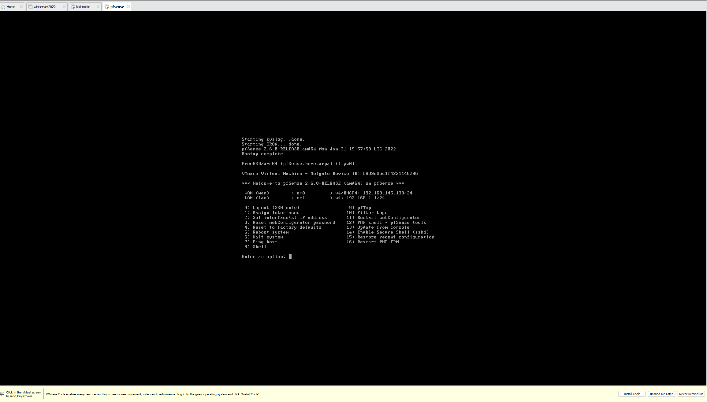

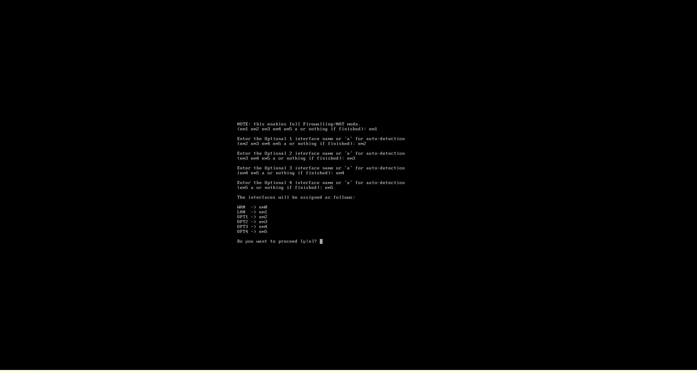

Each interface on pfSense was configured with distinct IP settings to manage the traffic flow and provide network services:
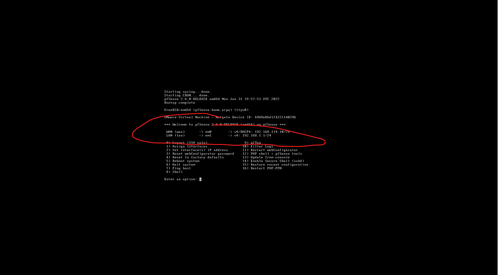

| pfSense Interface | IP Address | DHCP Enabled? | DHCP Range |
|-------------------|------------|---------------|------------|
| WAN (em0) | 192.168.114.10 (auto) | No (Acquired from host) | N/A |
| LAN (em1) | 192.168.1.254 | Yes | 192.168.1.10 - 192.168.1.253 |
| SPAN (em2) | No IP Address | No | N/A |
| Kali (em3) | 192.168.3.254 | Yes | 192.168.3.10 - 192.168.3.253 |
| SecOnion (em4) | 192.168.4.254 | Yes | 192.168.4.10 - 192.168.4.253 |
| Splunk (em5) | 192.168.5.254 | Yes | 192.168.5.10 - 192.168.5.253 |

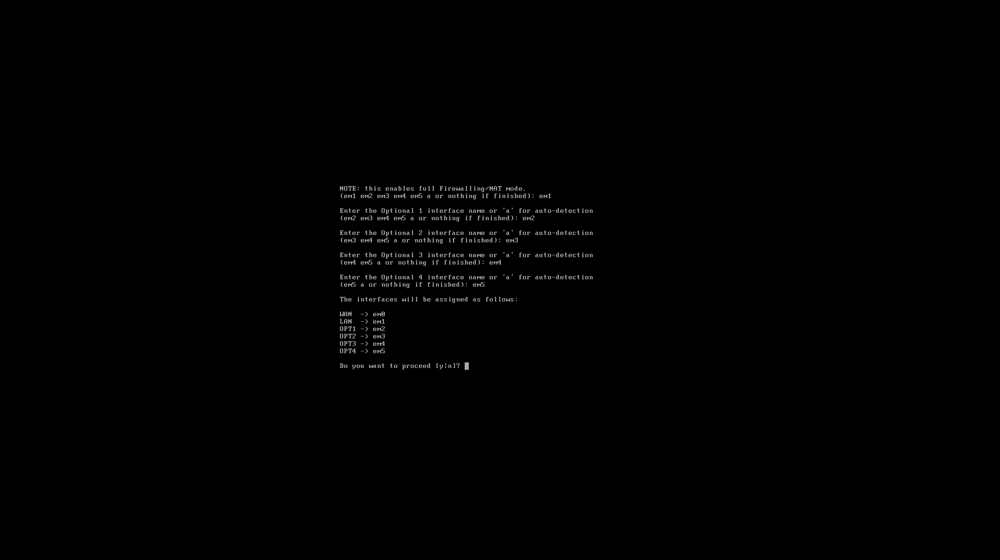
*NAT Interface Assignment*

The following table gives further details about the schema

| Network Segment | Subnet | PfSense Interface | VMware Adapter | Purpose |
|-----------------|--------|-------------------|----------------|---------|
| External (WAN) | 192.168.114.0/24 | em0 | Network Adapter (NAT) | Internet simulation |
| Internal LAN | 192.168.1.0/24 | em1 | Network Adapter 2 (VMNet2) | Corporate network |
| SPAN Port | No IP Address | em2 | Network Adapter 3 (VMNet3) | Traffic mirroring |
| Attacker | 192.168.3.0/24 | em3 | Network Adapter 4 (VMNet4) | Offensive tools |
| Security Onion | 192.168.4.0/24 | em4 | Network Adapter 5 (VMNet5) | Log collection |
| Splunk | 192.168.5.0/24 | em5 | Network Adapter 6 (VMNet6) | Log analysis |

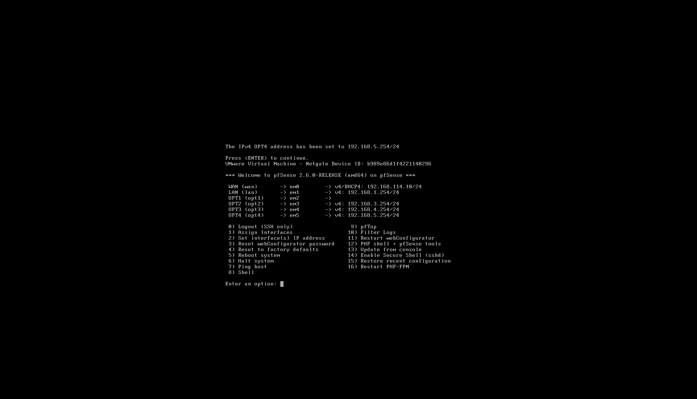

#### Initial WAN Interface Issue and Resolution

Upon initial configuration, the WAN interface (Network Adapter 1) did not acquire an IP address. This was traced to the VMware NAT service being stopped on the host machine. The issue was resolved by restarting the VMware NAT service, allowing the WAN interface to obtain an IP address of 192.168.114.10/24. This IP address was dynamically assigned by the host system, enabling the pfSense VM to connect to external networks.

**WAN (em0):** This is the external-facing interface, configured to receive its IP address from the host system via VMware’s NAT.
**LAN (em1):** Acts as the primary internal network interface, with DHCP enabled to allocate IP addresses between 192.168.1.10 and 192.168.1.253 for connected devices.
**SPAN (em2):** Configured without an IP address, this interface is used for traffic mirroring, allowing network monitoring tools to analyze and capture packets without being part of the routed network. Traffic from LAN will be sent to the Security Onion using the span.
**Kali (em3):** Connected to a network segment for the Kali Linux VM, with DHCP providing IPs within the 192.168.3.x range.
**SecOnion (em4):** Used for the Security Onion environment, a network monitoring and intrusion detection system, with its own DHCP pool in the 192.168.4.x range.
**Splunk (em5):** Configured for a Splunk instance to analyze and visualize logs, with DHCP allocating IPs in the 192.168.5.x range.

**Web Configurator Access:** The pfSense web configurator can be accessed by navigating to *<http://192.168.1.254>.* This allows administrators to make real-time adjustments to the pfSense configuration from within the internal network.

#### SPAN Interface Purpose

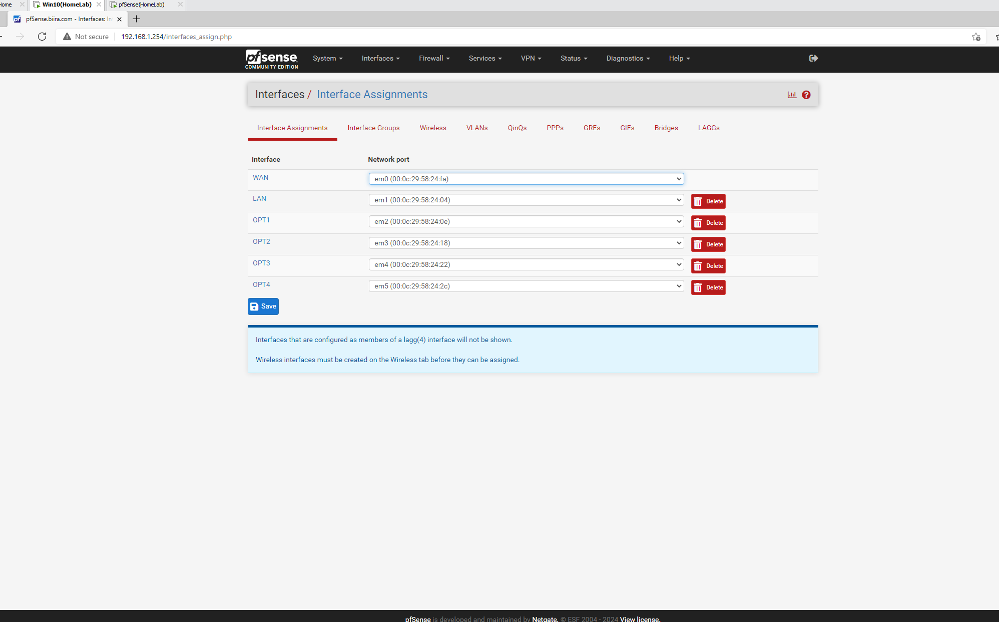
*Interface Naming in pfSence*

The SPAN (Switched Port Analyzer) interface is configured without an IP address to function solely as a traffic mirror. This setup allows it to replicate network traffic to monitoring systems for inspection and analysis, enhancing the lab’s capability for security auditing and troubleshooting.

This configuration of pfSense with multiple network adapters mapped to VMware virtual networks creates a versatile and secure lab environment. The segmentation into dedicated subnets allows each connected virtual machine to interact as needed while maintaining strong security boundaries and enabling detailed traffic analysis through the SPAN interface.

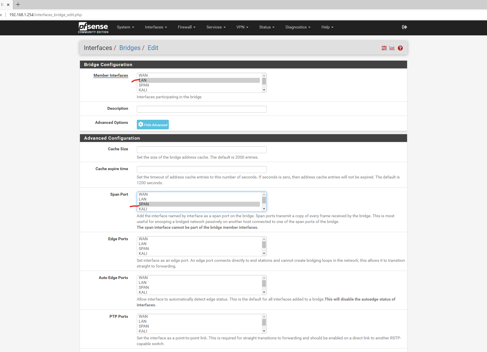
*Configuring Span*

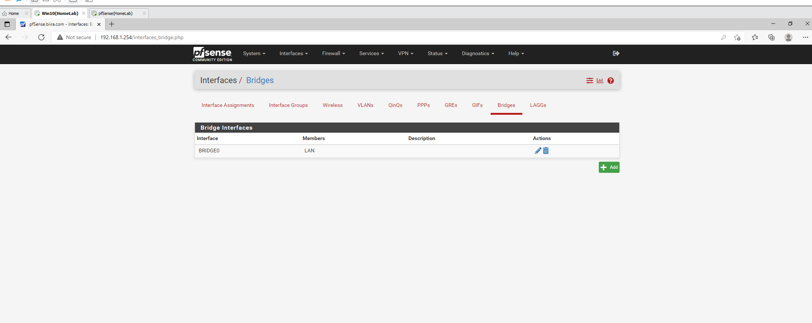
*Creating the Brige for Span*

#### Firewall Rules Configuration in pfSense

In a lab environment, it is often necessary to configure firewall rules that allow flexibility for testing and monitoring network interactions without restrictions. For this reason, permissive firewall rules were created on pfSense to ensure seamless communication across different network segments. Below is a detailed breakdown of the rules applied to the various interfaces.

#### 1. **WAN Interface Rules**

- **Configuration**: A rule was created to allow all inbound and outbound traffic on the WAN interface.
- **Purpose**: This setup facilitates unrestricted external connectivity for the lab, ensuring that test environments requiring internet access or communication with external services can do so without hindrance.
- **Security Note**: Allowing all traffic on the WAN interface is highly insecure for production environments. In real-world scenarios, WAN rules should be tightly controlled to permit only essential traffic to prevent unauthorized access and potential threats.
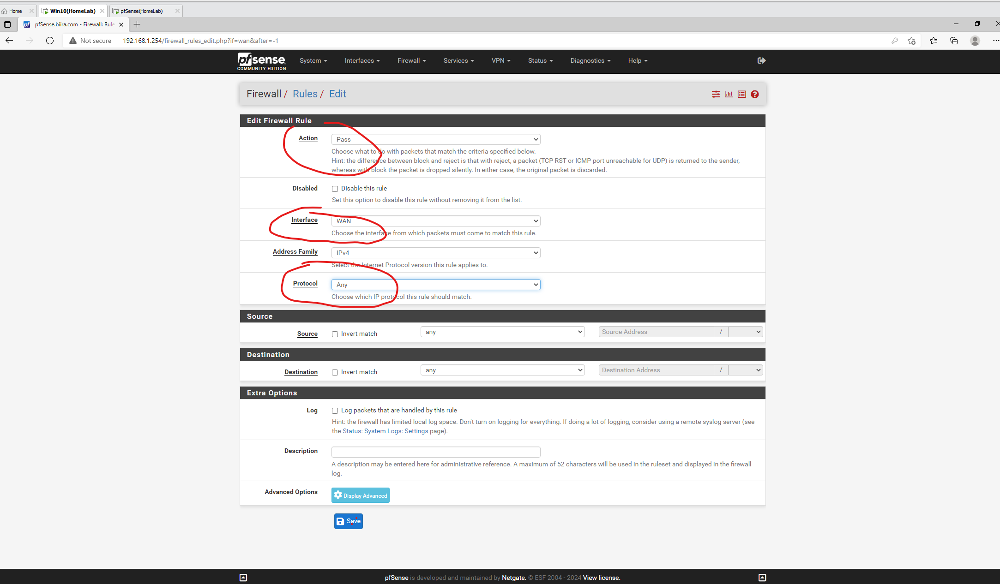
   *WAN Interface Rules*

#### 2. **LAN Interface Rules**

- **Configuration**: Similar to the WAN interface, the LAN interface was configured with a rule allowing all traffic.
- **Purpose**: This approach simplifies communication between connected devices on the LAN network, making it easier to test services, applications, and network flows without facing connectivity issues.
- **Security Consideration**: For production networks, this rule should be modified to include only specific allowed traffic to protect sensitive data and systems. Best practices involve defining rules that limit access based on IP address, port, and protocol.
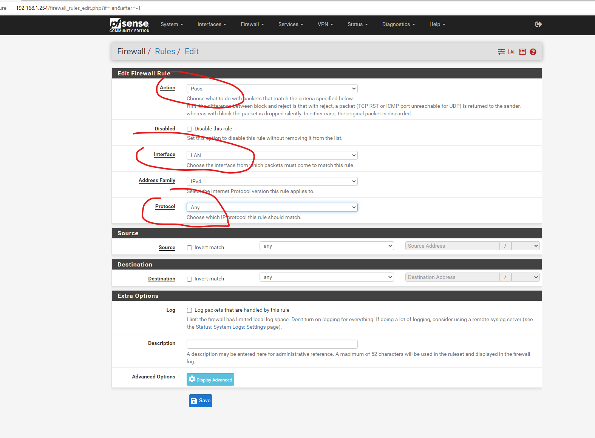
  *LAN Interface Rule*
  
#### 3. **Rules for Other Interfaces (e.g., Kali, SecOnion, Splunk)**

- **Configuration**: Each of the other interfaces (em3, em4, em5) was set up with rules allowing all traffic.
- **Purpose**: These permissive rules ensure smooth traffic flow across the entire lab environment, which is vital when testing network monitoring, intrusion detection systems (e.g., Security Onion), or log analysis tools (e.g., Splunk). Full traffic access enables comprehensive testing of security configurations, network performance, and data flow analysis.
- **Security Consideration**: While such open rules are acceptable in isolated lab environments, they pose significant security risks if used in production. In practical applications, these rules should be restricted to allow only necessary traffic. For instance, limiting traffic to specific sources, destinations, or service ports can help minimize exposure to potential security threats.

#### Best Practices for Production Use

- **Restrict Traffic**: Replace permissive "allow all" rules with rules that define specific sources, destinations, and allowed services.
- **Use Firewall Aliases**: To simplify rule management, use aliases to group IP addresses or networks and apply rules efficiently.
- **Enable Logging**: Activate logging for critical rules to monitor and analyze traffic patterns for potential issues or unauthorized access attempts.
- **Regular Review**: Periodically review and update rules to adapt to changing security requirements and network structures.

### Windows 10 Installation and Configuration

A Windows 10 virtual machine (VM) was installed and connected to VMNet2, which represents the internal LAN segment managed by the pfSense router. This setup serves to validate the network configuration and simulate a typical client environment within the lab.


#### Network Configuration and IP Assignment

- **DHCP Assignment:** The Windows 10 VM successfully received an IP address of 192.168.1.10 from the DHCP server configured on the pfSense LAN interface (em1). This automatic IP assignment confirms that the pfSense DHCP service is functioning as expected and properly managing the 192.168.1.x network.

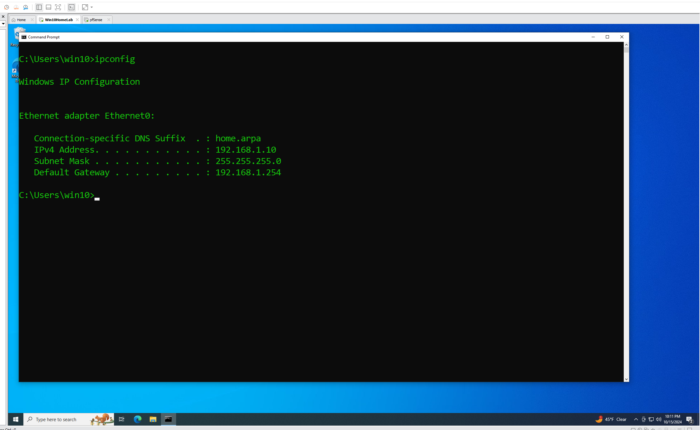
*IP Assigned Automatically*

- **Subnet Details:** The LAN interface, em1, is set up with an IP address of 192.168.1.254, acting as the default gateway for devices within this subnet in pfSence.
  
**Client Machine Role and Connectivity**
**Purpose**: The Windows 10 VM acts as a client machine on the internal network, enabling various use cases such as:

- **Accessing Network Resources:** Testing connectivity to other devices and services in the lab.
- **Network Configuration Testing**: Verifying that the internal network is properly segmented and isolated from other network interfaces.
- **Application Testing:** Simulating user interaction with applications hosted within the lab.

### Kali Linux Installation and Configuration

Kali Linux, a widely-used open-source tool for penetration testing and security evaluations, was installed and configured in the lab environment to mimic an attacker’s perspective. This setup enables realistic testing of security defenses, helping to identify vulnerabilities and assess the effectiveness of protective measures

#### **Network Configuration**

- **Assigned Interface**: The Kali Linux VM was connected to **VMNet4**, creating a dedicated network segment.
- **IP Address Range**: The `192.168.3.0/24` network was configured for this segment, managed by pfSense.
- **Kali Machine IP Address**: The VM was assigned a static IP of `192.168.3.10`, ensuring consistency for testing scenarios.
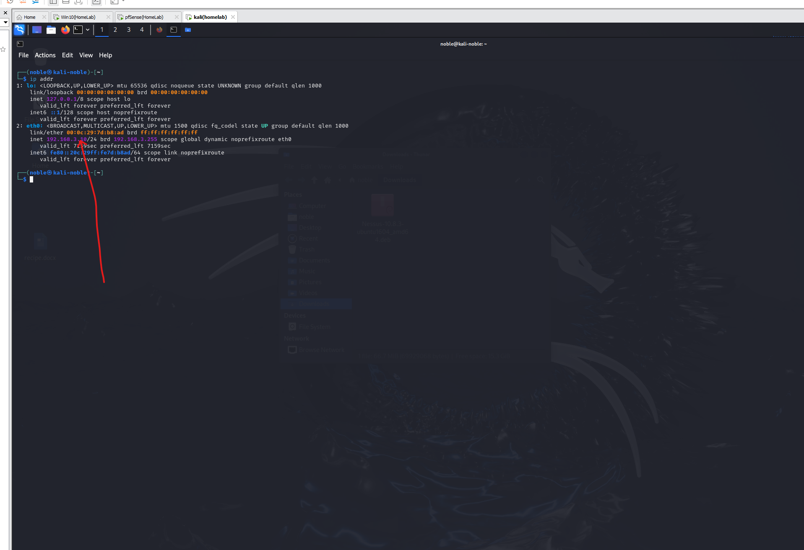

#### **Internet Connectivity**

The pfSense firewall was configured to allow the Kali Linux instance to access the internet. This connectivity is essential for:

- **System Updates**: Keeping the Kali Linux distribution and its tools up to date.
- **Tool Downloads**: Installing additional security tools required for penetration testing and advanced assessments.
- **External Resource Access**: Simulating real-world attacker behaviors that rely on external connectivity.

#### **Purpose and Use in the Lab Environment**

The inclusion of Kali Linux serves several important roles in the lab setup:

- **Attacker Simulation**: Placing Kali Linux in its own network segment (`VMNet4`) simulates an external or isolated attacker's position. This helps test how well the internal network and other systems respond to potential security threats.
- **Penetration Testing**: Kali Linux is equipped with numerous tools for vulnerability scanning, network discovery, password attacks, and exploitation. It can be used to evaluate the robustness of the security measures in place within the lab.
- **Security Assessments**: Administrators can use Kali to perform controlled tests on other network segments (such as those hosting Security Onion or Splunk) to verify their monitoring, detection, and response capabilities.

### Metasploitable 2 Setup and Configuration

**Metasploitable 2** is an intentionally vulnerable Linux distribution used for testing and learning about security vulnerabilities and exploitation techniques. Its inclusion in the lab provides a safe environment for practicing penetration testing and enhancing cybersecurity skills.

#### Network Configuration

- **Assigned Interface**: The Metasploitable 2 VM was connected to **VMNet2**, which represents the **Internal Network/LAN** segment.
  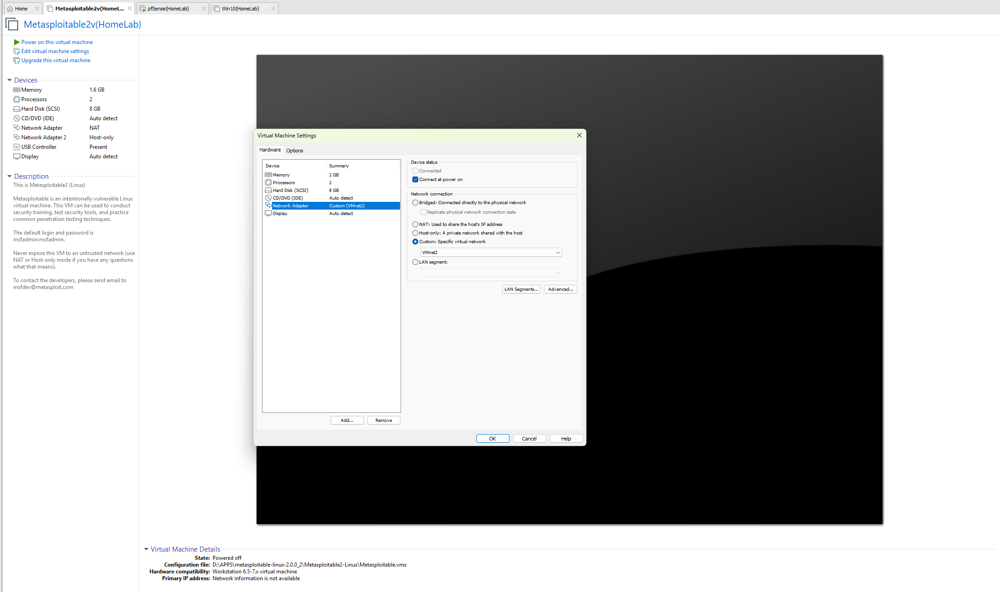
  
  *Metaspoitable 2 in VMNet2*
  
- **IP Assignment**: The machine was automatically assigned an IP address of `192.168.1.11` by the pfSense DHCP server, confirming proper integration with the network and connectivity to other lab devices.
- **Default Login Credentials**:
  - **Username**: `msfadmin`
  - **Password**: `msfadmin`
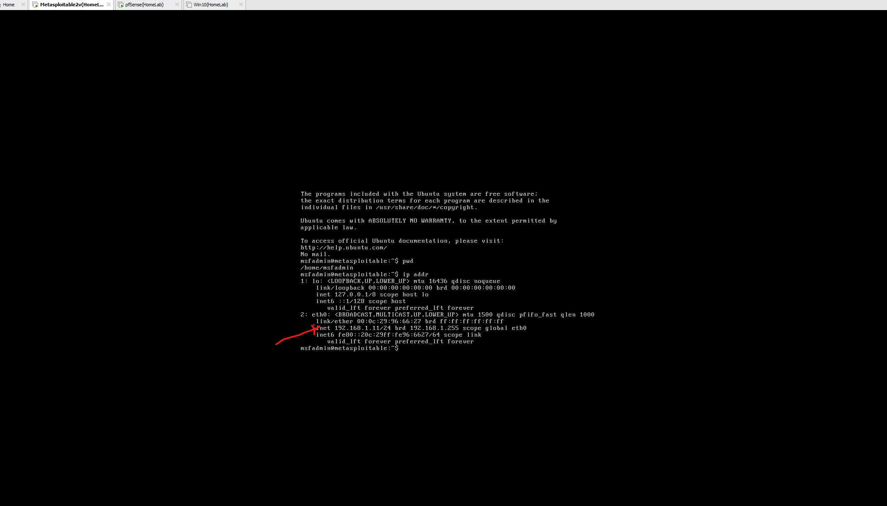
*Auto Assigned IP*

#### **Accessing the Metasploitable 2 Interface**

The **Metasploitable 2 web interface** can be accessed through a web browser at `http://192.168.1.11`. This interface provides access to various vulnerable services and applications, including:

*GUI of Metasploitable 2*

- **Damn Vulnerable Web App (DVWA)**: A PHP/MySQL web application designed to help security professionals and enthusiasts practice common web vulnerabilities, such as SQL injection, XSS (cross-site scripting), and command injection.
- 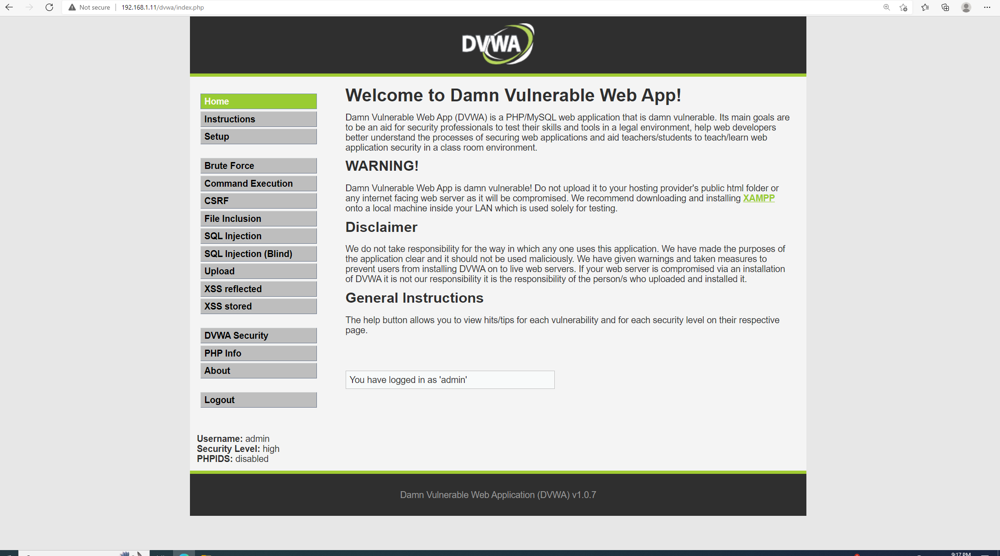
  *Damn Vulnerable Web App Interfcae*

#### **Purpose and Use in the Lab**

The installation and configuration of Metasploitable 2 serve multiple purposes within the lab environment:

- **Realistic Exploitation Scenarios**: Provides a practical target for security testing, allowing the use of tools like **Kali Linux** for launching simulated attacks and evaluating potential vulnerabilities.
- **Vulnerability Assessments**: Users can perform in-depth scans and analysis using various security tools (e.g., **Nmap**, **Metasploit Framework**) to identify weaknesses and explore exploitation techniques.
- **Training and Learning**: Offers a controlled platform for practicing ethical hacking, developing custom scripts for testing, and understanding how different vulnerabilities can be exploited and remediated.

### Security Onion Installation and Configuration

**Security Onion** is a powerful, open-source Linux distribution optimized for network security monitoring, intrusion detection, and threat hunting. Tailored for cybersecurity professionals, it aggregates multiple advanced tools into a cohesive environment to aid in the proactive detection, monitoring, and response to cyber threats across both network and endpoint layers. Security Onion’s comprehensive suite of pre-configured security tools supports network traffic analysis, alerting, endpoint monitoring, and log management.

#### Key Components of Security Onion

1. **Intrusion Detection Systems (IDS)**:
   - **Snort** and **Suricata**: Security Onion includes both Snort and Suricata as IDS options, each capable of deep packet inspection to identify malicious behavior in network traffic. These tools use signature-based and anomaly-based detection methods, ensuring real-time alerts and detection for a range of attack types.
   - **Signature Management**: Automatically updates signatures from community and proprietary sources, improving detection accuracy and threat identification.

2. **Network Traffic Analysis (NTA)**:
   - **Zeek (formerly Bro)**: Zeek’s powerful NTA capabilities provide comprehensive network session analysis, logging metadata about every session on the network. It enables detection of unusual behaviors such as protocol misuse, unauthorized access attempts, and suspicious connections.
   - **Behavioral Analysis**: Through protocol analysis, Zeek creates a detailed record of network behaviors, which assists in identifying deviations from normal patterns, indicative of potential security incidents.

3. **Log Management and Analysis**:
   - **Elasticsearch, Logstash, and Kibana (ELK Stack)**: Security Onion integrates the ELK stack to facilitate the collection, parsing, and indexing of logs from multiple sources, including network traffic, firewall logs, and endpoint activity.
   - **Log Aggregation**: Logstash efficiently aggregates logs from diverse sources, creating a centralized data repository that aids in correlation, query execution, and log analysis.
   - **Data Visualization**: Kibana’s intuitive dashboard offers robust visualization capabilities, allowing security teams to filter, search, and explore the data for quick insights and incident investigation.

4. **Alert Management and Visualization**:
   - **Kibana Dashboards**: Pre-built Kibana dashboards allow for visualization and management of alerts generated by IDS, NTA, and endpoint monitoring tools. These customizable dashboards support filtering by IP, event type, and severity to help identify and investigate threats.
   - **The Hive Integration**: For advanced incident response, Security Onion can be integrated with The Hive, a powerful open-source incident response platform. The Hive enhances Security Onion’s capabilities by enabling case management, collaboration, and threat intelligence integration for effective incident handling.

5. **Endpoint Monitoring and Host-Based IDS (HIDS)**:
   - **OSSEC/Wazuh**: Security Onion incorporates either OSSEC or Wazuh, host-based intrusion detection systems that monitor endpoint behaviors. These tools collect data on file integrity, rootkit detection, Windows logon/logoff events, and registry modifications, providing continuous endpoint visibility.
   - **Agent-Based Monitoring**: OSSEC/Wazuh agents monitor endpoint integrity and report critical events back to the server for further analysis, helping to detect and respond to endpoint-based anomalies.

6. **Full Packet Capture and Forensic Analysis**:
   - **NetworkMiner and Wireshark**: Security Onion supports full packet capture, providing forensic capabilities for post-incident analysis. NetworkMiner and Wireshark help examine packet data in detail, assisting in malware analysis, protocol inspection, and timeline reconstruction during incident response.
   - **pcap Storage and Analysis**: Full packet capture capabilities enable long-term storage of network data, supporting in-depth forensic analysis of historical network activity to identify the extent of potential breaches.

7. **Threat Hunting and Automation**:
   - **Sigma and Yara Rules**: Security Onion supports custom rule sets from Sigma (for log event detection) and Yara (for binary and file pattern matching) to enable proactive threat hunting and indicator-based detection.
   - **SOC Analyst Workbench**: The analyst workbench provides utilities for manual and automated analysis workflows, allowing for faster data correlation and threat investigation.

8. **Additional Integrations and Add-ons**:
   - **Moloch (Arkime)**: An open-source, large-scale packet capturing and indexing system that provides the ability to search and visualize packet captures efficiently. Arkime can be integrated with Security Onion to enhance packet data analysis.
   - **FleetDM and Osquery**: For advanced endpoint visibility, integrating FleetDM and Osquery provides powerful querying and monitoring capabilities, allowing security teams to perform queries across multiple endpoints in real time.
   - **Cortex**: Often used in conjunction with The Hive, Cortex enables automated analysis and enrichment of observables (such as IPs, domains, and hashes) against threat intelligence feeds.
   - **Open Threat Exchange (OTX) Integration**: Security Onion can leverage threat intelligence from AlienVault’s OTX, incorporating real-time threat data and correlation capabilities to enhance detection accuracy.

9. **Incident Response and Case Management**:
   - **Playbook Automation**: Automated playbooks can be created to streamline incident response activities, including alerting, threat validation, containment, and escalation.
   - **SOAR Capabilities**: Security Onion can be integrated with Security Orchestration, Automation, and Response (SOAR) tools for automated response actions, further enhancing incident handling capabilities.

#### **Network Configuration Overview**

- **Management Interface (ens160)**: Configured with a static IP of `192.168.114.5`, connected to the NAT network. This interface handles administrative tasks and provides access to the Security Onion web interface.
  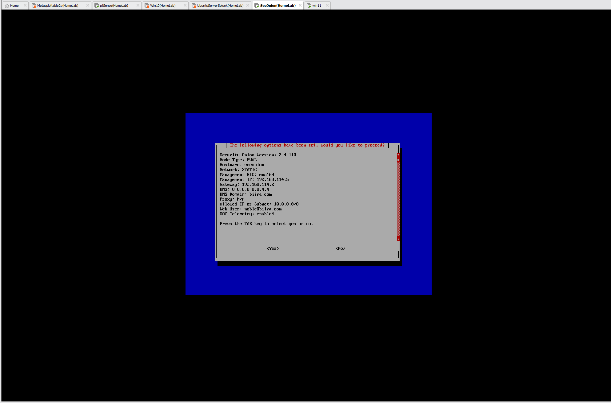
  *SecurityOnion Interfaces*

- **Mirror Interface**: Connected to **VMNet3**, designated for capturing mirrored traffic. This interface monitors and inspects network traffic from the LAN(VMNet2)  segment of the lab setup, simulating real-world intrusion detection scenarios.
- **Network Interface Configuration**: This interface was connected to pfSense solely to obtain an IP address on VMnet 5.

#### **Initial Setup and Configuration**

1. **Management Interface IP Assignment**:
   - **Static IP**: `192.168.114.5`
   - **Gateway**: `192.168.114.2`
   - **DNS Domain**: Set to `biira.com` for network identification and testing purposes.
2. **Web Interface Access**:
   - **URL**: `https://192.168.114.5/`
   - **Username**: `noble@biira.com` for login and administration.
3. **System Updates**:
   - The `sudo soup` command was run to apply the latest patches and enhancements, ensuring that Security Onion is up to date and fortified against known vulnerabilities.

#### Security Onion Installation and Troubleshooting in the Threat Detection and Monitoring Lab

After completing the installation of **Security Onion** , I faced an issue when attempting to access the web interface. The management interface was configured with the IP address **192.168.114.5**, and I had set the network to **NAT** to share IPs between the VM and my host machine.


#### Initial Connectivity Check

I verified network connectivity by **pinging** the Security Onion instance from my host machine. The ping was successful, confirming that the VM and the host were on the same network and communicating correctly. Despite this, accessing the web interface via `https://192.168.114.5/` was unsuccessful.

#### Service Status Check: Ensuring System Health

To investigate further, I ran the following command to check the status of Security Onion services:

```bash
sudo so-status
```

The output confirmed that all core services were running properly, which indicated that the system itself was functioning correctly and there were no underlying service-related issues. Below is an example of the `so-status` output indicating operational services.

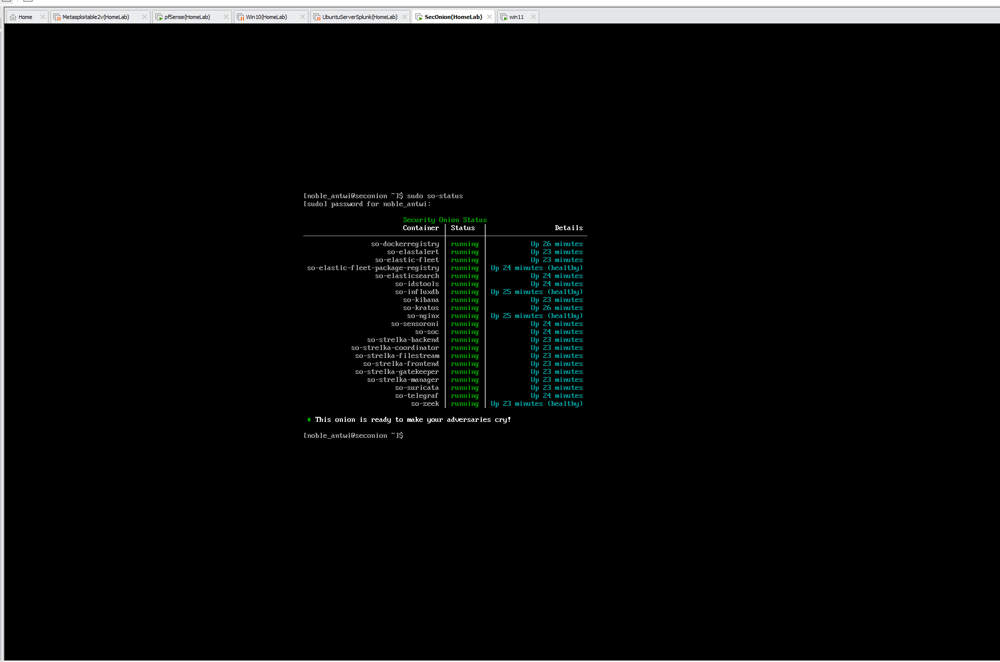

#### Investigating Firewall Configuration

Suspecting the issue was related to firewall settings, I reviewed the configuration. I attempted to use the **so-allow** command to add my host machine’s IP to the firewall whitelist. However, in **Security Onion version 2.4.110-20241010**, the **so-allow** command was not supported.

To view the current firewall rules, I ran:

```bash
sudo iptables -nvL
```

This command provided detailed information on the firewall configuration and confirmed that the access to the management interface was restricted. The `iptables` output showed which IPs were allowed to communicate with the system.

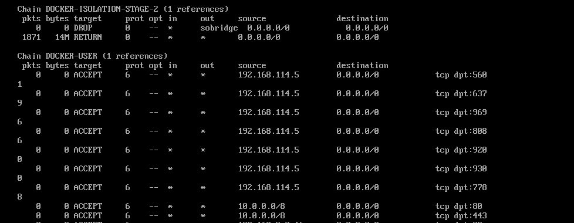
*iptables output showing firewall rules*

#### Resolving the Issue: Modifying Firewall Rules

To grant access to the web interface, I modified the firewall rules using the **so-firewall** command to include a broader IP range:

```bash
sudo so-firewall includehost analyst 192.168.0.0/16
sudo so-firewall apply
```


*Updated IP Rules*

After applying these changes, I could successfully access the Security Onion web interface from my **Windows 10 machine** with the IP **192.168.1.10**. The image below shows the Security Onion GUI after successful access.

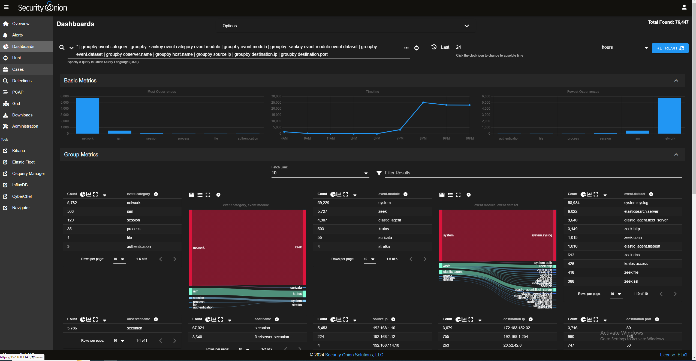
*SecurityOnion GUI*

This troubleshooting process highlights the importance of checking both service status and firewall configurations when diagnosing connectivity issues. By modifying the firewall rules with `so-firewall`, I enabled the necessary access to the Security Onion management interface, ensuring the lab environment's functionality and readiness for further security monitoring and analysis.

#### **Firewall Configuration**

The initial configuration allowed a broad IP range (`192.168.0.0/16`) to facilitate testing across various network segments. This approach was suitable for initial setup and verification but was refined for better security:

- **Final Restriction**: Access was limited to the host machine's IP (`192.168.114.1`) for improved security. This ensures that only the host can reach the Security Onion management interface.
  
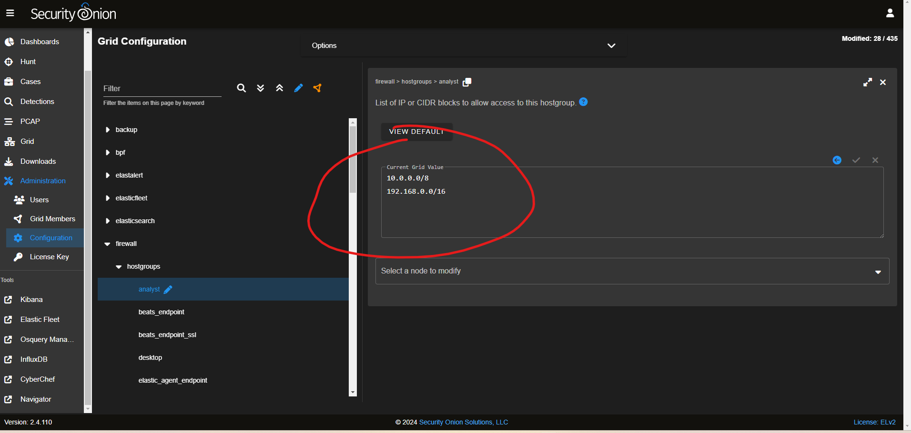
*Initial Configuration Setup*

- **Configuration Path**: The final firewall adjustments were made using the Security Onion GUI:
  - **Navigation**: `Administration > Configuration > Firewall > Hostgroup > Analyst`
  - **Hostgroup**: The access group was updated to include only the host IP of `192.168.114.1`.

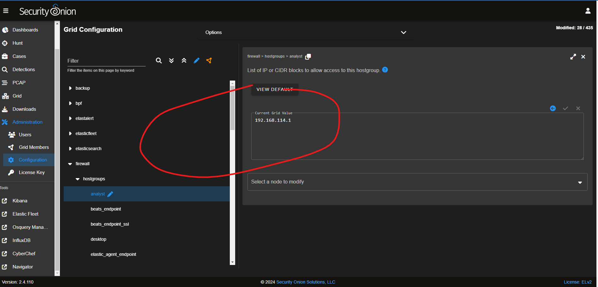
  *Final Configuration Setup*

#### **Role in the Lab Environment**

- **Network Traffic Monitoring**: The mirror interface captures packets, enabling real-time analysis of network activity. This feature helps identify anomalies and potential threats within the internal lab network.
- **Intrusion Detection**: Security Onion integrates with tools like Suricata and Zeek to provide comprehensive intrusion detection capabilities, highlighting suspicious activities and generating alerts.

### Active Directory Environment Setup

Active Directory (AD) is a directory service developed by Microsoft for Windows domain networks. It organizes and manages network resources like users, computers, and permissions, allowing administrators to control access to data and applications securely. AD uses a centralized structure to store information, making it easier to manage users and devices across an organization and enforce security policies.

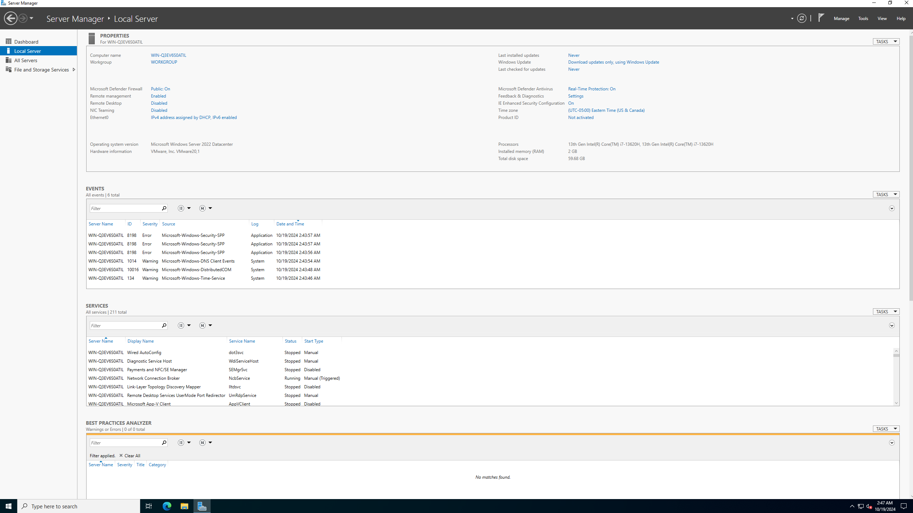

#### 1. **Windows Server 2022 Installation and Configuration**

Windows Server 2022 was installed on a virtual machine (VM) and placed within the internal network (VMnet2) for the cybersecurity home lab. The lab architecture is designed to replicate real-world scenarios with multiple subnets and network segments, as outlined in the following table:

| IP Subnet        | Network Connection | Role       | pfSense Interface | VMware Adapter   |
|------------------|--------------------|------------|-------------------|------------------|
| 192.168.114.0/24 | NAT                | WAN        | em0               | Network Adapter  |
| 192.168.1.0/24   | VMnet2             | LAN        | em1               | Network Adapter 2|
| 192.168.3.0/24   | VMnet4             | KALI       | em3               | Network Adapter 4|
| 192.168.4.0/24   | VMnet5             | SECONION   | em4               | Network Adapter 5|
| 192.168.5.0/24   | VMnet6             | SPLUNK     | em5               | Network Adapter 6|

Initially, the server was configured to obtain an IP address dynamically via the pfSense DHCP server. However, to ensure consistency and reliable network performance in a production environment, a static IP configuration was applied to the server:

- **Static IP Address**: 192.168.1.1
- **Subnet Mask**: 255.255.255.0
- **Default Gateway**: 192.168.1.254 (pfSense LAN interface)
- **Primary DNS**: 192.168.1.1 (self-referential for Active Directory DNS)
- **Secondary DNS**: 8.8.8.8 (Google DNS for fallback)

To simulate a vulnerable testing environment, the following security measures were deliberately disabled on the server:

- Windows Firewall was turned off.
- Windows Defender and other built-in security features were disabled.
- 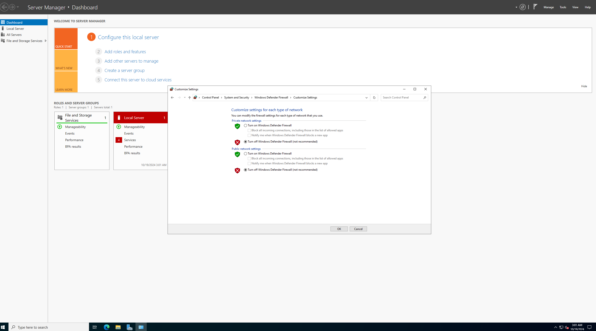

The server was renamed "srv1" to reflect its role as the primary domain controller (DC), and a reboot was performed to apply these changes.

#### 2. **Active Directory Domain Services (AD DS) Setup**

Active Directory Domain Services (AD DS) was installed using the Server Manager's "Add Roles and Features" wizard. Following the installation, the server was promoted to a domain controller with the following configuration:

- **Root Domain Name**: biira.com
- **Forest Functional Level**: Windows Server 2016
- **Domain Functional Level**: Windows Server 2016
- **Domain Controller Options**:
  - **DNS Server**: Installed and configured automatically.
  - **Global Catalog**: Enabled.
  - **Read-only Domain Controller (RODC)**: Not selected.
  
  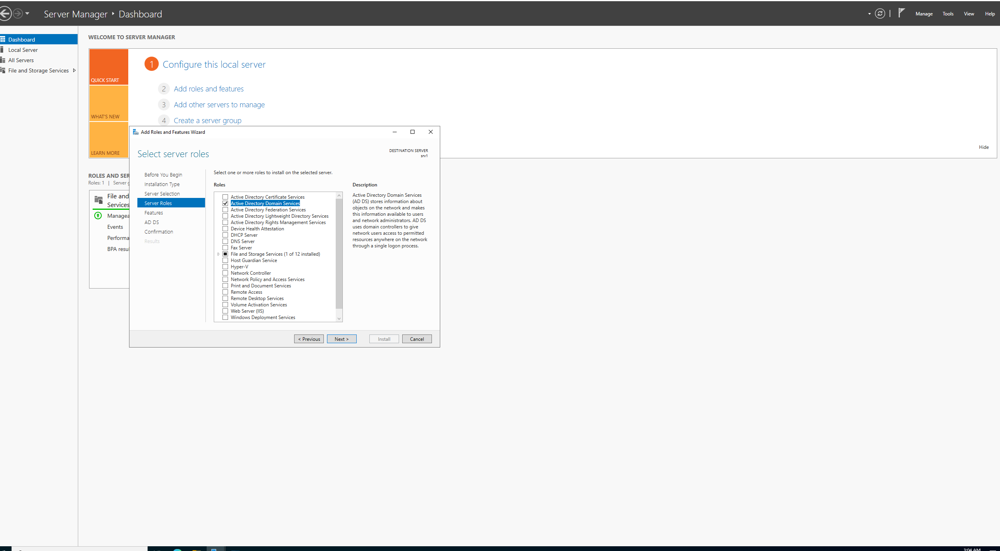

  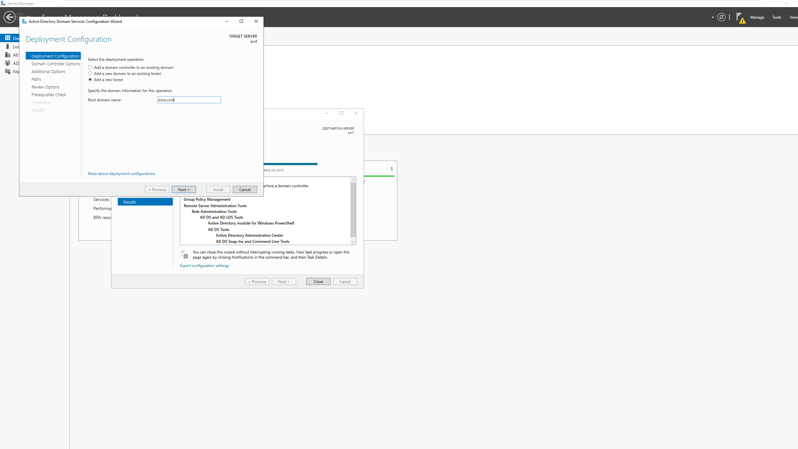

A Directory Services Restore Mode (DSRM) password was set to ensure the ability to recover from potential AD corruption or other disaster scenarios.

Additionally, the NetBIOS domain name was automatically set to **BIIRA**, derived from the full domain name **biira.com**. The default paths for the NTDS database and SYSVOL share were accepted:

- **NTDS Database Path**: C:\Windows\NTDS
- **Log Files Path**: C:\Windows\NTDS
- **SYSVOL Path**: C:\Windows\SYSVOL
  
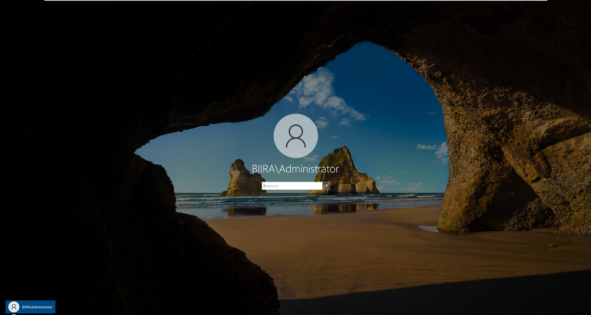

#### Reverse DNS Lookup Configuration

  Below is an illustration of Reverse DNS lookup configuration.
<video controls src="files/videos/2Configuringdnsreverselookup(4).mp4" title="DNS Reverse Lookup Setup"></video>

#### 3. **Creating and Managing Users and Groups**

Once the server was successfully promoted to a domain controller, an Organizational Unit (OU) named **CyberMonitoringLab** was created within Active Directory to organize domain objects for lab-specific configurations and testing. Under this OU, groups and users were created to simulate a typical organizational structure, providing a realistic environment for testing.

#### Implementing Vulnerable Active Directory

To create a realistic testing environment for cybersecurity scenarios, the Active Directory environment was deliberately made vulnerable using a script from a public GitHub repository. This approach allows for the rapid deployment of a complex, insecure AD structure that mimics real-world misconfigurations.

The vulnerability script was downloaded and executed using PowerShell with the following commands:

```powershell
IEX((new-object net.webclient).downloadstring("https://raw.githubusercontent.com/wazehell/vulnerable-AD/master/vulnad.ps1"));
Invoke-VulnAD -UsersLimit 100 -DomainName "biira.com"
```

This script, named `vulnad.ps1`, is designed to create a vulnerable AD environment automatically. The `Invoke-VulnAD` function was called with specific parameters:

- `UsersLimit 100`: This parameter sets the number of fake user accounts to be created.
- `DomainName "biira.com"`: This specifies the domain name for the vulnerable AD environment.

Below is the video demonstration during the running of the script to make the domain controller vulnerable to attacks.

<video controls src="files/videos/3Runningvulnearblescript(1).mp4" title="Running Script to Introduce Vulnearability"></video>

The script likely implemented several types of misconfigurations commonly found in real-world Active Directory environments, such as:

1. Weak Password Policies
2. Excessive Privileges
3. Misconfigured Group Policies
4. Insecure Service Accounts
5. Kerberos Misconfigurations
6. Unsafe Delegations
7. Unpatched Systems
8. Clear-text Passwords
9. Weak ACLs
10. Trust Relationships

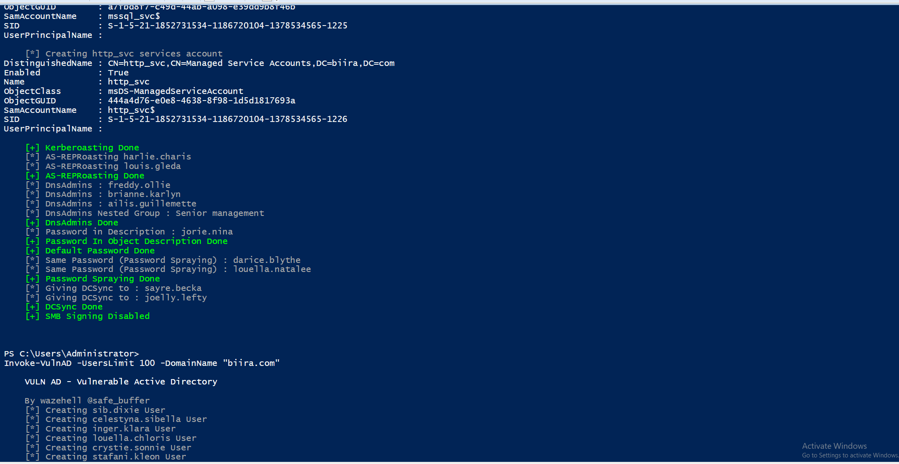


#### Potential Attack Vectors

The vulnerabilities introduced by the script open up several potential attack vectors that are commonly exploited in real-world scenarios:

1. **Password Spraying**: Attackers can attempt to gain access using common or weak passwords across multiple accounts.

2. **Privilege Escalation**: Misconfigured permissions allow attackers to elevate their privileges within the domain.

3. **Lateral Movement**: Weak segmentation and excessive permissions enable attackers to move laterally across the network.

4. **Kerberos Attacks**: Misconfigurations in Kerberos settings can be exploited for attacks like Golden Ticket or Silver Ticket.

5. **Domain Privilege Abuse**: Overly permissive settings on domain objects can be abused to gain domain admin rights.

6. **Group Policy Exploitation**: Misconfigured Group Policies can be leveraged to deploy malicious scripts or gain system access.

7. **Service Account Compromise**: Weak service account passwords or excessive permissions can be exploited for persistent access.

8. **NTLM Relay Attacks**: Misconfigured systems may allow for NTLM credential relay attacks.

9. **DCSync Attacks**: Improper AD replication permissions might allow unauthorized domain replication.

10. **Forest Trust Abuse**: Misconfigured forest trusts can be exploited to gain access across different domains.

This vulnerable Active Directory environment provides a rich testing ground for various attack scenarios and defensive strategies. It allows for practising on how to identify and exploit common AD misconfigurations, develop and test detection mechanisms for AD-based attacks, improve incident response procedures for AD compromise scenarios, and understand the impact of poor AD hygiene on overall network security.

### Joining a Windows 10 Client to the Domain

To complete the AD setup and integrate a client machine into the domain, the Windows 10 system was configured to join the **biira.com** domain. The steps for domain joining are outlined below:

1. I ensured the Windows 10 client is on the same network segment (VMnet2) as the domain controller, ensuring network connectivity.
2. Verify that the Windows 10 client can resolve the domain name **biira.com** using the domain controller as its DNS server.
3. I Change the computer name on the client machine to pc1.
   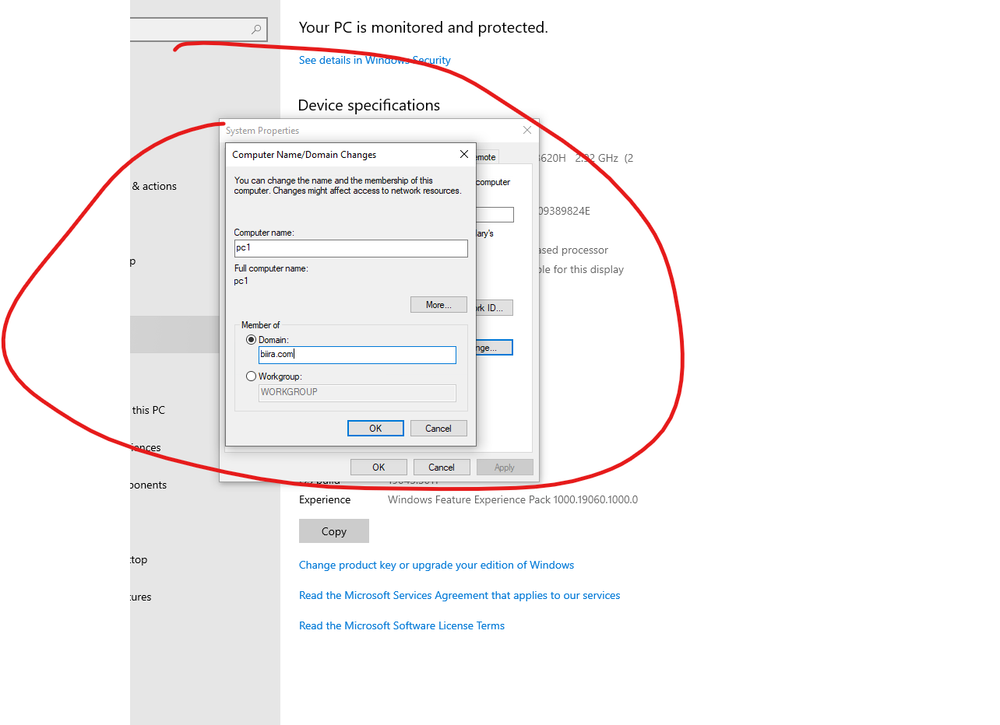
4. Join the domain by accessing the **System Properties** dialog (right-click **This PC > Properties > Change Settings > Change**).
5. I then entered the domain name **biira.com** and provide domain administrator credentials to authenticate the client machine into the domain.
   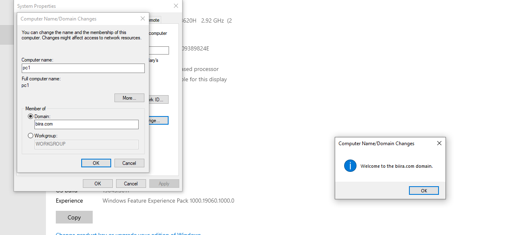
6. The machine was then restarted to complete the join
   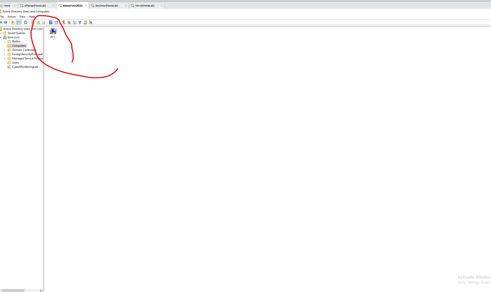.

After joining the domain, the Windows 10 client was able to authenticate against the domain controller, and domain resources were accessible based on the user’s permissions.

### Installing and Configuring Splunk on Ubuntu Server

Setting up Splunk in my **Threat Detection and Monitoring Lab** was a critical step for centralizing log management and enhancing visibility across the network. I deployed Splunk on an **Ubuntu Server** connected to the **192.168.5.0/24** network (VMNet6) to act as the main platform for log collection and analysis.

#### Ubuntu Server Configuration Journey

Initially, my Ubuntu Server was assigned a dynamic IP (`192.168.5.11/24`) by the **pfSense DHCP server**. The pfSense DHCP settings reserved IP leases starting from `192.168.5.10` to `192.168.5.253`, ensuring no conflicts with other services. For stability and ease of management, I reconfigured the server with a **static IP** (`192.168.5.1`), crucial for consistent communication with key infrastructure, including the **Domain Controller** at `192.168.1.1`.
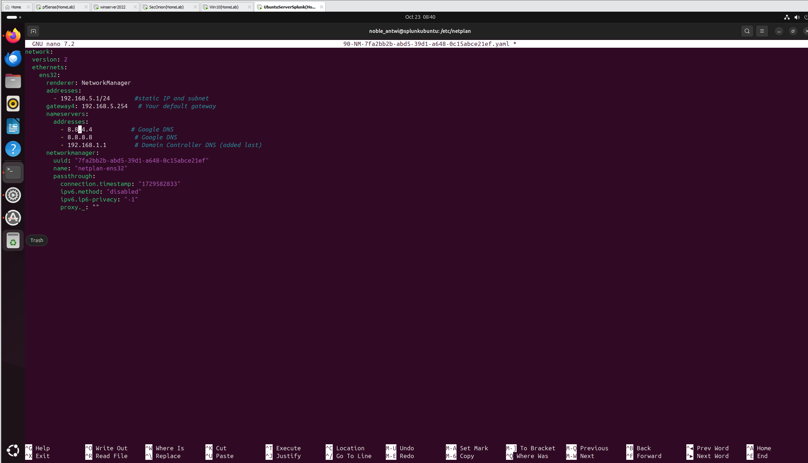
*Changing to a static IP address*

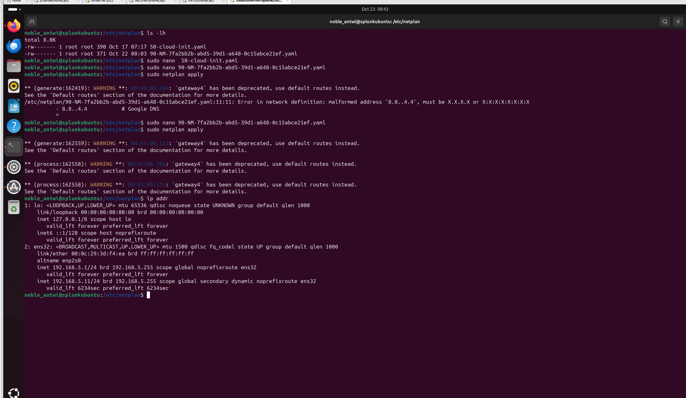
*Static IP Address Confirmed*

#### Installing Splunk: Step by Step

To set up Splunk, I used the following commands:

```bash
wget -O splunk-9.3.1-0b8d769cb912-linux-2.6-amd64.deb "https://download.splunk.com/products/splunk/releases/9.3.1/linux/splunk-9.3.1-0b8d769cb912-linux-2.6-amd64.deb"
sudo dpkg -i splunk-9.3.1-0b8d769cb912-linux-2.6-amd64.deb
```

#### Overcoming Installation Challenges

To make installation smoother, especially when copying and pasting commands, I installed the **Ubuntu Desktop GUI**:

```bash
sudo apt install ubuntu-desktop
```

This made the server environment more user-friendly for additional configurations.


#### Configuring Splunk for Auto-Start

To ensure Splunk would start automatically after reboots, I enabled the boot-start feature:

```bash
sudo /opt/splunk/bin/splunk enable boot-start
```

**Administrator Name**: `noble_antwi`

#### Starting Splunk and Web Interface Access

I launched Splunk for the first time with:

```bash
sudo /opt/splunk/bin/splunk start --accept-license
```

The web interface became accessible at `http://127.0.0.1:8000`. To maintain consistent log collection from devices like the **Domain Controller**, I ensured the server retained its static IP configuration (`192.168.5.1`).

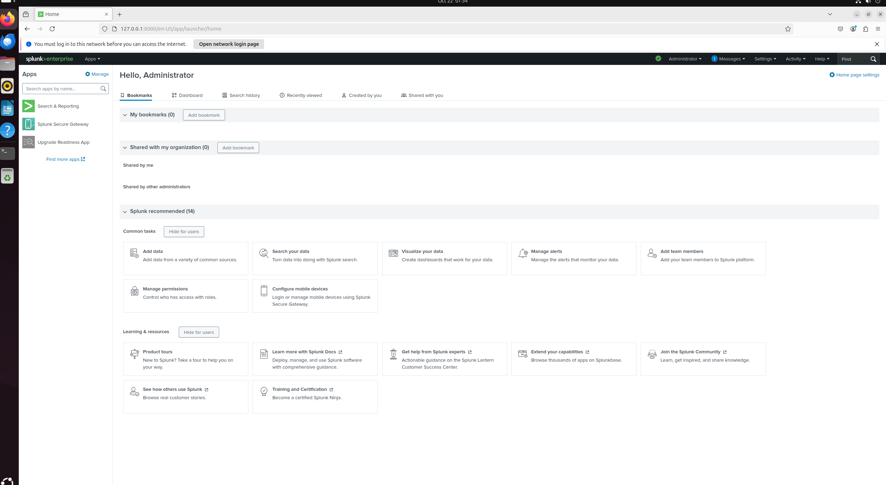
*Splunk Running on Ubuntu Server*

### Configuring the Domain Controller to Forward Logs to Splunk

The next step was to set up a Splunk Universal Forwarder on the **Domain Controller** (`192.168.1.1`) to send Windows logs to the Splunk instance for analysis. I downloaded **Splunk Universal Forwarder 9.3.1** for Windows from the [Splunk website](https://www.splunk.com/en_us/download/universal-forwarder.html#) and transferred the installation package to the Domain Controller.


*Donwloading Splunk Universak Forwader*

After completing the installation, I configured the `inputs.conf` file to specify which event logs should be sent to Splunk:

```powershell
[WinEventLog://Application]
disabled = 0

[WinEventLog://Security]
disabled = 0

[WinEventLog://System]
disabled = 0
```

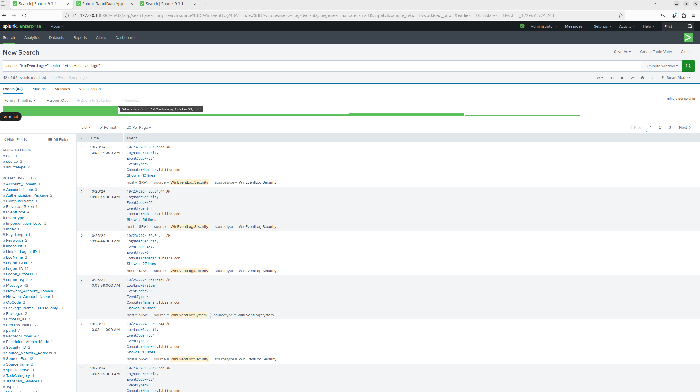
*Logs to Ingest*

This setup allowed the Domain Controller to forward **Application**, **Security**, and **System** logs to Splunk for in-depth analysis and monitoring.

 I also created a video tutorial showcasing the setup process step-by-step for better clarity.
 <video controls src="files/videos/Installing Splunk FOrwarder.mp4" title="Splunk Forwarder Configuration"></video>

## Security Testing and Vulnerability Simulation

The first test i carried out was to run an ICMP request on metasploitable 2. This also captued by securityOnion. The video explains further.

<video controls src="files/videos/Running Nmap Scans.mp4" title="Runnig Scans"></video>

### Runnung a Nessus Scan

Below a video demonstration of a nessus scan to view its capture in SecurityOnion
<video controls src="files/videos/Running Nessus Scan.mp4" title="Running Nessus Scans"></video>

### New Relic Integration

I used New Relic One agents on some hosts in teh lab setup to monitor perfromances. Watch video for a sneakpeak into the visuals

<video controls src="files/videos/New Relic Integration.mp4" title="NewRelic One Integratoin"></video>


## Conclusion

Completing this cybersecurity lab has been an enriching experience, offering deep insights into the complexities of network security, system hardening, and active threat detection. Through the implementation of tools like pfSense, Splunk, Security Onion, and Active Directory, I have gained a solid foundation in building, configuring, and maintaining secure environments that mimic real-world scenarios.

Looking ahead, this lab serves as a springboard for further projects aimed at enhancing my cybersecurity expertise. One major area of expansion will be connecting the existing Active Directory to Microsoft Entra ID using Entra ID Connect. This integration will enable testing of identity synchronization, conditional access policies, and multifactor authentication, bridging on-premises infrastructure with cloud identity solutions.

### Future plans include developing projects that involve:

**Automated Incident Response:** Implementing scripts and processes that detect and respond to threats in real-time.

**Threat Hunting:** Proactively searching for indicators of compromise using advanced analysis and data from monitoring tools.

**Red vs. Blue Team Scenarios:** Conducting simulated attack and defense exercises to bolster both offensive and defensive strategies.

**Cloud Security Practices:** Testing identity-based security measures and refining access management using Azure AD capabilities.

This project marks the beginning of a continuous journey. By building on this setup, I will be able to adapt to the evolving threat landscape, integrate new tools and techniques, and further develop my proficiency in cybersecurity. The lab will remain a pivotal learning environment, fostering skill growth and readiness to tackle complex security challenges as they emerge.