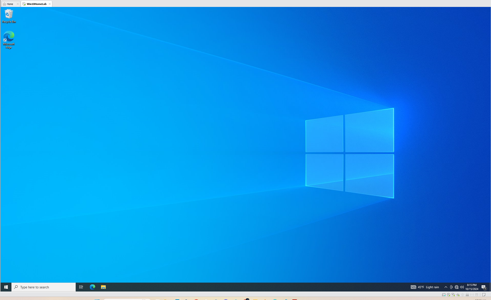
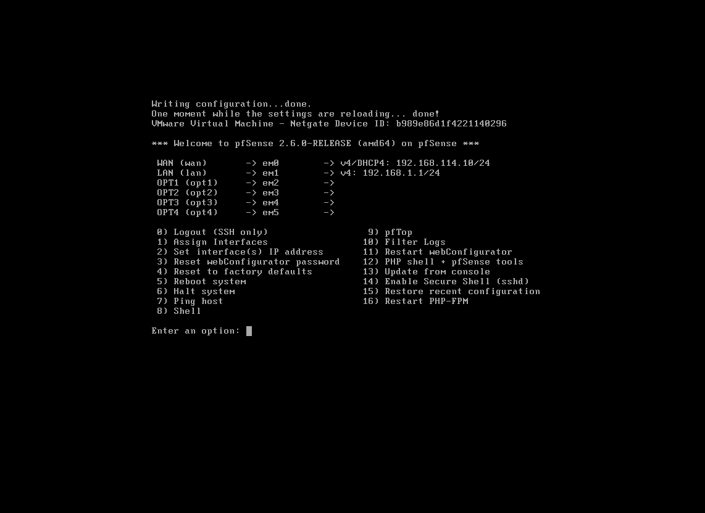
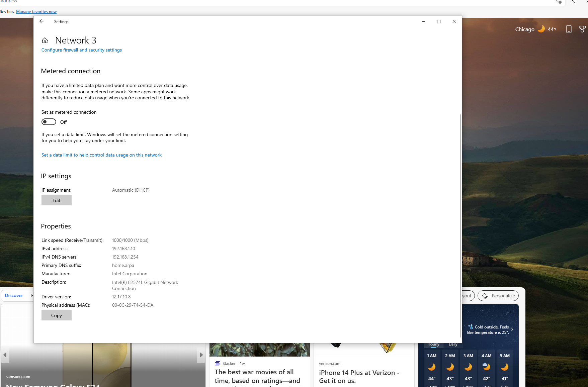
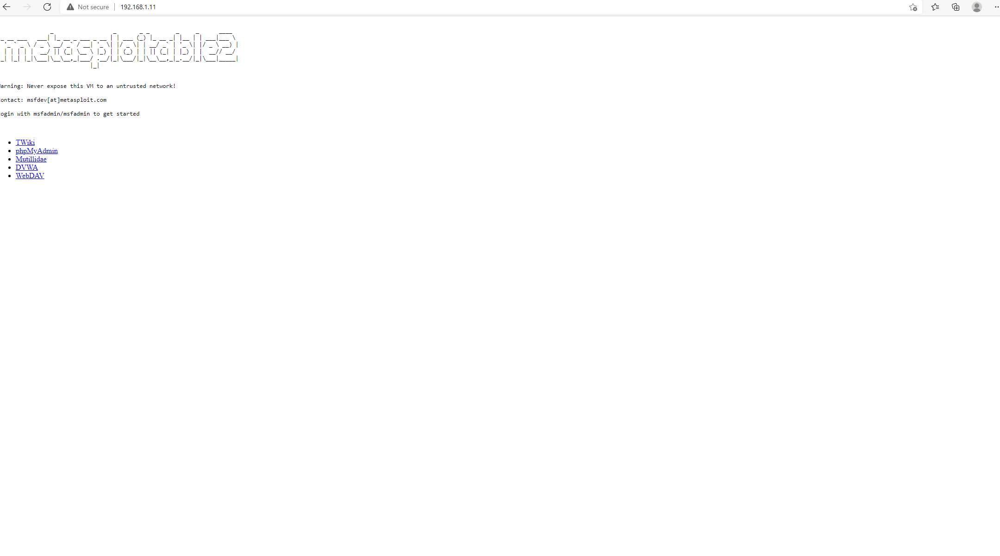
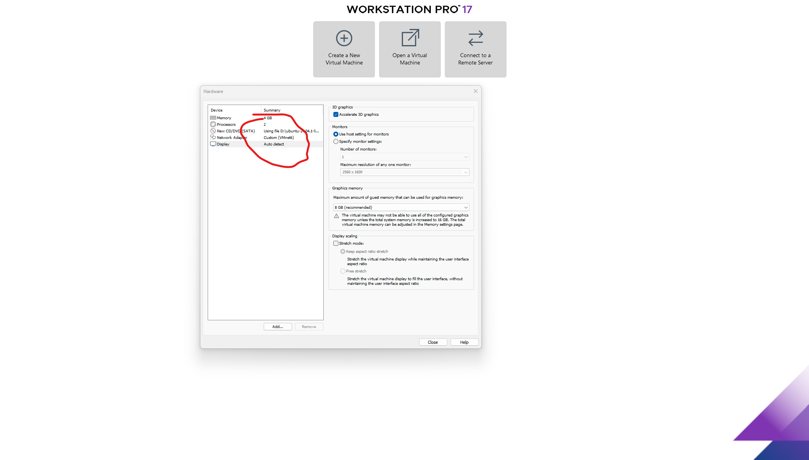
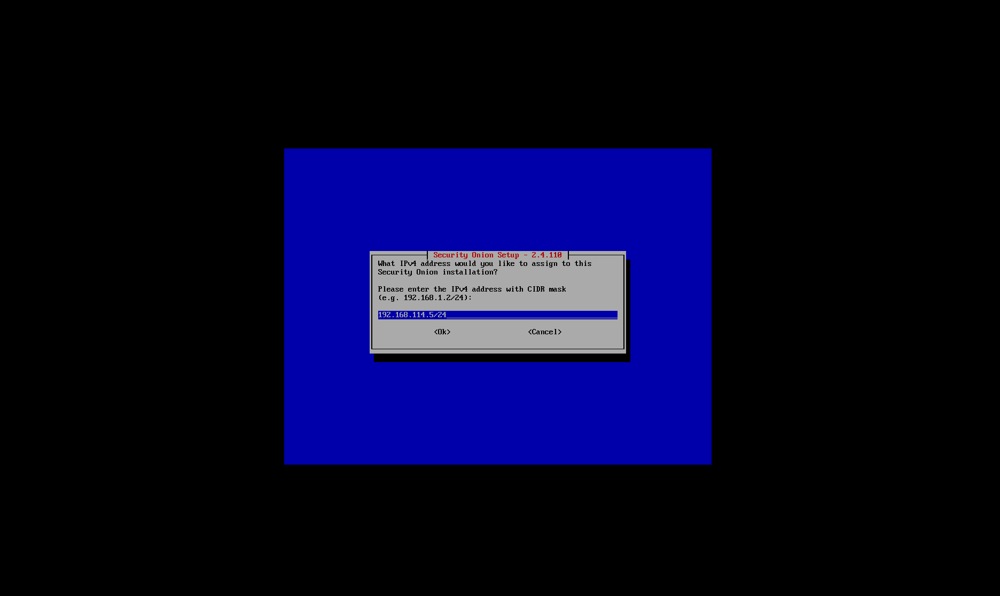

## Network and IP Schema for Security Lab Infrastructure

Here's a table in Markdown format based on the subnet and IP address details you provided:


| Description                    | Subnet / IP Address      |
|---------------------------------|--------------------------|
| External Subnet                 | 192.168.114.0/24         |
| Internal LAN Subnet             | 192.168.1.0/24           |
| SPAN Port IP Address            | No IP Address            |
| Attacker Subnet                 | 192.168.3.0/24           |
| Security Onion Logs Subnet      | 192.168.4.0/24           |
| Splunk Log Collector Subnet     | 192.168.5.0/24           |
| Metasploitable IP Address       | Through DHCP             |
| ADC IP Address                  | 192.168.1.100            |
| PC1 IP Address                  | 192.168.1.10             |
| Attacker IP Address             | Through DHCP             |
| Splunk IP Address               | Through DHCP             |
| Security Onion IP Address       | 192.168.114.50           |
| Security Onion MGMT IP Address  | 192.168.114.1            |
| DNS                             | 8.8.8.8, 4.4.4.4         |


This table neatly organizes the subnet and IP address information for easy reference.


## IP Subnet and Interface Mapping for PfSense Virtual Lab

Here's a table in Markdown format based on the information you provided:


| Role      | Interface | Network Adapter | VMNet    |
|-----------|-----------|-----------------|----------|
| WAN       | EM0       | Network Adapter  | VMNet   |
| LAN       | EM1       | Network Adapter 2 | VMNet2   |
| SPAN      | EM2       | Network Adapter 3 | VMNet3   |
| KALI      | EM3       | Network Adapter 4 | VMNet4   |
| SECONION  | EM4       | Network Adapter 5 | VMNet5   |
| SPLUNK    | EM5       | Network Adapter 6 | VMNet6   |


## Installations
1. VMware
2. Windows 10


3. Installations of pfSense
   Per the topology above, the pfsesne will have 6 interfaces which is idicate below.
   The configuration is.

| Network Adapter   | VMNet   |
|-------------------|---------|
| Network Adapter   | NAT     |
| Network Adapter 2 | VMNet2  |
| Network Adapter 3 | VMNet3  |
| Network Adapter 4 | VMNet4  |
| Network Adapter 5 | VMNet5  |
| Network Adapter 6 | VMNet6  |


During the installation process, the first interface to show up in order to configure the rest of the interfaces indicated no IP address configuration for WAN (wan) with interface em0.
Further research on my side showed that the WMware NAT servies running ont he host was stoped hence the insatance was not getting the WAN interface IP address which is the IP.
address it will use to access the internet.  A restart of the Service in services resolves th issue.
In th intial IP assigment. th Wan insterface has an IP ADDRESS OF 192.1868.114.10/24  WHICH IS THE FIRST ip i CONFIGURED IN vmware fOR nat TO ASSIGNT O THE FURST INSTANCE IN THE NETWORK..The configuration can be seen below.


This version aligns the content properly for a clean and readable table in Markdown.

### Configuration of pfSense Interfaces

In the image below the interfaces from WAN to em65 have been assisgned

After completing th einterface assigment, all the interfaces are now showing as indicated below:

.

The next thing to do is to set IP addresses and then set all of them. STARING WITH THE lan INTERFACES.
In this step however, I have decided to assign each interfaces the last IP in the ranges i will be using.
I also Enabled http on the LAN in order to access the firewall Graphically.
The URL to access the web configurator is *http://192.168.1.254*

| pfSencse Interface | IP Address|DHCP Enabled? | Range of DHCP IP |
|----------- | ----------| -----------|-------------------|
|WAN (em0) | 192.168.114.10 (auto assigned)| Acquired From host | Will Revert|
|LAN (em1) | 192.168.1.254 | Yes | 192.168.1.10 to 192.168.1.253|
|OPT1 (em2)    | No IP Address configured (used as a Span Port)| Not Required Since it is a Span Port   | Not Required|
|OPT2 (em3) | 192.168.3.254 | Yes | 192.168.3.10 to 192.168.3.253|
|OPT3 (em4) | 192.168.4.254 | Yes | 192.168.4.10 to 192.168.4.253|
|OPT4 (em5) | 192.168.5.254 | Yes | 192.168.5.10 to 192.168.5.253|

Below is the command line interface representation of the assigned IP addresses

As indicated in the table above, the intefcae em2, on th pfsense will be used as a  span port hence no need to assign IP address.

### Creating Firewall Rules with pfSense Web Interface

The Table below will serve as a guide for the set up. The content of the table is an extension from  the one above.

| IP Subnet       | Network Connection | Role   | PfSense Interface | VMware Adapter  |
|-----------------|--------------------|--------|-------------------|-----------------|
| 192.168.114.0/24 | NAT                | WAN    | em0               | Network Adapter |
| 192.168.1.0/24   | VMNet2             | LAN    | em1               | Network Adapter 2 |
| No IP Address    | VMNet3             | SPAN   | em2               | Network Adapter 3 |
| 192.168.3.0/24   | VMNet4             | KALI   | em3               | Network Adapter 4 |
| 192.168.4.0/24   | VMNet5             | SECONION | em4              | Network Adapter 5 |
| 192.168.5.0/24   | VMNet6             | SPLUNK | em5               | Network Adapter 6 |

Since the pfsense is within the LAN network which is VMNet2, I will put a work station on the same netowrk in order to access the web configurator.
In this case i will use the windows 10 workstation installed earlier. The reserveed IP addresses for the LAN are from, 192.168.1.1 to 192.168.1.9. Since pfsense have been configured as  DHCP for the lan networkI am expectignt that the windows instance.
will have any IP address from 192.168.1.10 to 192.168.1.253 and its Gatway will be the LAN IP confifured for the.
pfsense which is 192.168.1.254.

OPening the windows instance indicated to me the instance has been assigned an IP of 192.168.1.10 as can be confirmed from the attached.
image below




The web configurator URL as indicated earlier can be assessed via  *http://192.168.1.254*
Entering the URL in windows opens up the web configurator as shown below:

In the first web interface set up

1. Hostnmae = pfsense
2. Domain = biira.com
3. Primary DNS: 8.8.8.8
4. Seconday DNS : 4.4.4.4
   

5. Time Server was kept as the Default. and time change to US central timezone.
6. ALl setttings on the WAN interface was kep as default apart from the option to ```Block RFC1918 Private Networks``` and  ```Block bogon networks``` which were unchecked.


7. LAN IP is set tp 192.168.1.254 which is correct hence not need to touch anything there as the configuration from the CLI is correct.
8. Admin Password was changed to a preffered one from the Deaful one of pfsense.

Pfesense reloads after the step above and then comes up with the interface in order to now start the configuration.


In order for easy compreheions, i will go ahead and rename the Instrafers from the the Deafult ones  as some do not correspond to the Lab configuration


Some of the interfacenames have been changed as indicated below

Here’s a table in Markdown format with the headers "Old Name" and "New Name" along with two rows of dummy data:

| Old Name       | New Name        |
|----------------|--------------- |
| OPT1 (em2)     | span           |
| OPT2 (em3)     | Kali           |
| OPT4 (em5)     | SecOnion       |
| OPT5 (em6)     | splunk         |


#### COnfiguring Span

In the Bridges tab, I will then forward all traffic from the LAN port to the SPAN as per the configuraiton


### Creatinf FIrewall Rules

1. On the WAN network I configured traffic to be allowed with no restrictions.


2. On th LAN, the Default Firewall Rule was deleted and then created a new rule to allow all traffic.
   
3. ALl other ports were confirigures the smae way to allow for communication from any port to 

## Installing Kali Linux

Kali Linux has been installed and assigned to VMnet4 interface which will ensure it obtaines IP address in the.
ragne from 192.168.3.0/24 network but it starts from 192.168.3.10.
THe Kali maachine therefore has the IP address of 192.168.3.10 as indicated below. It ill also be reacherable to the interenet through the
pfsense firewall configuration.


## Installing Metasplloitable

The installation of this Vulnerable box is places on VMnet2 which is representing the Internal Netowkr or LAN. SInce the pfSense is also working as a DHCP it automatically leases out the next IP after thr one it had already leased to the Windows 10 instance which also fell in the LAN network. The IP address given to the Metasploitable Instance is 192.168.1.11 as can be seen from the Image below:


Mestappitable has an automatic user name of ```msfadmin``` and and correspingin password or ```msfadmin```.
The Metaspoitable 2 GUI can therefore be accessed at http:192.168.1.11 as indicated below


This also gives me the optint o have a graphical interface access to the other components likes the Damn Vulnerable Web App (DVWA).


## Installing Ubuntu Server

Per the topology, Ubuntu server which will host the Splunk software will be installed on the 192.168.5.0/24 network whhich is configured to be on Vmnet6


## Installation of Security Onion

In the setup of Security Onion, I will be using three network adapters namely

1. NAT : Used for the managment
2. Vmnet3 : Mirror Interface.
3. Vmnet5 : will be used to collect the logs collection. 

In the setup, ens160 has been desginated as the Managment Interface.


The Managemnet Interface was then assign a static IP address of 192.168.114.5 which is the IP from the vmnet8 adapter that has the NAT configuration on teh host machine


The Gateway IP is 192.168.114.2 as indicated below


IN the NAT Ocnfiguration i did as can be seen from the images above, The automatic IP assignemtn starts from  192.168.114.10 to  192.168.114.254. The static IPS are from  192.168.114.1- 192.168.114.9. However, the  192.168.114.1 has been assigned to the Hposy PV VMWare network adaptor as shown above whist the  192.168.114.2 is used as the Gateway. This therfore implies that, the available Static IP addresses available to assign are from  192.168.114.3 to  192.168.114.9.

I will hoever assign the  192.168.114.5 to the SecurityOnion Management Interface.



I then set the Default Gateway to 192.168.114.2 as indicated earlier in the NAT configuration and then also set the DNS to *biira.com*


The URL to access the Security Onion Console (SOC) Interface is https://192.168.114.5/.
The SOC Username as set is noble@biira.com with the password known to myself. Lol

After installation, I ran the ```sudo soup``` command to ensure that my Security Onion instance was up to date with the latest security patches and software enhancements. This step is crucial for maintaining the integrity and security of the system, as it ensures that all detection tools like Zeek and Suricata are operating with the most current features and protections.

Keeping Security Onion updated with sudo soup helps enhance stability, ensures compatibility with other tools, and fortifies the system against known vulnerabilities—critical aspects in any security-focused environment.

---

### Configuring Security Onion Web Interface Access: Firewall Rule Adjustments in a Threat Detection Lab

After completing the installation of **Security Onion** in my **Threat Detection and Monitoring Lab** on a VMware virtual machine, I encountered an issue when trying to access the web interface. The management interface for Security Onion was set to the IP address **192.168.114.5**, and I had configured the network using **NAT** to share IPs between the VM and my host machine.

I was able to **ping** the Security Onion instance from my host machine, confirming connectivity, but the web interface was inaccessible when I tried using the same IP address.

#### Investigating the Issue: Services Running but No Web Access

To begin troubleshooting, I checked the status of Security Onion services by running:

```bash
sudo so-status
```

The command confirmed that all services were running as expected, indicating there were no issues preventing the system from functioning properly. Below is an image showing the output, which indicates the system’s health.


Since the services were operational, I turned my attention to the firewall configuration.

## Initial Troubleshooting: Firewall Configuration

I suspected that the firewall was blocking access to the web interface. I tried using the **so-allow** command, which typically adds IP addresses to the firewall whitelist. However, **this command was not supported** in the version of Security Onion I was using, which was **2.4.110-20241010**.

To get more insights into the firewall rules, I ran the following command to list the current settings:

```bash
sudo iptables -nvL
```

This gave me a clear view of the firewall rules, confirming that access to the management interface was restricted. The output (image below) showed which IP addresses were currently allowed to communicate with Security Onion.


## Solution: Modifying Firewall Rules to Grant Access

To resolve the issue, I needed to modify the firewall rules to allow access from my host machine. I used the **so-firewall** command to include a broader range of IPs temporarily for testing:

```bash
sudo so-firewall includehost analyst 192.168.0.0/16
sudo so-firewall apply
```

After applying the change, I successfully accessed the Security Onion web interface from my **Windows 10 machine** with the IP **192.168.1.10**. The image below shows the Security Onion GUI after gaining access.


#### Rethinking Security: Narrowing Access to a Specific IP

While the broad **192.168.0.0/16** range worked, it presented a security risk by allowing too many devices on the network to access the web interface. In a real-world environment, minimizing the attack surface is crucial. To restrict access further, I decided to limit web interface access to just my **host machine** with IP **192.168.114.1**.

### Configuring a More Secure Firewall Rule

I had already configured **Vmnet8 NAT** in VMware to distribute IP addresses from **192.168.114.10** to **192.168.114.254**. The **Security Onion instance** was assigned the static IP **192.168.114.5**, and the NAT gateway was **192.168.114.2**. My host machine had the IP **192.168.114.1**, and I wanted only this IP to access Security Onion.

## Solution: Modifying Firewall Rules to Grant Access via the GUI

To resolve the issue of web interface access, I decided to modify the firewall rules. Instead of using command-line , I opted to adjust the settings via Security Onion's **GUI**.

### Step-by-Step Firewall Modification Using the GUI

I navigated to **Administration > Configuration > Firewall > Hostgroup > Analyst** within the Security Onion interface. I removed the broad range previously set and configured the firewall to allow access only to **192.168.114.1**.

This change immediately went into effect, successfully limiting access to my host machine while blocking others. The **Windows 10 machine** (IP **192.168.1.10**) could no longer access the Security Onion web interface, whereas my host machine continued to maintain access as shown below.


This limited access to only **192.168.114.1**, my host machine’s IP address. As a result, other devices, such as my **Windows 10 machine** (with IP **192.168.1.10**), were no longer able to access the Security Onion web interface. Below is an image showing successful access from the host machine while blocking access from others.


## Installing Windows Server 2022
The windows server 2022 was installed successfuly and placed on Vmet2 which is serving as the internal network as depicted below

| IP Subnet       | Network Connection | Role   | PfSense Interface | VMware Adapter  |
|-----------------|--------------------|--------|-------------------|-----------------|
| 192.168.114.0/24 | NAT                | WAN    | em0               | Network Adapter |
| 192.168.1.0/24   | VMNet2             | LAN    | em1               | Network Adapter 2 |
| No IP Address    | VMNet3             | SPAN   | em2               | Network Adapter 3 |
| 192.168.3.0/24   | VMNet4             | KALI   | em3               | Network Adapter 4 |
| 192.168.4.0/24   | VMNet5             | SECONION | em4              | Network Adapter 5 |
| 192.168.5.0/24   | VMNet6             | SPLUNK | em5               | Network Adapter 6 |


From the IP configuration layout below, teh Server would have obtained its IP addess from pfSense that had already been configured as the DCH server.
| pfSencse Interface | IP Address|DHCP Enabled? | Range of DHCP IP |
|----------- | ----------| -----------|-------------------|
|WAN (em0) | 192.168.114.10 (auto assigned)| Acquired From host | Will Revert|
|LAN (em1) | 192.168.1.254 | Yes | 192.168.1.10 to 192.168.1.253|
|OPT1 (em2)    | No IP Address configured (used as a Span Port)| Not Required Since it is a Span Port   | Not Required|
|OPT2 (em3) | 192.168.3.254 | Yes | 192.168.3.10 to 192.168.3.253|
|OPT3 (em4) | 192.168.4.254 | Yes | 192.168.4.10 to 192.168.4.253|
|OPT4 (em5) | 192.168.5.254 | Yes | 192.168.5.10 to 192.168.5.253|

It is however imperative to note that a server obtaining its IP address from DCHP  not be wise to do as other clients will be depending on the server for services. 
From the range above, teh reserved IP range for VMnet2 whuch the server recides in is from ```192.168.1.1 to 192.168.1.9```.
I will therofre assign a static IP of ```192.168.1.1``` and set the Gateway as the IP of the pfSense and and set the DNS as the server IP with the seconday been that of ```8.8.8.8```
. The firewall was tunred off and the security also tunred off in order to simulate the attack laer in the project.
The server name was also changed to srv1 and then rebooted for the changes to take effect

I started to add the Active DIrecotry to the Server in order to maek it the Domain Cocntroller.


After the installaiont i promoted teh server to be a domain controller and then set the Root Domain Name as ```biira.com```

The domain and forest functional levels were set to 2016 for backwak compatibility asn thent the DSRM password set accordingly. it then set the NetBios name as BIIRA which was good. The NTDS and SYSVOL file were kept in the default folders. Below is the script generated which can later be used to do AD promotion to domain controller
```powershell
#
# Windows PowerShell script for AD DS Deployment
#

Import-Module ADDSDeployment
Install-ADDSForest `
-CreateDnsDelegation:$false `
-DatabasePath "C:\Windows\NTDS" `
-DomainMode "WinThreshold" `
-DomainName "biira.com" `
-DomainNetbiosName "BIIRA" `
-ForestMode "WinThreshold" `
-InstallDns:$true `
-LogPath "C:\Windows\NTDS" `
-NoRebootOnCompletion:$false `
-SysvolPath "C:\Windows\SYSVOL" `
-Force:$true
````
I encounted a failur on my first trail due to the fact that i do not have alocal admin passowrd set on the server and hence had to fix that.

The installation was able to proceed successfuly as the password issue was fixed.


After the isntallation, I created an organisational Unit (OU) called ```CyberMonitoringLab``` with groups and hen users which were later added to the group Below is a Video demonstration of part of the activity.


===================================================================================================


[Link to the Architectural Diagram](https://drive.google.com/file/d/1L2Ri70p85bDrAMxXZyRc9m__X1sVpACT/view?usp=sharing)

### Comprehensive Home Lab Setup for Cybersecurity Testing and Monitoring

As part of the setup for this cybersecurity home lab, the primary goal is to simulate real-world scenarios by segmenting the environment into multiple isolated networks. This allows for the creation of distinct zones for attack simulations, monitoring, and defensive operations. Below is a comprehensive overview of the lab’s architecture and network configuration, followed by a detailed explanation of each component, its purpose, and suggested improvements.

### Objectives of the Home Lab
1. **Simulate real-world attacks and defenses**: By creating isolated networks, this lab will allow for the simulation of cybersecurity attacks, defensive measures, and traffic analysis.
2. **Isolate roles across networks**: Network segmentation ensures that attack traffic and victim traffic can be analyzed independently while maintaining a strong boundary between attacker, victim, and monitoring resources.
3. **Implement monitoring tools**: Centralized monitoring solutions like Splunk and Security Onion will provide traffic capture, incident detection, and network visibility across the different segments.
4. **Learn and practice threat detection and response**: The lab will offer an environment to understand how various tools work together in threat detection, network monitoring, and response processes.

---

### Network Design and Segmentation

#### 1. **Security Operations Network** (Better name: **Monitoring/Defense Network**)
- **IP Range**: `192.168.3.0/24`
- **Description**: This network is designated for Security Onion and other related defense tools such as Intrusion Detection Systems (IDS), Intrusion Prevention Systems (IPS), and log aggregation services. It will act as the nerve center for monitoring traffic, analyzing logs, and correlating events across the lab’s networks.
- **Components**:
  - **Security Onion**: (`192.168.3.10`) A platform for monitoring, detecting, and responding to cybersecurity threats. This instance will capture logs, analyze network traffic, and provide visibility into attack vectors.
  - **Additional monitoring tools**: Other tools like Grafana, Kibana, and ELK Stack can be deployed in the future to provide advanced visualization and data correlation.

#### 2. **Victim Network** (Better name: **Corporate Network/Target Network**)
- **IP Range**: `192.168.2.0/24`
- **Description**: This network represents the internal, corporate-like environment that is simulated for victim systems. It will be the target of attacks launched from the Attacker Network. The key focus here is creating a realistic corporate domain structure with systems such as Domain Controllers, workstations, and potentially other internal services (e.g., file servers, web servers).
- **Components**:
  - **Domain Controller**: (`192.168.2.10`) This acts as the Active Directory (AD) server, controlling user access, group policies, and authentication within the victim environment.
  - **Windows Workstation 1**: (`192.168.2.11`) A standard user machine that attackers might exploit using lateral movement, phishing campaigns, or malware.
  - **Windows Workstation 2**: (`192.168.2.12`) A second machine simulating another user endpoint, used for expanding the environment and testing larger attack vectors.
  - **Potential Expansion**: Additional systems (Linux servers, database servers, etc.) can be added as needed to increase the scope of attack simulations.

#### 3. **Monitoring Network** (Better name: **Log Aggregation Network**)
- **IP Range**: `192.168.4.0/24`
- **Description**: This network contains the key log aggregation and monitoring systems, including Splunk. The purpose is to collect logs from all systems across the lab (Security Onion, victim systems, etc.) and provide a central point for analyzing logs, monitoring events, and correlating them to potential attacks.
- **Components**:
  - **Splunk**: (`192.168.4.10`) A powerful platform for searching, monitoring, and analyzing machine-generated data from across the network.
  - **Grafana** (future potential): A real-time analytics tool that provides visualizations of network performance, security events, and system health data, pulling from sources like Splunk or other log collectors.
  - **Scalability**: Other security monitoring solutions can be added to this segment to provide enhanced visibility or to test their integration with existing tools.

#### 4. **Attacker Network** (Better name: **Penetration Testing/Threat Actor Network**)
- **IP Range**: `192.168.1.0/24`
- **Description**: This network is designed to simulate external attackers attempting to breach the victim environment. It is isolated from the other networks but connected via pfSense, which will handle routing and segmentation. The purpose here is to allow the launch of attacks from the attacker environment to the corporate network.
- **Components**:
  - **Kali Linux**: (`192.168.1.10`) The attacker machine used to perform penetration testing, exploit vulnerabilities, and simulate real-world attacks. This machine will utilize tools like Metasploit, Nmap, and others to compromise the victim systems.
  - **Other Attack Tools** (optional): In the future, additional attack platforms (such as Parrot OS) can be added to introduce variability in the attack methods.

---

### Network Design Details

#### **pfSense Firewall and Routing**
- **IP Range**: Each network segment will be routed through **pfSense**, which serves as the core firewall and router, ensuring traffic flows securely between networks. 
- **Firewall Rules**: 
  - **Victim Network**: Strict rules should be in place to prevent unnecessary traffic between the Victim and Attacker networks. For example, the Victim Network should only allow certain types of incoming traffic from the Monitoring Network (e.g., for log collection and analysis).
  - **Attacker Network**: Traffic from the Attacker Network should be limited to predefined penetration testing scenarios.
  - **Monitoring Network**: Traffic should be allowed freely from the Monitoring Network to all other networks, as this network will collect logs and monitor all activity.

#### **Network Security Layers**:
- **Internal Traffic Monitoring**: Security Onion and Splunk will be set up to capture network packets from the different segments and analyze them for anomalies. You can use **port mirroring** on the victim network to allow Security Onion to detect and analyze potential threats.
- **Traffic Segregation**: Ensure all networks (Attacker, Victim, Monitoring) are properly isolated using pfSense to avoid unauthorized access between segments.

#### **Future Expansions**:
- **Additional Victim Machines**: You can expand the Victim Network with more workstations or servers, such as Linux servers, email servers, or web servers, to simulate a more complex environment.
- **Advanced Attack Techniques**: Introduce more sophisticated attack tools or attackers in the future to simulate complex APT (Advanced Persistent Threat) attacks, ransomware infections, or phishing campaigns.
- **Log Aggregation Expansion**: The Monitoring Network can include new tools as you grow your lab, such as **ELK stack** for advanced analytics or **Prometheus** for real-time monitoring.
  
---

### Example IP Addressing Scheme

| **Device**                | **Role**                    | **Network**             | **IP Address**        |
|---------------------------|-----------------------------|-------------------------|-----------------------|
| Domain Controller          | Active Directory Server      | Victim Network           | 192.168.2.10           |
| Windows Workstation 1      | User Endpoint                | Victim Network           | 192.168.2.11           |
| Windows Workstation 2      | User Endpoint                | Victim Network           | 192.168.2.12           |
| Kali Linux                 | Attacker Machine             | Attacker Network         | 192.168.1.10           |
| Security Onion             | IDS/IPS and Monitoring       | Security Operations Net. | 192.168.3.10           |
| Splunk                     | Log Aggregation              | Monitoring Network       | 192.168.4.10           |
| pfSense                    | Firewall and Router          | All                      | 192.168.1.1, 192.168.2.1, 192.168.3.1, 192.168.4.1 |

---

### Diagram Overview
For visualization, the architecture can be illustrated with a network diagram that represents the four network segments (Attacker, Victim, Monitoring, and Security Operations). This will show how pfSense acts as the routing layer, connecting each segment while ensuring proper segmentation and security controls.

---

### Conclusion:
This lab setup is ideal for simulating a variety of cybersecurity scenarios, including network intrusions, lateral movement, and monitoring of attack behavior. The use of pfSense for network segmentation ensures isolation, while tools like Security Onion and Splunk enable real-time analysis and monitoring. The lab is modular, allowing for future expansion in terms of both network devices and monitoring capabilities.


**Security Onion** is an open-source Linux distribution designed to enhance network security monitoring, intrusion detection, and threat analysis. It is widely used by security professionals to streamline security operations and improve their organization's ability to detect and respond to cyber threats. The **Security Onion VM** provides a comprehensive, pre-configured environment with a suite of advanced security tools, offering the following capabilities:

1. **Intrusion Detection**: Utilizes industry-standard tools like **Snort** and **Suricata** to analyze network traffic for malicious activities and generate real-time alerts.

2. **Network Traffic Analysis**: Employs **Zeek (formerly Bro)** to monitor and analyze network communications, providing deep insights into network behaviors and potential threats.

3. **Log Management**: Integrates with **Elasticsearch** and **Logstash** to collect, parse, and index security logs, enabling efficient querying and analysis of event data.

4. **Alert Management and Visualization**: Uses **Kibana** to visualize security alerts and logs, providing an intuitive interface for filtering, managing, and investigating security events.

5. **Endpoint Monitoring**: Incorporates host-based intrusion detection with tools like **OSSEC** or **Wazuh**, allowing continuous monitoring of endpoint systems for anomalies or breaches.

6. **Full Packet Capture and Forensic Analysis**: Captures and stores network packets for comprehensive forensic investigation, supporting deep-dive analysis using tools like **Wireshark**.

In summary, Security Onion offers an integrated platform that enhances an organization's threat detection, incident response, and overall security posture.

