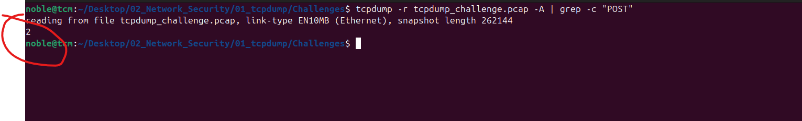

# Description of Project

The SOC received an alert that an endpoint was exhibiting abnormal behavior as it triggered several detections, pointing to a potential info-stealer malware variant. As a SOC Analyst at Astley Financial, review the tcpdump_challenge.pcap packet capture and analyze its contents to complete the report below.

Challenge File:
02_Network_Security/01_tcpdump/Challenges/tcpdump_challenge.pcap

## How many total packets are in the tcpdump_challenge.pcap packet capture?

I obtained this by running the command `tcpdump -r tcpdump_challenge.pcap --count` Which gave an output of **1344** as the number of packets available in the pcap.

## How many ICMP packets are in the challenge.pcap packet capture?

This was obtained with the command `tcpdump -r tcpdump_challenge.pcap  icmp --count`, giving a result of **132** packets in the captures pcap.

## What is the ASN of the destination IP address that the endpoint was pinging?
To obtian this information, i first hage to obtained the destination IP address of the ICMP request which was identified to be `172.67.72.15` after running the tcpdump command `tcpdump -r tcpdump_challenge.pcap  icmp   -c 5` which fetches the top 5  ICMP request.  

I then run a `whois` command on the obtained destination IP address as `whois 172.67.72.15` which generated lots of vital information mong which i got the ASN to be `AS13335`
.

## How many HTTP POST requests were made in the packet capture?
In order to obtain this I initially run the command `tcpdump -r tcpdump_challenge.pcap -A | grep -c "POST"`  which counted the POST occurence and gave a result of **2**. This was howver wrong as one packet has two occurencies of the POST word. I then use the command `tcpdump -r tcpdump_challenge.pcap -A | grep -E "POST"` which further explained the reason why the two was obtained. I therefore realised the actual asnwer is **1**

## Look for any credentials within the payloads of any HTTP packets, what is the password you uncover?

In order to obtain the above, I run two similar commands. The first been `tcpdump -r tcpdump_challenge.pcap -n -A | grep -i 'user\|pass\|login"` and the second been `tcpdump -r tcpdump_challenge.pcap -A | grep -Ei "login|user|pass"`. Both commands were searching for words like `user, pass, and login` which can give a clue to the solution. Going through the content, i came a very important session where i saw the username and password displayed as `username=bsmith&password=ilovecats9102`. The password was therefore obtained as **ilovecats9102**. There also exist ftp users and their corresping passwords in plain text in the pacp file

## Aside from HTTP on port 80, what is the other well-known tcp port in the capture?

In asering the above challenge, i gradually add together bash code gradully in order to generate teh complete command as `tcpdump -r tcpdump_challenge.pcap tcp -n | cut -d " " -f 3 |cut -d "." -f5 | sort |uniq -c | sort -nr`.

Since i am looking for well known ports and the fact that port 80 is elimiated from the queston, the next most used port is `port 21 (ftp)` which occured uniquely as 21 times.

## What set of valid credentials did the endpoint use to access the file sharing server?

Obtaining this also require good command over the command line. I used the command the command `cpdump -r tcpdump_challenge.pcap -n -A port 21 | grep -i "USER\|PASS\login"` which generated the answer to be `demo:password` after several research. The user is `demo` and the password is `password`.

## What is the name of the file that was retrieved from the file sharing server?

With the help of ChatGPT and good prompting, i was able to obain the command `tcpdump -r tcpdump_challenge.pcap -A port 21 | grep -i "RETR"`, where the RETR is an ftp command used to retrive or download files. The out is a name of a file called `readme.txt`

## Based on the unique User-Agent string found within the HTTP requests, what is the name of the related malware the endpoint might be infected with?

Using the command `tcpdump -r tcpdump_challenge.pcap -A port 80 | grep -i "User-Agent"`, I was able to view a strange User-Agent in rh cotnent with the name `TeslaBrowser/5.5`
.
A google search on this User AGent reeavled that a C2 server called Lumma Stealer. Below are some information sourced from `https://malpedia.caad.fkie.fraunhofer.de/details/win.lumma` whch provided more information about the C2 Lumma Stealer. 

## In defanged format, what was the full URL that the endpoint tried to connect to using the user agent identified above?

The initial command i researched to find out the solution to this is `tcpdump -r tcpdump_challenge.pcap -A port 80 | grep -B 10 -i "User-Agent: TeslaBrowser"` which was able to give me the host as a Telegram server name as `t.me` and the GET request as `+zz0192lskaaa`. Putting the two tegther gives the URL the endpint is trying to connect to as `http://t.me/+zz0192lskaaa`

The seond command which i found to be better and more straight forward is ` tcpdump -r tcpdump_challenge.pcap -A port 80 | grep -A 15 -i "User-Agent: TeslaBrowser"` This was more direct and fethc the needed infromation as can be seen in teh attached image below:

In order to put the URL in a defanged format, i used Cybershef to acomplish the result and the final defaned URL is `hxxp[://]t[.]me/+zz0192lskaaa`

## Reputation of 149.154.167.99

The IP address 149.154.167.99 was identified as the one with the C2 and the endpoint is reaching out to it. Analysis of the IP address in Virus total, it was flagged as  amalicious IP as shown below:

##  What is the full title of the YouTube video that the user requested?

To find the full title of the YouTube video from the packet capture (PCAP) analysis, you'll need to locate an HTTP request that involves YouTube. This could involve looking for a GET request to a YouTube URL in the HTTP traffic, as the title would likely be found in a request to a YouTube page. With this in mind, I got two commands of which are :
1. `tcpdump -r tcpdump_challenge.pcap -A port 80 | grep -i "youtube" and `
2.` tcpdump -r tcpdump_challenge.pcap -A port 80 | grep -i "youtube.com" | grep -oP '(?<=<title>)(.*?)(?=</title>)'`

Both of these commands produced the same result and the URL `Location` gave out the URL to the Yourtube video content.
The identified URL is `https://www.youtube.com/watch?v=dQw4w9WgXcQ` which point to a Youtube Video Titled **Rick Astley - Never Gonna Give You Up (Official Music Video)**

`. 