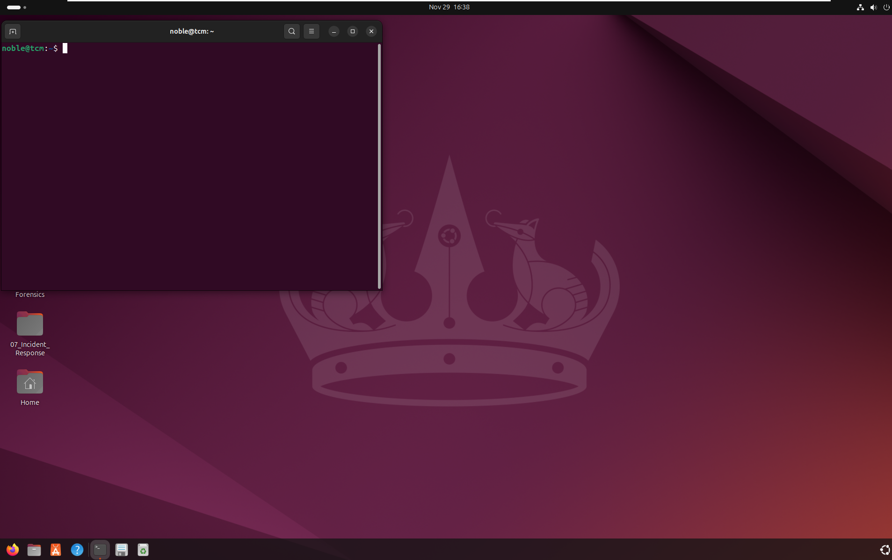
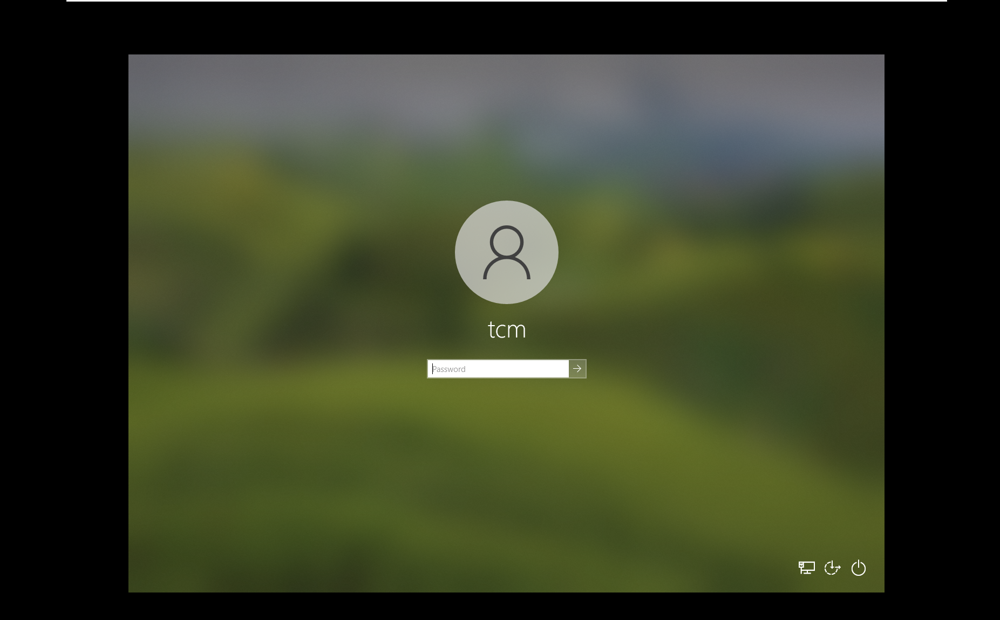

# TCM SOC 101 Study Journey

This will be a place where i document my study of SOC 101 from TCM Security. I will try as much as mpossible to document anything of value on this page.

## LAB Setup

I install Windows 10 and Ubuntu Virtula machine on VMware Hypervisor


Ubuntu Installation



### Configuring Windows

In order to ensure windows security does not block some of the attacks I will be runnong, I have to turn it off and also the regsitry key by sunig the commans below:

1. Disable real-time protection

     ```powershell

        Set-MpPreference -DisableRealtimeMonitoring $true
     ```

2. Disable the scanning of network files

```powershell
Set-MpPreference -DisableScanningNetworkFiles $true
```

3. Disable the blocking of files at first sight

```powershell
Set-MpPreference -DisableBlockAtFirstSeen $true
```

4. Disable Windows Defender AntiSpyware

```powershell
reg add "HKLM\SOFTWARE\Policies\Microsoft\Windows Defender" /v DisableAntiSpyware /t REG_DWORD /d 1 /f
```

I ensured both the Ubuntu and Windows are sitting on the same network in VMware.

### Clone the course repository

```bash
git clone <https://github.com/MalwareCube/SOC101.git>
```

Next, extract each of the course ZIP files onto the desktop using the password below:

ZIP file password
nucleus-faucet-rockslide

## SOC Model

1. Internal SOC
2. Managed SOC : Third party provider of security opeartions
3. Hybrid: combines both internal and managed soc.

### SOC Roles

1. SOC Analyst: Frontline roles
   1. Tier I: Entry level
   2. Tier II (Incident Responder): INvestigating and remediating an escalted incident
   3. Tier 3 (Threat Hunters)
   4. SOC Team Lead
2. Specialsied roles
   1. Incidence Responder
   2. Threat Hunters: They are proactive. Developing custom alert and detection rules.
   3. Threat Intelligence Analyst
   4. Security Engineer
   5. Vulnerability Management.
   6. Forensics Analyst
   7. Malware analysts
3. Management Roles
   1. SOC Manager: Day to day operation of SOC team, including budgeting etc
   2. Director of Security.
   3. CISO

## Incident and Event Management

The goal is to accuratly collect records with regards to security incidents

### Incident management

 1. Incident identification
 2. Incident calssification
 3. Incident investigation
 4. Incident containment
 5. Incident eradication
 6. Incident recovery

## SOC Metrics

1. Mean Time to Detection (MTTD): Average time it takes SOC to detect
2. Mean Time to Resolution (MTTR)
3. Mean Time to Attend and Analyse (MTTA&A)
4. Incidence Detection Rate: Higher rate, means higher visibility.
5. False Positive Rates: Calculated in percentages.
6. False Negative Rates: Fewer rates are good.

## SOC Tools

1. Security Information and Event Managment System(SIEM): Aggregate logs accross the enterprise
   1. Log management
   2. real-time monitoring
   3. alerting and notification
   4. reporting
   5. visualisation
   6. threat intelligence incoportation
2. Security Orhestration, Automation, and Response (SOAR).
3. Incidence Managment Tools
   1. Ticketing management system
   2. alert management
   3. workflow automation
   4. collaboration
4. Network Security Moniroting(NSM)
   1. Packet capture and analysis
   2. Network Trafic Analysis
   3. Intrusion Detection
5. Endpoint Detection and Response (EDR)
   1. DentinelOne
   2. Crowdstrike
   3. User entitry behaviour and analytics (UEBA)
6. IDS /IPS
7. Firewall
   1. pfsense, paloalto, cloudflare,juniper, 
   2. NextGen Firewall
   3. web application firewall
8. Threat Intelligence Platforms
   1. Maltego, 
   2. data aggregation and enrichment
   3. indicator of compromise
   4. analysis nad prioritixation
9. Forensics Analsis Tool
10. Malware Analysis Tool
    1.  Hybrid analysis, cuckoo, chidra, any run

## Common Threats and Attacks

1. Social engineering
   1. expoiting humansa
   2. spoofing
   3. phishing
      1. spear phishing
      2. whaling : targets high profile individuals
      3. vishing (Voice phishing)
      4. smishing (sms phishing
      5. Quishing ())
2. Worm: Self replicating without
   1. stuxnet, blaster
3. Spyware /Adware
4. Ransomware
5. Botnet: set of compromised devices called zombies.
6. Fileless malwate: Executes in memory, living of the land
   1. uses stuffs like WMI, powershell, and code injection.
7. Idenity and account compromise
   1. an individual gaines access account they are not supposed to. 
8. Insider Threat.
9. Denial of Service
10. Data Breaches

## Phishing

Expliting the weakest link in the security of an organization. Phishing mails may show
1. Authority
2. Trust
3. Intimidation
4. Social Proof: validate legitimate throuh consensus.
5. Urgency  
6. Scarcity
7. Farmiliarity.


## EMAILS

This is control by the protocol SMTP(Simple Main Transfer Protocl) using port 25 or 465 and 587 if it is secured. Handles the outgoing message from client to the recipient. 
### POP3
Protocol used by mail client to download email from mail server. Use 110 port

### IMAP

ALso use to access email from the email server but this one does not delete the mail on the server but rather syncs with the server. wokrs on port 143

 ### EMail Headers

Contains information about email content, origin and how it should be handled. 

### Mail Transfer Agent

Helps to move the email from multiple servers till it reaches the end-users mail server

### Mail User Agent

Actual software used to compose email like gmail, yahoo, outlook etc

### Mail Delivery Agent

More like the last agent to hold the email for the receiver to retrive it.

## Types of Phishing

1. Information gathering attacks.
2. Credential Harvesting.
3. Malware delivery
4. Spear phishing: target a specific group
5. whaling: high profile individual
6. Vishing: Voice phishing
7. smishing: SMS
8. Quishing: exploitaion of QR Codes
9. 