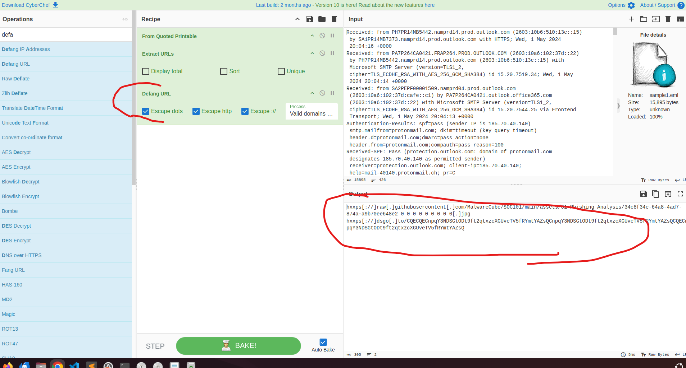
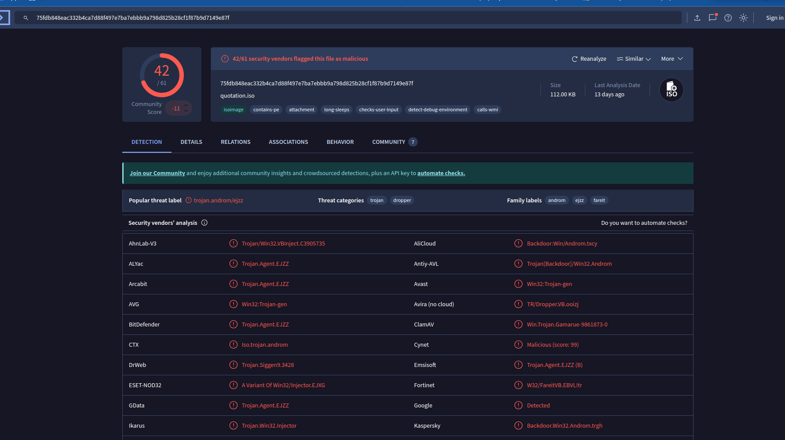
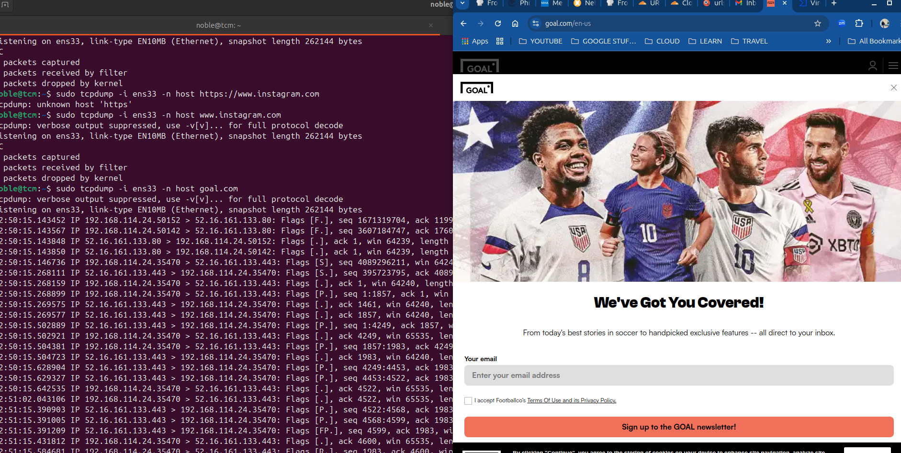
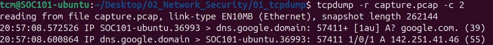
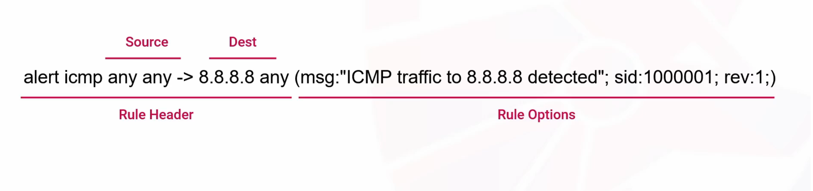
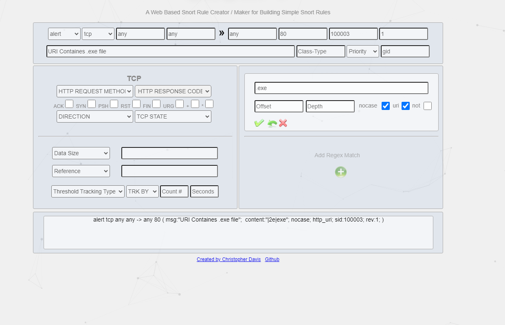
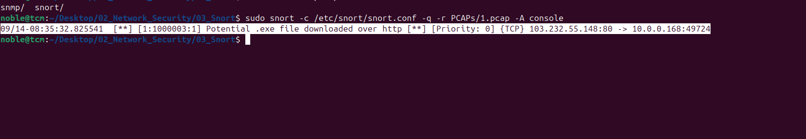

# TCM SOC 101 Study Journey

This will be a place where i document my study of SOC 101 from TCM Security. I will try as much as mpossible to document anything of value on this page.

## LAB Setup

I install Windows 10 and Ubuntu Virtula machine on VMware Hypervisor


Ubuntu Installation


### Configuring Windows

In order to ensure windows security does not block some of the attacks I will be runnong, I have to turn it off and also the regsitry key by sunig the commans below:

1. Disable real-time protection

     ```powershell

        Set-MpPreference -DisableRealtimeMonitoring $true
     ```

2. Disable the scanning of network files

```powershell
Set-MpPreference -DisableScanningNetworkFiles $true
```

3. Disable the blocking of files at first sight

```powershell
Set-MpPreference -DisableBlockAtFirstSeen $true
```

4. Disable Windows Defender AntiSpyware

```powershell
reg add "HKLM\SOFTWARE\Policies\Microsoft\Windows Defender" /v DisableAntiSpyware /t REG_DWORD /d 1 /f
```

I ensured both the Ubuntu and Windows are sitting on the same network in VMware.

### Clone the course repository

```bash
git clone <https://github.com/MalwareCube/SOC101.git>
```

Next, extract each of the course ZIP files onto the desktop using the password below:

ZIP file password
nucleus-faucet-rockslide

## SOC Model

1. Internal SOC
2. Managed SOC : Third party provider of security opeartions
3. Hybrid: combines both internal and managed soc.

### SOC Roles

1. SOC Analyst: Frontline roles
   1. Tier I: Entry level
   2. Tier II (Incident Responder): INvestigating and remediating an escalted incident
   3. Tier 3 (Threat Hunters)
   4. SOC Team Lead
2. Specialsied roles
   1. Incidence Responder
   2. Threat Hunters: They are proactive. Developing custom alert and detection rules.
   3. Threat Intelligence Analyst
   4. Security Engineer
   5. Vulnerability Management.
   6. Forensics Analyst
   7. Malware analysts
3. Management Roles
   1. SOC Manager: Day to day operation of SOC team, including budgeting etc
   2. Director of Security.
   3. CISO

## Incident and Event Management

The goal is to accuratly collect records with regards to security incidents

### Incident management

 1. Incident identification
 2. Incident calssification
 3. Incident investigation
 4. Incident containment
 5. Incident eradication
 6. Incident recovery

## SOC Metrics

1. Mean Time to Detection (MTTD): Average time it takes SOC to detect
2. Mean Time to Resolution (MTTR)
3. Mean Time to Attend and Analyse (MTTA&A)
4. Incidence Detection Rate: Higher rate, means higher visibility.
5. False Positive Rates: Calculated in percentages.
6. False Negative Rates: Fewer rates are good.

## SOC Tools

1. Security Information and Event Managment System(SIEM): Aggregate logs accross the enterprise
   1. Log management
   2. real-time monitoring
   3. alerting and notification
   4. reporting
   5. visualisation
   6. threat intelligence incoportation
2. Security Orhestration, Automation, and Response (SOAR).
3. Incidence Managment Tools
   1. Ticketing management system
   2. alert management
   3. workflow automation
   4. collaboration
4. Network Security Moniroting(NSM)
   1. Packet capture and analysis
   2. Network Trafic Analysis
   3. Intrusion Detection
5. Endpoint Detection and Response (EDR)
   1. DentinelOne
   2. Crowdstrike
   3. User entitry behaviour and analytics (UEBA)
6. IDS /IPS
7. Firewall
   1. pfsense, paloalto, cloudflare,juniper,
   2. NextGen Firewall
   3. web application firewall
8. Threat Intelligence Platforms
   1. Maltego,
   2. data aggregation and enrichment
   3. indicator of compromise
   4. analysis nad prioritixation
9. Forensics Analsis Tool
10. Malware Analysis Tool
    1. Hybrid analysis, cuckoo, chidra, any run

## Common Threats and Attacks

1. Social engineering
   1. expoiting humansa
   2. spoofing
   3. phishing
      1. spear phishing
      2. whaling : targets high profile individuals
      3. vishing (Voice phishing)
      4. smishing (sms phishing
      5. Quishing ())
2. Worm: Self replicating without
   1. stuxnet, blaster
3. Spyware /Adware
4. Ransomware
5. Botnet: set of compromised devices called zombies.
6. Fileless malwate: Executes in memory, living of the land
   1. uses stuffs like WMI, powershell, and code injection.
7. Idenity and account compromise
   1. an individual gaines access account they are not supposed to.
8. Insider Threat.
9. Denial of Service
10. Data Breaches

## Phishing

Exploiting the weakest link in the security of an organization. Phishing mails may show

1. Authority
2. Trust
3. Intimidation
4. Social Proof: validate legitimate throuh consensus.
5. Urgency  
6. Scarcity
7. Farmiliarity.

## EMAILS

This is control by the protocol SMTP(Simple Main Transfer Protocl) using port 25 or 465 and 587 if it is secured. Handles the outgoing message from client to the recipient.


### SMTP

Used to send outgoing mail. Port 24 (or 465, 587)

### POP3  (Post Office Protocol version 3)

Protocol used by mail client to download email from mail server and then deletes them. Use Port 110 port ( or 995 )

### IMAP (Internet Message Access Protocl)

It is also another email retrival protocol but in this case it does not delete the mail after client accessese it unlike POP3.Emails stores on the mail server. wokrs on port 143 (993 for secure)

### Email Headers

Contains information about email content, origin and how it should be handled.

### Mail Transfer Agent (MTA)

Helps to move the email from multiple servers till it reaches the end-users mail server

### Mail User Agent

Actual software used to compose email like gmail, yahoo, outlook etc

### Mail Delivery Agent

More like the last agent to hold the email for the receiver to retrive it.

## Types of Phishing

1. Information gathering attacks.
2. Credential Harvesting.
3. Malware delivery
4. Spear phishing: target a specific group
5. whaling: high profile individual
6. Vishing: Voice phishing
7. smishing: SMS
8. Quishing: exploitaion of QR Codes

### Phishing Attack Tecqnieue

1. Pretexting
   1. Fabricates story to deceive a victim
   2. Manipulation under false orete
2. SPoofing and Impersonation
   1. Email Addres Spoofing
   2. Domain Spoofing
3. URL Manipulation
   1. URL Shortening
   2. subdomain spoofing
4. homograph: same or similar words but with different meaning,. A homoglyth site can generate the similiar link
5. typosquatting . Registering similar domain names to the original(DNS twist can be used to identify typosquatting)
6. Encoding: Obfuscate and evade detection.Can be used in Base64, URL encoding, HTML encoding
7. Attachement
   1. Abuse of legitimate services like google drive, dropbox. using trusted reputations to send malware. You can use the Phishtank to analyse suspicious URLS
8. Pharming: Two steps technique
   1. Directst to a malicois site
   2. alware bases pharming
   3. DNS server poisoning

#### Phishing Analysis Methodology

1. Initial Triage
   1. quickly assess and prioritise
2. Header and Sender Examiniation
3. Content Examination
   1. look for socail enfineering red flags
   2. analyze email content
4. Web and URL examiniation
5. Attachment examination
6. Contextual Examiniation
   1. look for paterns and assess scope
   2. consider broder context
7. Defense measures
   1. take reactive defense actions (if needed)
   2. take proactive defense actions
8. Documentationa dn reporting.

### Email Headers

1. Date: SPecifies the date the message was composed or sent
2. From: Sender details: this can be spoofed.
3. Subject:
4. Message ID: Unique ID generated by the first MTA. Under no circumstance should this be duplicated. Containes 2 parts. Part before the @ is a unique field whilst the part after the @ indicates the host IP or the domain from which the email originated from.
5. To: Indicates the recipient Email Address
6. Reply to: Indicates the email address to whcih the replies go to in the even the user want to send a reply.
7. Return Path: also known as the envelope, or bounce address: This indicates where failed email address shpuld be sent i.e if there is a failure in sending a mail then it should be sent to the specified email address.
8. X-headerer IP ot X-origninating IP: Indicates the IP of the email provider it coming from.If this is not present then you can check the received hearders section
9. Received: There are mutiple of them which ondicates hte ralye of MTA hwich is the number of email servers that the email traverse.The received orderes are in reverese chronilogial order.

Parsing email headers can also be done in an easy way by using the platform <https://mha.azurewebsites.net/> and <https://mxtoolbox.com/EmailHeaders.aspx>

### Email Authentication Headers

there are 3 major Email authentication headers out there namely

1. SPF (Sender Policy Framework)
2. DKIM (Domain Keys Identified Mail) and
3. DMARC (Domain Based Authentication, Reporting and Conformance)
These protocols can be used to check if a domain actually send and email or it has been spoofed.

#### SPF (Sender Policy Framework)

 Domain owners use this policy to specify which domains are authorised to send email on thier behalf/. Works by publishing SPF records in DNS. SPF record can be checked for any domain by using the `dig` command or `nslookup`  or by using dig
 
 The v states the version which in this case is verison 1 and will the same in most cases. The IP address shown are the ones allowed to send email address.
 The `_include`where google is stated also shows that google is allowed to send email on behalf of shodan. The `-all` (hard fail) means that emails from any other unauthorised senders should be rejected. Another option you will see often is the `~all` (knows as the soft fail) which indicates that the server should accept mails from IPs not explicitely listed in the SPF recored but should treat them with suspicion.

#### DKIM (Domain Keys Identified Mail)

Used to authenticate the origin or email messages. Its primary purpose is to allow a receiver that an email msg is indded from the email server and does this with PKI

#### DMARC (Domain Based Authentication, Reporting and Conformance)

Works alongside SPF and DKIM to enhance the overall email authentication with additional reporting mechanism

## Encoding

1. HTML Entity encoding
2. Qouted printable encoding
3. URL Encoding
4. base64 encoding

## Anatomy of a URL


## URL Analysis

The first step for URL analysis is to extrat the URL.
Using Cybershef..

1. open URL as meial attachment
2. decode using things like
   1. qouted printable
   2. url decoding
   3. base 64 endoding
   4. 
3. Extract URLS: after the decoding has been done, we use the url extraction from cybershef to fetch out all urls present in the file.
   1. 
4. The next step will be to Defang the urls: meaning it will no longer be clickable hyperlink i.e we want to prevent them from been turn into an automatic link
   1. 
5. Another way is to use the script in extracting all the file details. [Click her for the script](https://raw.githubusercontent.com/MalwareCube/Email-IOC-Extractor/refs/heads/main/eioc.py). The script will have to be run with python3
   1. 

Phishtang is a webpage where people can report malicous urls for community review and categorization.`https://phishtank.org/`

Another tool is the use of `https://www.url2png.com/`. This website will scan the urls pasted to give you a visual reprensetation of the site and you can make some deduction as to whether it is a genuine site or not.

We can also make use of `https://urlscan.io/`.
 Another option is to use Virus Totla wiht the url `https://www.virustotal.com/gui/home/upload`

 URL Vooid is another one that can confirm the reputation of a url `https://www.urlvoid.com/`

Wanabrowser can give u the content of the url browser: `<https://www.wannabrowser.net/>

Short URL can be unshortend by Unshorten it : `https://unshorten.it/`. Wanabrowser can also be used to unshorten URLs

URL Haus is a list of suspicious urls submitted by researchers `https://urlhaus.abuse.ch/`

You can also use Google safe browing to check the status of a particular domain: `https://transparencyreport.google.com/safe-browsing/search`

Joe Sandbox can also be use to browse and detonate URLs.

## Email Attachment

Apaert from downloadin the attachment, there is another script from the DidierStevens suit that allows you to extract files from email all from the command line. Link to the file is `https://github.com/DidierStevens/DidierStevensSuite/blob/master/emldump.py`. Below is the demomstation of using command to extract attachement using the script


### Collecting FIle Hashes

1. sha256sum <name of file>
2. md5sum <name of file>
3. sha1sum <name of file> or combine the three at a go using &&
4. sha256sum <name of file> && md5sum <name of file> && sha1sum <name of file> 


The email extration script can also obtaint the hashes of any attached file.


After obtaining the hashes, we will need to use File Reputation databases to obtian more information about them. One very importanta service is the Virus Total: `https://www.virustotal.com/gui/home/upload`. It is advisable to use a fiel has rather than uploadind the file as a user withj enterprse access can access adn download those file.


Another tool to use for File reputation check is the Cisco Talos. It is a threat intellifence and research organisation opearted by Cisco `https://talosintelligence.com/`


It is very importan to always documentation of all finding during analysis and hence the need to use possibly screenshot as well during the process of investigation.

### Dynamic Attachment Analysis and Sandboxing

Sanboxing is a seuciry technique ise to isolating potentially harmfuk file from the rest of our system.
 There are some things to look out for in a dynamic analysis

 1. Process activity: the processes that are coming up due to the file execution and thier parent child relationship
 2. Registry Changes
 3. Network connection: conenctions made when the files executes
 4. File Activity: Ading more files etc

#### Malware analysis tolls

1. Hybrid Analysis (`https://hybrid-analysis.com/`): Free malware analysis tool that can detect malware powered by crowdstrike falcon sandbox
   
   \
2. Joe Sandbox
3. Any run (`https://app.any.run/`)

#### Static MalDoc Analysis

Making use of the script from DidierStevens `https://github.com/DidierStevens/DidierStevensSuite/blob/master/oledump.py
`

The capital M shows there is an embded macro in the index of A4

Running the above will produce the hex dump of the raw macro as shown below:

To extrnas teh string we use the `-S` flag


In order to extract the ful vba script, we make use of the `--vbadecompresscorrupt`


Along with malicious word documents, another popular way to dsitribute malware is malicous pdfs. We will go  through some tools to dig and carve into pdfs. Most instances there include malicous urls in pdf files that users clicked to access those sites. the potential of evading email filteres.
Use Didierstenves suits to parse and carve through pdfs. 

[DidierStevensSuite
pdf-parser.py](https://github.com/DidierStevens/DidierStevensSuite/blob/master/pdf-parser.py)


Use the pdf name as argument to the parser and piped t more command in order to scroll through one by one.

To searach a specific thing in the commnad, you use the -s flag as showun in the image below which is searching for URI


we can also use the pdf id parser
[pdfid.pytex](https://github.com/DidierStevens/DidierStevensSuite/blob/master/pdfid.py)


Key things to look out for are:
1. jsavascript embedding
2. JS
3. open action: can cours the pdf reader to take action
4. lunch objects
5. emebdded files

You cna then use the pdf parser to extract the embedded files


For automatics tool make use of `PHISHTOOL`


## REACTIVE PHISHING DEFENSE

1. containment
   1. Determine scope
   2. quarantine
   3. block sender artifacts
   4. block web artifacts
   5. block file artifacts. Lverage endpoint edr to block such files
2. Eradication
   1. remove malicous mails
      1. content search and edsicovery
   2. Remove malicous files
   3. Abuse form submissions
   4. credential changes
   5. Reimaging
3. Recovery
   1. restore systems
4. Communication
   1. Notify affected users
   2. update stakeholders
5. user education

## PROACTIVE PHISHING DEFENSE
1. Email filtering
   1. email secuirty appliance
   2. marking external emails
2. URL Scanning
   1. real time url inspection
   2. block recefntly registered domains
3. Attachment filtering
   1. file extension block
   2. attachment sandboxing
4. Email auhentication methodd
   1. spf
   2. dkim
   3. dmarc
5. User training

### DOCUMENTATION

### MORE PRACTICE.
For more practice check these resources out/;
1.  [Github repo of phishing emails:](https://github.com/rf-peixoto/phishing_pot)
2.  [Phishtang URLs](https://phishtank.org/)
3.  [Mlware Database to donwload and test out your skill](https://bazaar.abuse.ch/)

### NETWORK LAYER PROTOCOLS

1. IP(Internet Protocol). Falls in the network layer
   1. IP Addressing
   2. IP routing
2. Tranmission COntrol Protol (TCP)
   1. Operates at the Transport layer. Ensures reliable connection using sequence number. It is connection oriented protocol.
   2. Uses flow control and congestion control.
3. User Datagram Protocl(UDP)
   1. Does not provide relibality or seqence number.

#### IPv4 Header


## Traffic Analsys

### Packets
Made up of three main parts
1. Headers
2. Payload
3. Trailor

### Packet Based Analysis

#### Introduction to tcpdump

You can set up automatic capture with scripts. Typically used with root user

1. `sudo tcpdump -i lo` : capture on the loppback address
2. Check interfaces using `ip link show`
3. tcpdum -D : show all interfaces to capture.

4. sudo tcpdump -i <interface name > or <number>
5. 
6. 
7. `sudo tcpdump -i lo -X `: The -X prints it in Hexadecimal and ASCII format.

The messages is Uncripted


8. `sudo tcpdump -i lo -A `: Tells TCPdump to just print out the ASCII data
9. `sudo python3 -m http.server 80`: This sets up a web server on the system
10. 
11. `sudo tcpdump -i ens33 ` This will give u the fulll DNS names

12. `sudo tcpdump -i ens33 -n` will remove the dns name


#### Capture FIlter
`sudo tcpdump -i ens33 -n host example.com`: Helps to capture traffic regarding the specifi host.
In the case above, it will only capure traffic from only example.com when you enter that as the url in a browser. This filer will become very important when you wnat to monitor trffaci from a known domain or a malicous site.


There is also the `source (src)` and the `destination (dst)` filsters that can be applied to tcpdump which allows to filter on specific senders and receivers of a traffic
`sudo tcpdump -i ens33 -n src <>`:
`sudo tcpdump -i ens33 -n dst <>`:

We can also set to capture traffic to a specif subnet based on the range or CIDR notation.
`sudo tcpdump -i ens33 -n net  192.168.1.1/24`:

We can also append the dst or src to the net
`sudo tcpdump -i ens33 -n  src net  192.168.1.1/24` : Source Subnet
`sudo tcpdump -i ens33 -n  dst net  192.168.1.1/24` : Destination subnet

Another one is port. Caputring based on a specific port and can add source port or destination port
`sudo tcpdump -i ens33 -n  port 21`
`sudo tcpdump -i ens33 -n src port 21`
`sudo tcpdump -i ens33 -n dst  port 21`

#### Logical Operators
`sudo tcpdump -i ens33 -n src 192.168.11 and dst port 21`

##### Combining Various Opearators


Filter Pcket based on protocol

`sudo tcpdump -i ens33 -n arp`
`sudo tcpdump -i ens33 -n ssh`

#### Saving to a File

`sudo tcpdump -i ens33 -n src 192.168.11 and dst port 21 -w ~/Desktop/capture.pcap`
This will save the output to Destop to the name capture.pcap

### Analyzing Network Traffic

Count the number of packets in a pcap file we use the command 
`tcpdum -r <name of pcap> --count`


To determine the number of packets to capture or read from a pcap we use the `-c ` flag as shown
`tcpdum -r <name of pcap> -c 2` Indicating you are reading only 2 packets


Adding the `-t` flag removes the timestamp

Using double t (tt) will convert the time to standard epoc time

The **-ttt** will print the time in milisecond since the previous packet


Useing **tttt** will print in the standard date and time format


Sort and Cut command Combination


## Intrusion Detection  and Prevention with Snort


IDS: will continoulsy moniotr network traffic for abnormal things and can trigger alert that can even conduct. IDS logs all its events. Passive monitoring

IPS: deployed inline and hence can introduce some latency.

1. Network based IDS/IPS
2. Host based IDS/IPS

### Detection Methods
1. Signature base detection: 
   1. comparing activities against known attack patterns
   2. effective at known threats
   3. not effective againt what it does not known
2. Behaviour-Based detections
   1. identifying anomalies that deviate fromc a pre-establushed baseline
3. Rule-base detection
   1. requires a lot of maintenance

### SNort Modes

1. Sniffer mode
2. Packet Logger mode
3. IDS/IPS mode
### snort configuration files
/etc/snort

Running snort in the sniffer mode `snort -i <name of interface>`
to see the tcp header we can add the `-e` argument.

TO obtain the paylod output in ASCI and 

### Packet logger mode.
`snort -i <name of interface>` -l

### Read a Snort Log

snort -r <name of log>

Snort log can also be opened with tcpdump and wireshark as well


### Writing Snort Rules

Snort rules are divided into two logical sections



Running snort shuld use -A which specifies the alert mode whuch can be Full, fast and none
`root@tcm:/etc/snort# snort -A console -l /var/log/snort/ -i ens37 -c /etc/snort/snort.conf -q`

### community Rules

### snort as IPS

In the rule, you use drop instead of alert.
snorpy is the web based portal to create snort rules on the fly.

### intrusion Detection and Prevention with Snort
 
 **Creating Custom Detection Rules**

Opening a wireshark with the terminal `sudo wireshark 1.pcap `

Creationg of the rule can be done usingg the url `https://snorpy.cyb3rs3c.net/`


Rule creation

`alert tcp any any -> any 80 ( msg:"URI Containes .exe file";  content:"|2e|exe"; nocase; http_uri; sid:100003; rev:1; )`

Moving into the local Rules Directory

`sudo nano /etc/snort/rules/local.rules`


I will then run the snort to read from a pcap in order to determine whether it catches anything using the rule above

`sudo snort -c /etc/snort/rules/snort.conf -q -r 1.pcap -A console`

In the example above, we were able to detect the downloaded file due to the .exe extension included in the request uri.
In the case the file extension is not included in the request URI or obscured by other means, we will have to rely on other detection Method
to captured malicous downloads. One approach in doing this is to inspeec the content type headers in the http response.
Many excecutable files are transmitted with the content tyep `application/x-msdownload` . Thu string can therefore be used to triger alert.


Creating Snort Rules to Detect These Scenario
The created rule is  
```bash
alert tcp any 80 -> any any (msg:"Potential .exe file downloaded over http"; content:"Content-Type: application/x-msdownload";http_header; sid:1000003; rev:1;)

```


Running snort with the newly configured Rule

Running the command 
`sudo snort -c /etc/snort/snort.conf -q -r PCAPs/1.pcap -A console` generated an alert of 

``` bash
09/14-08:35:32.825541  [**] [1:1000003:1] Potential .exe file downloaded over http [**] [Priority: 0] {TCP} 103.232.55.148:80 -> 10.0.0.168:49724
```


IT is still possible for attackers to spoof the file extension and the content type header. These are common techniques attackers use to by passwordchecks and 
these kinds of rules.

You should egt ehr Magic byte of the the windows executatble. The magic byte for windows excutable is`MZ` and its corresponding Hexadecimal pattern is `4D 5A`

File Signatures can be obtained at `https://en.wikipedia.org/wiki/List_of_file_signatures`


Now creating the new Rule to alert on this kind of information.

``` bash

alert tcp any 80 -> any any (msg: "HTTP Payload contained DOS MZ or PE executable signature"; file_data; content:"|4D 5A|"; depth:2; sid:1000004; rev:1;)

```


The result can be sene below


Opening the log in wireshark

In the wireshark attachd screenshot, following the tcp stream will reveal that the file has the `MZ` attached.


#### Creating the Snort RUle to catch the SSLoad User Agent


``` bash
alert tcp any any -> any any (msg: "Detected SSLOad activity via User-Agent"; content: "User-Agent: SSLoad/1.1"; http_header; nocase; sid:1000005; rev:1;)

```
The nocase ensure it catches the SSLoad even when it comes in small letters making it case in-senstive.


Now Running SNort Agagin but this time around in the Second PCAP file containes the sslload user-agent.
The command used to run snort is:

```bash
sudo snort -c /etc/snort/snort.conf -q -r PCAPs/2.pcap -A console
```


It generated 9 alets which corresponds to having a wireshark filer of **http.user_agent containes "SSLoad"**


#### Analyzing an SSH Brute Force pcap (3.pcap) || Creating a Snort Rule to Detect the SSH Brute Force Attempt

This time around we will use snorpy to generetat the rule set.


The generated rule is
``` bash
alert tcp any any -> any 22 ( msg:"Potential SSH Brute Force Attack Detected"; flow:to_server,established; threshold:type both, track by_src, count 5 , seconds 30; sid:1000007; rev:1; )

```

The rule generated the alert as expected in the image below


## SKILLS

1. Email Analysis.
2. Phishing Analysis
3. URL Analysis
4. Intrusion detection and Prevention with Snort
5. Packet Analysis
6. Detection Rules
7. Network Monitoring
8. Snort
