# Cracking NTLM Hashes - Project Overview

## Project Description

This project delves into **cracking NTLM (NT LAN Manager) password hashes**, a critical exercise in understanding the weaknesses of legacy authentication protocols. **NTLM** is a suite of security protocols used by Microsoft for authenticating users and ensuring integrity and confidentiality. NTLM, although once widespread, has fallen out of favor due to vulnerabilities in its cryptographic design, which make it susceptible to password cracking techniques.
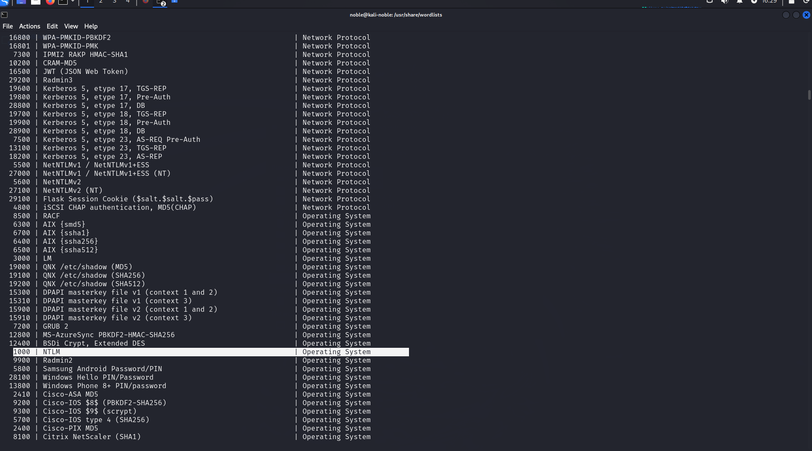

Despite being considered outdated and insecure compared to modern standards like Kerberos, NTLM is still found in legacy systems, making it an essential topic in cybersecurity assessments. This project simulates a real-world scenario where an attacker might attempt to crack NTLM password hashes, providing a hands-on learning experience.

By using various password cracking tools, I will uncover the inherent weaknesses of NTLM hashes and explore how attackers exploit these vulnerabilities. The project will demonstrate the following stages of password cracking:

1. **Extraction of NTLM Hashes** from the target system.
2. **Hash Cracking Techniques** using brute-force, dictionary attacks, and rainbow tables.
3. **Analysis of Results** to understand the efficacy and limitations of different cracking methods.

## Objective

The main goals of this project are to:

- **Crack the given NTLM password hashes** using widely available password-cracking tools.
- **Analyze the NTLM hash structure** and explain how the hashing process works.
- **Evaluate various hash-cracking techniques** and document the methodology, including detailed explanations, screenshots, and tools used.

## Key Learning Outcomes

1. **Understanding NTLM:** Gain in-depth knowledge of NTLM as an authentication protocol, how it works, and why it is considered weak compared to modern encryption standards.

2. **Hash Cracking Techniques:** Learn different password-cracking techniques, including brute-force attacks, dictionary attacks, and the use of pre-computed hash values (rainbow tables).

3. **Tool Usage:** Explore popular tools like **Hashcat**, **John the Ripper**, and **Rainbow Crack**, understanding their strengths and limitations when used to crack NTLM hashes.

4. **Security Implications:** Understand the real-world security implications of NTLM vulnerabilities in enterprise environments and explore how security professionals mitigate these weaknesses through password policies, encryption standards, and multi-factor authentication (MFA).

## Technical Background

- **NTLM Hashing Process:** NTLM uses a combination of MD4 hash functions to convert plaintext passwords into hashes. The process does not use salt (random data added to the password), making the hashes easier to crack. This lack of salt combined with predictable password choices by users exposes NTLM hashes to brute-force and dictionary attacks.
  
- **Vulnerabilities in NTLM:** Some of the most notable weaknesses in NTLM include:
  - **No salting:** NTLM hashes are deterministic, meaning the same password always produces the same hash. This makes it vulnerable to *rainbow table attacks*.
  - **Slow computational process:** Although NTLM uses the MD4 hash function, which is faster than modern hashing algorithms, it lacks the security provided by advanced algorithms like bcrypt, scrypt, or Argon2.
  - **Weak passwords:** Users often choose weak passwords, making cracking tools highly effective when paired with common password dictionaries.

## Tools Used

- **Hashcat:** A high-performance password recovery tool that supports many types of hash algorithms, including NTLM. It offers multiple attack modes, including dictionary attacks, brute-force, and hybrid attacks.
  
- **John the Ripper:** A widely used password cracking tool that supports NTLM and many other hash formats. John the Ripper excels in both speed and customization, making it a powerful tool for testing password strength. ( I made use of this methodology as well but did not include it in the documentation)

## **Password Hashes Explanation**

### **Understanding Password Hashes:**

Operating systems typically store password hashes instead of plain-text passwords for security reasons. A **hash** is a one-way cryptographic transformation that converts input, like a password, into a fixed-size string. It’s designed to be irreversible, meaning the original password cannot be directly recovered from the hash.

### Hash Dump Analysis

We are provided with a password hash dump that looks like this:

```bash
Administrator:500:aad3b435b51404eeaad3b435b51404ee:e02bc503339d51f71d913c245d35b50b:::

vagrant:1000:aad3b435b51404eeaad3b435b51404ee:e02bc503339d51f71d913c245d35b50b:::

sshd:1001:aad3b435b51404eeaad3b435b51404ee:31d6cfe0d16ae931b73c59d7e0c089c0:::

c_three_pio:1008:aad3b435b51404eeaad3b435b51404ee:0fd2eb40c4aa690171ba066c037397ee:::

boba_fett:1014:aad3b435b51404eeaad3b435b51404ee:d60f9a4859da4feadaf160e97d200dc9:::

```

### Components Breakdown

Each line in the dump is structured as follows:

```
<username>:<UID>:<LM hash>:<NTLM hash>:::
```

- **Username**: The account name of the user (e.g., `Administrator`, `vagrant`).
- **UID (User Identifier)**: A unique number assigned to each user (e.g., `500`, `1000`).
- **LM Hash (LanMan Hash)**: A legacy and insecure password hash format, commonly replaced with placeholders (`aad3b435b51404eeaad3b435b51404ee`) in modern systems.
- **NTLM Hash**: A more widely used and modern password hash format, vulnerable to attacks without additional security features like salting.

### NTLM Hashes and Security

NTLM hashes are susceptible to **brute-force attacks** and **rainbow table lookups** due to the absence of security features like salting and key stretching. This means that NTLM hashes can be cracked using modern tools if sufficient computational resources or a large enough wordlist are available.

### Example Breakdown

Taking one line from the dump:

```
Administrator:500:aad3b435b51404eeaad3b435b51404ee:e02bc503339d51f71d913c245d35b50b:::
```

- **Username**: `Administrator`
- **UID**: `500`
- **LM Hash**: `aad3b435b51404eeaad3b435b51404ee` (placeholder, no LM hash)
- **NTLM Hash**: `e02bc503339d51f71d913c245d35b50b` (this is the hash we aim to crack)

The other users in the dump (`vagrant`, `sshd`, `c_three_pio`, and `boba_fett`) follow the same structure, and we will be cracking the NTLM hashes for all of them.

### Cracking Process Overview

To crack these NTLM hashes, we will use the following methods:

1. **Dictionary Attack**: Using a wordlist like **RockYou.txt**, we will attempt to find the password by comparing the hash of each word in the list to the given NTLM hash.

2. **Brute-Force Attack**: If the dictionary attack fails, a brute-force attack can be used to try every possible combination of characters until the correct password is found. This method can be slow but is thorough.

3. **Rainbow Tables**: Precomputed hash values stored in **rainbow tables** can be used to quickly find the corresponding password for an NTLM hash, exploiting the lack of salting.

## Cracking NTLM Passwords Using Hashcat

### **Step 1: Creating the Hash File**

To start cracking the NTLM hashes, I first created a dedicated directory for the project. Using the `mkdir` command, I set up the following structure within my home directory:

1. **Created directories:**
   - `projects` (main folder)
   - `passwordcracking` (subfolder)

   I navigated into the `passwordcracking` directory using the `cd` command.

Next, I created a text file to store the NTLM hashes:

```bash
nano ntlmhash.txt
```

Inside the file, I entered the following NTLM hashes:

```bash
e02bc503339d51f71d913c245d35b50b
31d6cfe0d16ae931b73c59d7e0c089c0
0fd2eb40c4aa690171ba066c037397ee
d60f9a4859da4feadaf160e97d200dc9
e02bc503339d51f71d913c245d35b50b
```

I saved the file using `CTRL + O`, then pressed `Enter`, and exited with `CTRL + X`. The created hash file is now ready for use, as shown below:

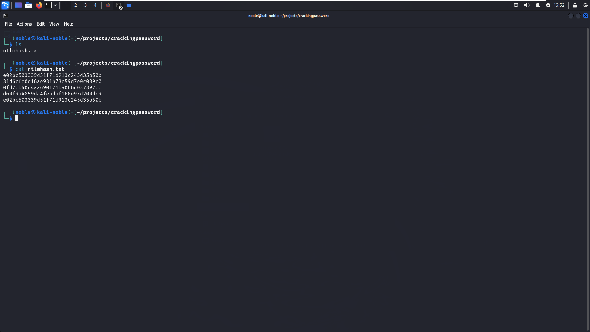

### **Step 2: Preparing the Wordlist**

To crack these hashes, a wordlist is essential. Kali Linux includes the popular `rockyou.txt` wordlist, but it’s compressed by default. I navigated to the directory where `rockyou.txt.gz` is stored:

``` bash
cd /usr/share/wordlists/
```

I decompressed the file using the `gunzip` command:

``` bash
sudo gunzip rockyou.txt.gz
```

To confirm successful decompression, I listed the contents of the directory:

``` bash
ls /usr/share/wordlists/
```

This confirmed that `rockyou.txt` was now available and ready for use.

### **Step 3: Running Hashcat to Crack the Passwords**

With both the hash file and the wordlist ready, I proceeded to use **Hashcat** in dictionary mode. While in the `passwordcracking` directory, I executed the following command:

```bash
hashcat -m 1000 -a 0 -o crackedpassword.txt ntlmhash.txt /usr/share/wordlists/rockyou.txt
```

Here’s a breakdown of the command:

- `-m 1000`: Specifies the NTLM hash type.
- `-a 0`: Sets Hashcat to straight/dictionary mode.
- `-o crackedpassword.txt`: Outputs the cracked passwords to a file.
- `ntlmhash.txt`: The file containing the NTLM hashes.
- `/usr/share/wordlists/rockyou.txt`: The wordlist used for cracking.

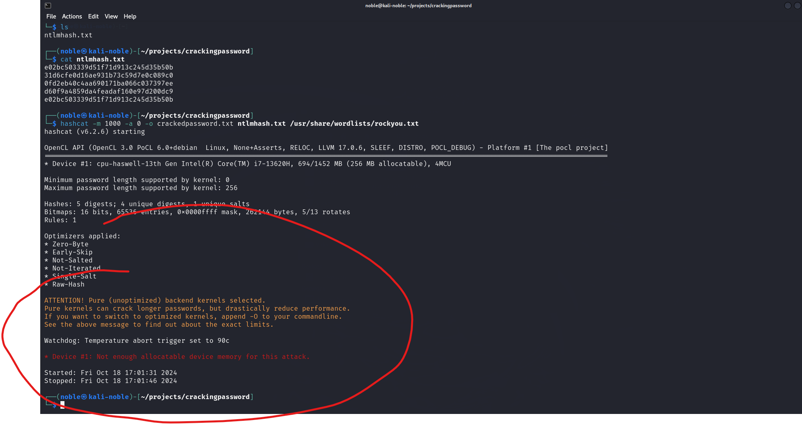

Initially, the cracking attempt failed due to insufficient RAM. To resolve this, I increased my system's RAM from 2GB to 14.9GB, as shown below:

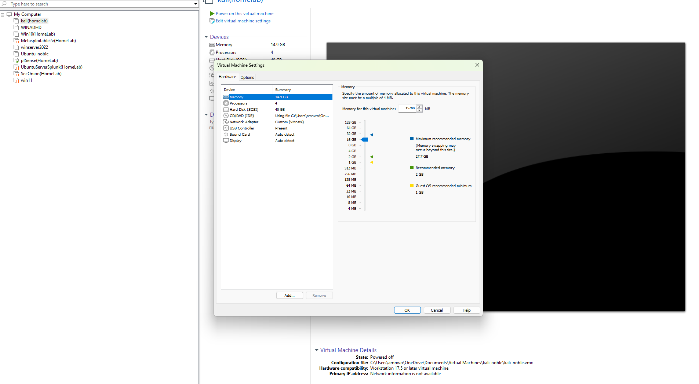

### **Step 4: Monitoring the Cracking Process**

Once I re-ran the command, I monitored the terminal output as Hashcat attempted to crack the hashes:

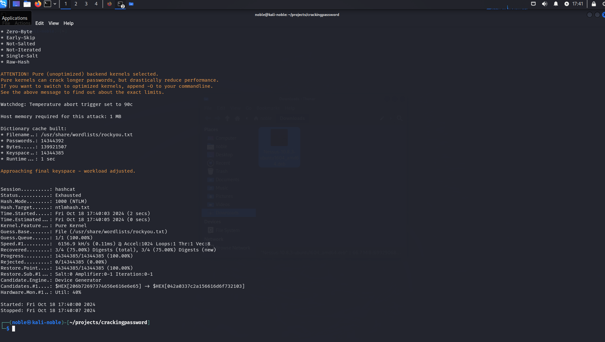

From the output:

```
Recovered........: 3/4 (75.00%) Digests (total), 3/4 (75.00%)
```

Hashcat successfully cracked 3 out of 4 hashes (75%).

### **Step 5: Viewing the Cracked Passwords**

After the cracking process completed, I displayed the contents of the output file to review the results:

```bash
cat crackedpassword.txt
```

Here’s the result:

| NTLM Hash                                | Plaintext  |
|------------------------------------------|------------|
| 31d6cfe0d16ae931b73c59d7e0c089c0         |            |
| e02bc503339d51f71d913c245d35b50b         | vagrant    |
| 0fd2eb40c4aa690171ba066c037397ee         | pr0t0c0l   |

The hash `31d6cfe0d16ae931b73c59d7e0c089c0` has no password set (an empty password), while `e02bc503339d51f71d913c245d35b50b` corresponds to `vagrant`, and `0fd2eb40c4aa690171ba066c037397ee` matches `pr0t0c0l`.

### **Step 6: Verifying the Results**

To ensure accuracy, I verified the hashes using **CyberChef**’s NTLM hash tool, accessible at [CyberChef](https://gchq.github.io/CyberChef/#recipe=NT_Hash()):

- **Empty Password:**
  
  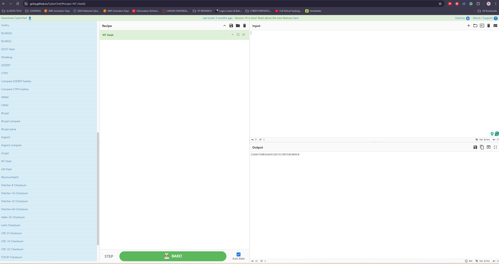

- **Vagrant:**

  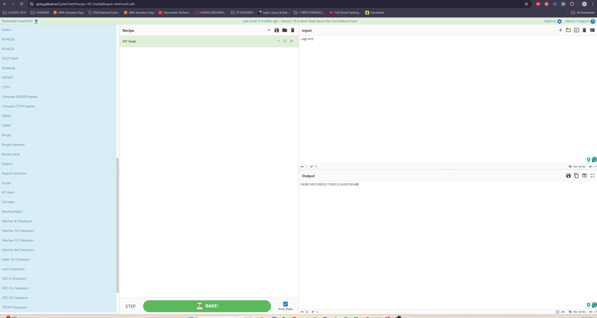

- **pr0t0c0l:**

  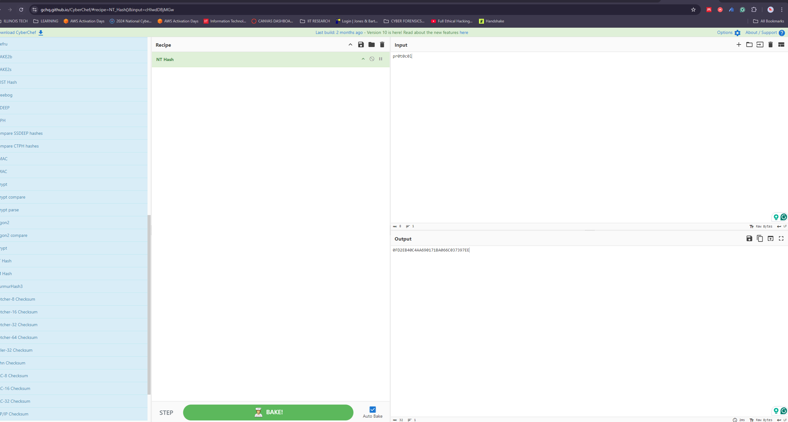

### **Next Steps:**

The password for the hash `d60f9a4859da4feadaf160e97d200dc9` could not be found during this process. Further exploration of other cracking techniques or tools will be needed to recover this password.

### **Step 7: Utilizing Hashcat in Brute-Force Mode (`-a 3`)**

After successfully cracking three NTLM hashes using the `rockyou.txt` wordlist, one hash remained uncracked. To overcome this, I explored Hashcat’s brute-force capabilities in mask attack mode (`-a 3`). This mode systematically tests all possible combinations of characters according to predefined patterns. I initiated the brute-force attack with the following command:

```bash
hashcat -m 1000 -a 3 -o boba_fet_cracked_password.txt boba_fett.txt ?l?l?l?l?l?l?l?l
```

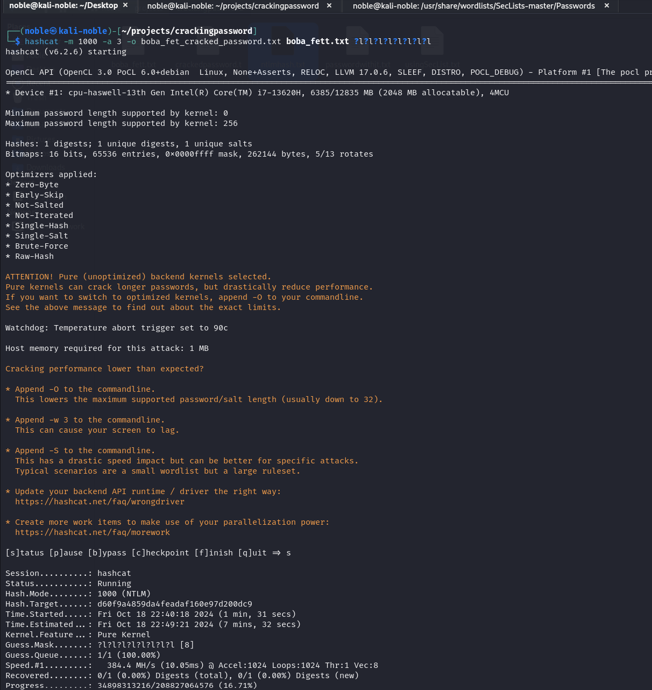

#### Command Breakdown

- **`-m 1000`**: Specifies the hash type as **NTLM**.
- **`-a 3`**: Sets the attack mode to **mask attack** (brute-force).
- **`-o boba_fet_cracked_password.txt`**: Outputs cracked passwords to this file.
- **`boba_fett.txt`**: Input file containing NTLM hashes.
- **`?l?l?l?l?l?l?l?l`**: Defines a mask that tests combinations of 8 lowercase letters.

While the brute-force attack began running, it became evident that this method was more time-consuming due to the vast number of possible combinations. The attack took about seven minutes but did not result in any cracked passwords.

### Step 8 : Brute Force Revision

After the initial attempt failed, I revised the command to broaden the scope by incorporating a wider character set and allowing password lengths between 6 and 12 characters:

```bash
hashcat -m 1000 -a 3 -o boba_fet_cracked_password.txt boba_fett.txt -i ?1?1?1?1?1?1?1?1?1?1?1?1 --increment-min=6 --increment-max=12 -1 ?l?u?d?s
```

#### Command Breakdown

- **`hashcat`**: Password recovery tool.
- **`-m 1000`**: NTLM hash type.
- **`-a 3`**: Mask attack mode.
- **`-o boba_fet_cracked_password.txt`**: Output file for cracked passwords.
- **`boba_fett.txt`**: Input file with NTLM hashes.
- **`-i`**: Enables incremental mode to vary password lengths.
- **`?1?1?1?1?1?1?1?1?1?1?1?1`**: Mask for testing up to 12 characters.
- **`--increment-min=6`**: Minimum password length is 6.
- **`--increment-max=12`**: Maximum password length is 12.
- **`-1 ?l?u?d?s`**: Custom character set including lowercase (`?l`), uppercase (`?u`), digits (`?d`), and special characters (`?s`).

Although this command was designed to test a wide range of combinations, after running for over 30 hours without success, I chose to terminate the process and explore alternative methods.

---

### **Step 9: Using SecLists for a Dictionary Attack**

To further enhance my password cracking strategy, I utilized wordlists from the SecLists repository, which contains a vast collection of public wordlists. Below are the steps I followed.

#### Clone the SecLists Repository

I cloned the SecLists repository from GitHub to access its comprehensive collection of wordlists:

```bash
git clone https://github.com/danielmiessler/SecLists.git
```

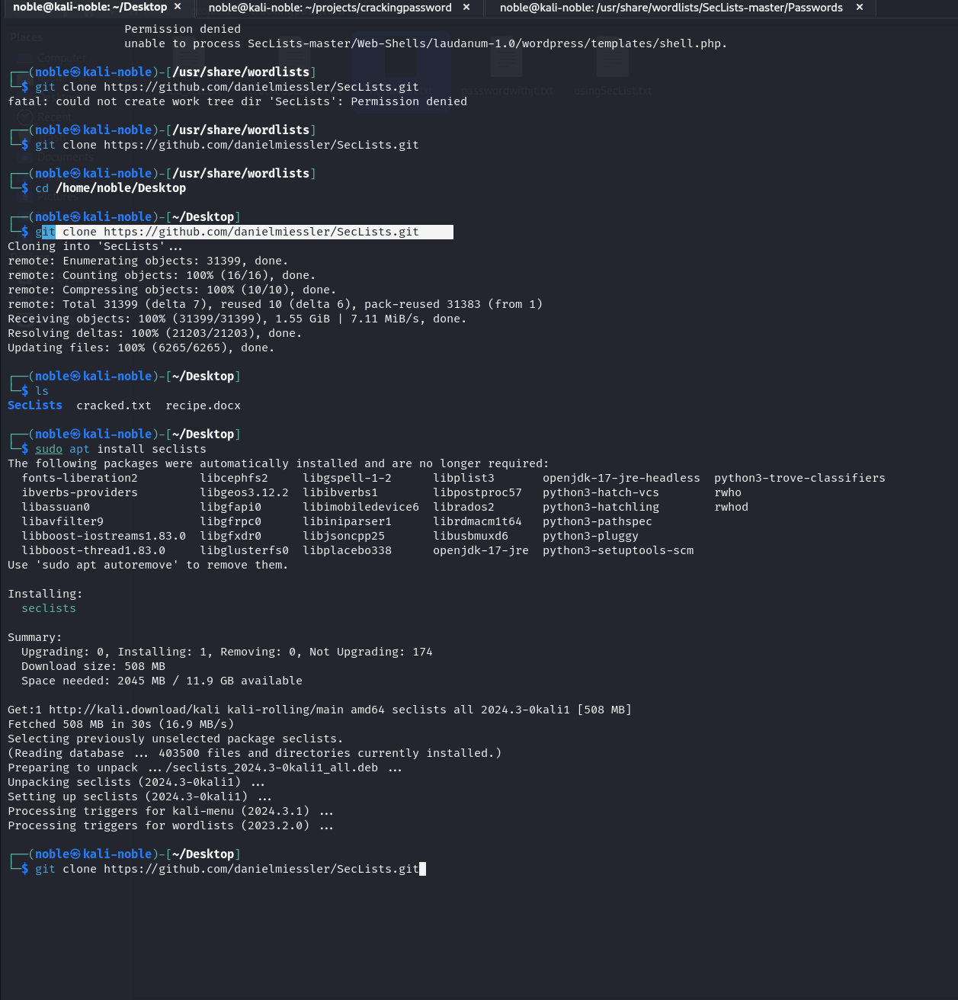

#### Unzip the SecLists Archive

After cloning the repository, I unzipped the SecLists folder:

```bash
sudo unzip Seclists
```

#### Navigate to the Password Directory

Once unzipped, I navigated to the directory containing the password wordlists:

```bash
cd /usr/share/wordlists/SecLists-master/Passwords
```

#### Run Hashcat with SecLists Wordlist

Next, I ran Hashcat using a wordlist from SecLists to crack the NTLM hashes:

```bash
hashcat -m 1000 -a 0 -o /home/noble/projects/crackingpassword/usingSecList.txt /home/noble/projects/crackingpassword/ntlmhash.txt xato-net-10-million-passwords.txt
```

#### Command Breakdown

- **`-m 1000`**: Specifies the hash type as NTLM.
- **`-a 0`**: Sets attack mode to a dictionary attack.
- **`-o`**: Specifies the output file for cracked passwords.
- **`xato-net-10-million-passwords.txt`**: Wordlist from SecLists used in the cracking attempt.

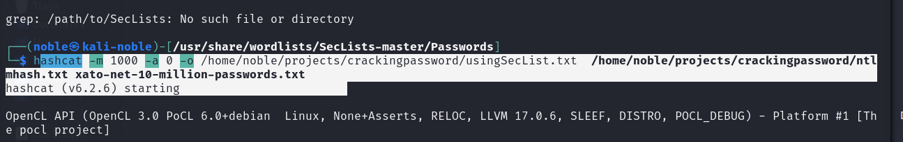

#### Verify the Cracked Password

After the process completed, I successfully cracked the final NTLM hash `d60f9a4859da4feadaf160e97d200dc9`, revealing the password:

```bash
mandalorian1
```

To verify the password, I used CyberChef to hash `mandalorian1` and confirmed it produced the same NTLM hash:

```bash
d60f9a4859da4feadaf160e97d200dc9
```

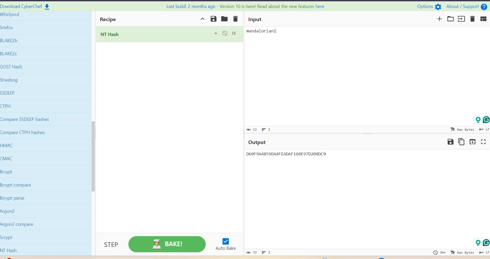

## **Conclusion: Lessons Learned and Future Approaches**

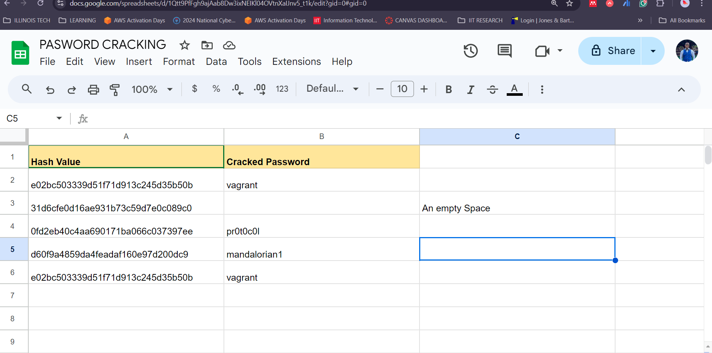

Throughout this exploration of NTLM hash cracking using Hashcat, I have gained invaluable hands-on experience in utilizing both dictionary-based and brute-force attacks to recover passwords. While initial efforts using common wordlists, such as *rockyou.txt*, yielded success for several hashes, the more complex hashes required more advanced techniques, like mask attacks in brute-force mode.

The challenges encountered during the brute-force phase, including long processing times with no successful results, highlighted the limitations of brute-force attacks, especially when faced with modern, well-secured password schemes. This led me to adopt a more refined strategy by leveraging extensive wordlists from the SecLists repository, which proved to be effective in cracking the final hash.

Key takeaways from this process include:

- **Efficiency of Wordlists**: Using a curated wordlist from SecLists significantly reduced the time and computational resources needed compared to brute-force methods.
- **Limitations of Brute-Force Attacks**: Despite being exhaustive, brute-force attacks can be impractical for longer and more complex passwords due to the sheer number of possible combinations.
- **Importance of Flexibility**: Adapting my approach from straightforward dictionary attacks to more specialized mask attacks was crucial in facing complex password hashes.

Looking ahead, I plan to further enhance my password-cracking process by creating a Python script that automates the use of SecLists with Hashcat. This script will traverse the **Passwords** directory in the SecLists repository—whether it's text files or subdirectories—and automatically run the Hashcat function against each wordlist. By automating this process, I aim to make password-cracking workflows more efficient and convenient, saving time and reducing the manual effort required to handle multiple wordlists. I plan to undertake this project as a future addition to my toolkit.

In the future, I also intend to explore hybrid attacks (combining dictionary and brute-force techniques) and experiment with advanced rulesets to optimize password-cracking efficiency further. Additionally, staying updated on cutting-edge password-cracking techniques and tools will be essential as the landscape of cybersecurity continues to evolve.

This project not only reinforced the value of persistence and adaptability but also highlighted the critical role of password security in modern systems. By understanding the methodologies used to crack passwords, we can better appreciate the importance of strong, complex passwords and more secure authentication mechanisms in defending against potential attacks.
